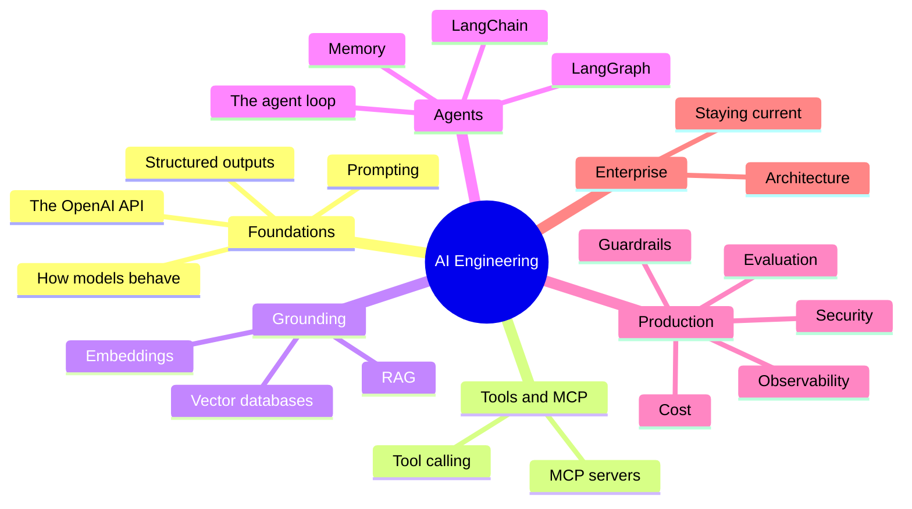
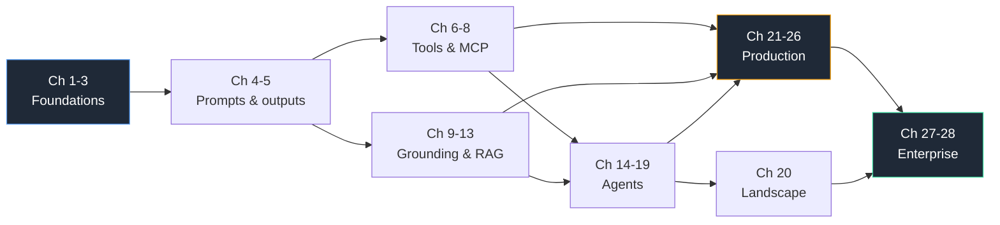

# Enterprise AI Engineering Playbook

**An engineering playbook for experienced software engineers moving into AI Engineering.**

Not a framework tutorial. Not API documentation. Not a course.
This is how modern AI systems are actually designed, built, and kept alive in production — explained through OpenAI, LangChain, and LangGraph, so nothing stays abstract.

> The model is the easy part. Everything that makes a model safe to put in front of real users lives *outside* the model. That "everything" is AI Engineering.

---

## Who This Is For

You have 10+ years of software engineering behind you. You have shipped systems in Java, C++, Go, or Python. You know AWS, Azure, or GCP, plus Kubernetes, microservices, distributed systems, DevOps, REST, and databases.

**You have no ML background, and you do not need one.** You are here to understand this well enough to build real things — tools, MCP servers, agents, retrieval systems — and to make good decisions about them.

This playbook assumes you can already build software. It teaches the part you are missing: how to reason about a probabilistic component sitting inside a deterministic system.

## Who Should *Not* Read This

| If you are… | Read this instead |
| --- | --- |
| Learning to program | A programming fundamentals course |
| Training or fine-tuning foundation models | An ML curriculum — that is a different job |
| Looking for a starter app to copy | A framework quickstart or template repo |
| Looking for `import openai` reference | The provider's SDK docs |
| Researching model architectures | Papers, not playbooks |

## How It Is Written

Six rules, applied to every chapter:

- **No maths.** Ever. ML concepts appear only as intuition, in a clearly marked, skippable box.
- **No hardware internals.** You get the consequence, not the mechanism.
- **Every concept shown in code.** Raw OpenAI first, so nothing is hidden. Then LangChain or LangGraph, with an honest account of what the framework adds *and what it hides*.
- **Concept and framework named separately.** *"This is tool calling; LangChain calls it `bind_tools`."* So the chapter survives a rename.
- **Snippets under 12 lines.** If it needs more, it needs a diagram.
- **One running example** across all 28 chapters, so you watch one system grow instead of meeting 28 unrelated ones.

---

## The Running Example: CaseMate

Every chapter builds the same thing — **CaseMate**, an internal assistant for support engineers at a software vendor. It answers questions from product documentation and can look up a customer's support case by ID.

| By the end of | CaseMate can |
| --- | --- |
| **Part I** | Answer a question and return a result your code can parse |
| **Part II** | Look up a real case in the support system, over MCP |
| **Part III** | Answer from your product documentation, with citations |
| **Part IV** | Triage a case end to end, across multiple steps |
| **Part VI** | Prove it works, be traced, be bounded, and be affordable |

Deliberately unglamorous, and deliberately realistic. It needs every topic in the playbook, in roughly the order the playbook covers them.

---

## The Shift You Are Making

Everything you know about software engineering still applies. Four assumptions you have relied on for a decade quietly stop holding.

| You are used to | In AI systems |
| --- | --- |
| Same input → same output | Same input → *different* output, every time |
| Failures are exceptions you catch | Failures are **confident, plausible, wrong answers** that return HTTP 200 |
| Correctness is binary — tests pass or fail | Correctness is a distribution — you measure quality, not pass/fail |
| Cost scales with compute you control | Cost scales with **tokens**, and one bad prompt can 10× your bill |

Your job is to wrap a probabilistic component in enough deterministic engineering that the *system* behaves predictably. That is the whole discipline.

---

## Learning Roadmap



| Part | Chapters | What you walk away with |
| --- | --- | --- |
| **I — Foundations** | 1–5 | A correct model of what an LLM is, and fluency with the API |
| **II — Tools and MCP** | 6–8 | Models that can call your systems. This is what you build |
| **III — Grounding** | 9–13 | Answers based on *your* data, without fine-tuning anything |
| **IV — Agents** | 14–19 | When autonomy helps, when it is a liability, and how to bound it |
| **V — Landscape** | 20 | How to evaluate any framework, applied to the current field |
| **VI — Production** | 21–26 | Evaluation, tracing, guardrails, security, deployment, cost |
| **VII — Enterprise** | 27–28 | Architecture, and how to stay current |

Full chapter list: **[SUMMARY.md](SUMMARY.md)** · Progress: **[ROADMAP.md](ROADMAP.md)**

---

## Estimated Completion Time

Each chapter is about **30 minutes**. No chapter should exhaust you.

| Path | Chapters | Reading time | Realistic calendar time |
| --- | --- | --- | --- |
| **Fast track** — useful on a real project | 1, 2, 3, 5, 6, 10, 14, 21 | ~4 hours | 1 week |
| **Core** — the working AI Engineer | Parts I–IV, VI | ~11 hours | 4–6 weeks |
| **Complete** | All 28 | ~15 hours | 8–10 weeks |

Reading time is not learning time. Budget about **3× the reading time** for building something small alongside each part. Reading twenty-eight chapters and shipping nothing produces someone who can *talk* about AI Engineering.

---

## Skills You Will Gain

- **Decide whether a problem needs an LLM at all** — and say no when it does not
- **Choose between prompting, retrieval, tool calling, agents, and fine-tuning** with a defensible rationale
- **Build and expose tools over MCP** that a model can safely call
- **Design a retrieval pipeline**, and explain why retrieval quality beats model choice
- **Bound an agent** so a reasoning loop cannot spend $4,000 or delete a production table
- **Build an evaluation suite** that gates changes the way unit tests gate code
- **Instrument a system** with traces good enough to debug a bad answer from three weeks ago
- **Threat-model** against prompt injection, data exfiltration, and tool abuse
- **Control cost** per request, per feature, per tenant
- **Hold your own** in an architecture review

---

## Career Roadmap

| Role | What the job is | Emphasise |
| --- | --- | --- |
| **AI Engineer** | Ship product features on foundation models | Parts I–IV, 21, 22 |
| **Applied AI Engineer** | Turn a fuzzy business problem into a working capability | Parts I–III, 21, 26 |
| **Forward Deployed Engineer** | Discovery, integration, and delivery in the customer's estate | Every FDE Notes section, Parts VI–VII |
| **AI Platform Engineer** | Build the paved road other teams ship on | Parts II, V–VII |
| **Enterprise AI Architect** | Own the reference architecture and risk posture | Parts VI–VII, every Decision Matrix |

Every chapter rates the topic ★ to ★★★★★ and says where it shows up in interviews. Detail in **[career/](career/)**.

---

## Recommended Reading Order

**Chapters 1–3 first, in order.** They install the mental model and the API fluency everything else assumes.



Three shortcuts:

- **Building an MCP server or tool next week:** 1 → 2 → 3 → 5 → 6 → 7 → 8
- **Building a RAG system next week:** 1 → 2 → 3 → 9 → 10 → 12 → 21
- **Building an agent next week:** 1 → 2 → 3 → 6 → 14 → 16 → 17 → 23

Do not read Part V early. Choosing a framework before you understand the problem is the most expensive mistake in this field.

---

## How Every Chapter Is Structured

Same sections every time, so you can skim to what you need:

1. Why This Matters
2. The Problem
3. Mental Model
4. The ML Bit, in Plain English *(skippable)*
5. Architecture
6. **See It in Code** — raw OpenAI, then LangChain/LangGraph, then CaseMate
7. Engineering Decisions
8. Decision Matrix
9. Technology Landscape
10. Production Notes
11. Best Practices and Common Mistakes
12. **Forward Deployed Engineer Notes**
13. Career Notes
14. One Minute Summary
15. Interview Questions and References

In a hurry? Read **Mental Model**, **See It in Code**, and **One Minute Summary**. About 8 minutes, and most of the value.

---

## Repository Structure

```
.
├── README.md              # You are here
├── SUMMARY.md             # Full table of contents
├── ROADMAP.md             # Chapter status and house style
├── docs/                  # The chapters
├── diagrams/              # Reusable Mermaid sources
├── decision-matrices/     # Standalone "should I use X?" matrices
├── references/            # Consolidated reading list
├── career/                # Role tracks, interview prep, skills matrix
├── templates/             # Chapter template, ADR template, checklists
└── assets/                # Images
```

---

## Status

Published one chapter at a time, deliberately. See **[ROADMAP.md](ROADMAP.md)**.

## Contributing

Corrections, production war stories, and "this is wrong in 2026" reports are all welcome. See **[CONTRIBUTING.md](CONTRIBUTING.md)**.

The bar for every addition is one question: *Will this help an experienced software engineer become a better AI Engineer?*

## License

[MIT](LICENSE) — prose and snippets alike.
