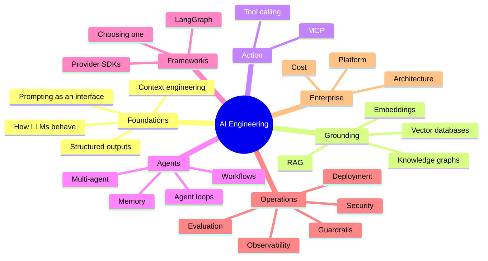
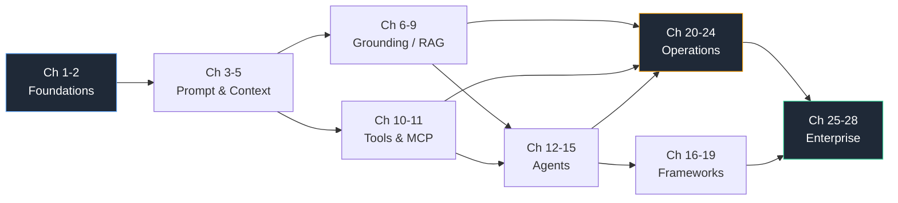

# Enterprise AI Engineering Playbook

**An engineering playbook for experienced software engineers moving into AI Engineering.**

Not a framework tutorial. Not API documentation. Not a course.
This is the reasoning behind how modern AI systems are designed, built, deployed, observed, and kept alive in production.

> The model is the easy part. Everything that makes a model safe to put in front of real users lives *outside* the model. That "everything" is AI Engineering.

---

## Who This Is For

You have 10+ years of software engineering behind you. You have shipped systems in Java, C++, Go, or Python. You have run things on AWS, Azure, or GCP. You know Kubernetes, microservices, distributed systems, DevOps, REST, and databases.

You are new to AI Engineering, and the ecosystem looks like noise: forty frameworks, a new protocol every quarter, and a lot of people who sound confident.

This playbook assumes you already know how to build software. It teaches you the part you are missing: **how to reason about probabilistic components inside deterministic systems.**

## Who Should *Not* Read This

| If you are… | Read this instead |
| --- | --- |
| Learning to program | A programming fundamentals course |
| Training or fine-tuning foundation models | An ML/deep learning curriculum — that is ML Engineering, a different job |
| Looking for copy-paste code or a starter app | A framework quickstart or template repo |
| Looking for `import openai` syntax | The provider's official SDK docs |
| Doing research on model architectures | Papers, not playbooks |

This repository is deliberately **not code-first**. You will find pseudo-code, tiny snippets, and API shapes — never a full application. If a diagram explains it better than 200 lines of Python, you get the diagram.

---

## The Shift You Are Making

Everything you know about software engineering still applies. But four assumptions you have relied on for a decade quietly stop holding.

| You are used to | In AI systems |
| --- | --- |
| Same input → same output | Same input → *different* output, every time |
| Failures are exceptions you catch | Failures are **plausible, confident, wrong answers** that return HTTP 200 |
| Correctness is binary — tests pass or fail | Correctness is a distribution — you measure quality, not pass/fail |
| Cost scales with compute you control | Cost scales with **tokens**, and a bad prompt can 10× your bill overnight |

Your job is to wrap a probabilistic component in enough deterministic engineering that the *system* behaves predictably. That is the whole discipline.

---

## Learning Roadmap



### The Seven Parts

| Part | Chapters | What you walk away with |
| --- | --- | --- |
| **I — Foundations** | 1–5 | A correct mental model of what an LLM is and is not |
| **II — Grounding** | 6–9 | How to put *your* data in front of a model without fine-tuning it |
| **III — Action** | 10–11 | How models call your systems, and the protocol layer standardising it |
| **IV — Agents** | 12–15 | When autonomy helps, when it is a liability, and how to bound it |
| **V — Frameworks** | 16–19 | How to choose, and how to avoid being owned by your choice |
| **VI — Operations** | 20–24 | Evaluation, tracing, guardrails, security, deployment |
| **VII — Enterprise** | 25–28 | Architecture, cost, platform, and how to stay current |

Full chapter list: **[SUMMARY.md](SUMMARY.md)** · Progress and status: **[ROADMAP.md](ROADMAP.md)**

---

## Estimated Completion Time

Each chapter is written to be finished in **30–45 minutes**. No chapter should exhaust you.

| Path | Chapters | Reading time | Realistic calendar time |
| --- | --- | --- | --- |
| **Fast track** — enough to be useful on a real project | 1, 2, 3, 4, 7, 10, 12, 20, 22 | ~5 hours | 1 week |
| **Core** — the working AI Engineer | Parts I–IV, VI | ~13 hours | 4–6 weeks |
| **Complete** — architect / platform depth | All 28 | ~18 hours | 8–10 weeks |

Reading time is not learning time. Budget roughly **3× the reading time** for building something small alongside each part. The chapters are designed so you can read one over a lunch break and apply it the same week.

---

## Skills You Will Gain

By the end you should be able to do these things without looking anything up:

- **Decide whether a problem needs an LLM at all** — and say no when it does not
- **Choose between prompting, RAG, tool calling, agents, and fine-tuning** with a defensible rationale
- **Design a retrieval pipeline** and explain why retrieval quality — not model choice — dominates answer quality
- **Bound an agent** so a reasoning loop cannot spend $4,000 or delete a production table
- **Build an evaluation suite** that gates prompt and model changes the way unit tests gate code changes
- **Instrument an AI system** with traces that let you debug a bad answer from three weeks ago
- **Threat-model an AI system** against prompt injection, data exfiltration, and tool abuse
- **Model and control cost** per request, per feature, per tenant
- **Run a technology-selection conversation** with a customer or an architecture review board and hold your ground

---

## Career Roadmap

Five roles come out of this material. They share a foundation and diverge in emphasis.

| Role | What the job actually is | Emphasise |
| --- | --- | --- |
| **AI Engineer** | Ship product features built on foundation models | Parts I–IV, Evaluation, Observability |
| **Applied AI Engineer** | Turn a fuzzy business problem into a working AI capability | Parts I–III, Evaluation, Cost |
| **Forward Deployed Engineer (FDE)** | Sit with the customer; discovery, integration, and delivery in *their* environment | Every FDE Notes section, Parts VI–VII |
| **AI Platform Engineer** | Build the paved road other teams ship on: gateway, evals, tracing, governance | Parts V–VII, Deployment, Security |
| **Enterprise AI Architect** | Own the reference architecture, build-vs-buy, and risk posture across an org | Parts VI–VII, every Decision Matrix |

Every chapter carries a **Career Notes** section rating the topic ★ to ★★★★★ and telling you where it shows up in interviews and in real enterprise projects. Detail lives in **[career/](career/)**.

---

## Recommended Reading Order

**Read Chapters 1–2 first, in order, no exceptions.** They install the mental model everything else depends on. After that:



Three honest shortcuts:

- **If you are building a RAG system next week:** 1 → 2 → 4 → 6 → 7 → 8 → 20
- **If you are building an agent next week:** 1 → 2 → 10 → 12 → 13 → 22 → 21
- **If you are reviewing someone else's AI architecture on Friday:** 1 → 25 → 23 → 26, then every Decision Matrix

Do not read Part V (Frameworks) early. Choosing a framework before you understand the problem is the single most common expensive mistake in this field.

---

## How Every Chapter Is Structured

Same fifteen sections, every time, so you can skim to what you need:

1. Why This Matters
2. The Problem
3. Mental Model
4. Architecture
5. Internal Working
6. Engineering Decisions
7. Decision Matrix
8. Technology Landscape
9. Production Notes
10. Best Practices
11. Common Mistakes
12. **Forward Deployed Engineer Notes**
13. Career Notes
14. One Minute Summary
15. Interview Questions & References

In a hurry? Read **Mental Model**, **Decision Matrix**, and **One Minute Summary**. That is roughly 8 minutes and about 60% of the value.

---

## Repository Structure

```
.
├── README.md              # You are here
├── SUMMARY.md             # Full table of contents
├── ROADMAP.md             # Chapter status and publishing plan
├── docs/                  # The chapters
├── diagrams/              # Reusable Mermaid sources
├── decision-matrices/     # Standalone "should I use X?" matrices
├── references/            # Consolidated reading list
├── career/                # Role tracks, interview prep, skills matrix
├── templates/             # Chapter template, ADR template, checklists
└── assets/                # Images
```

---

## Status

This playbook is published **one chapter at a time**, deliberately. A finished chapter beats four drafts.

See **[ROADMAP.md](ROADMAP.md)** for what is written, what is next, and what is planned.

## Contributing

Corrections, real production war stories, and "this is wrong in 2026" issues are all welcome. See **[CONTRIBUTING.md](CONTRIBUTING.md)**.

The bar for every addition is one question: *Will this help an experienced software engineer become a better AI Engineer?* If not, it stays out.

## License

[MIT](LICENSE) — prose and snippets alike. Use it, teach from it, adapt it.
