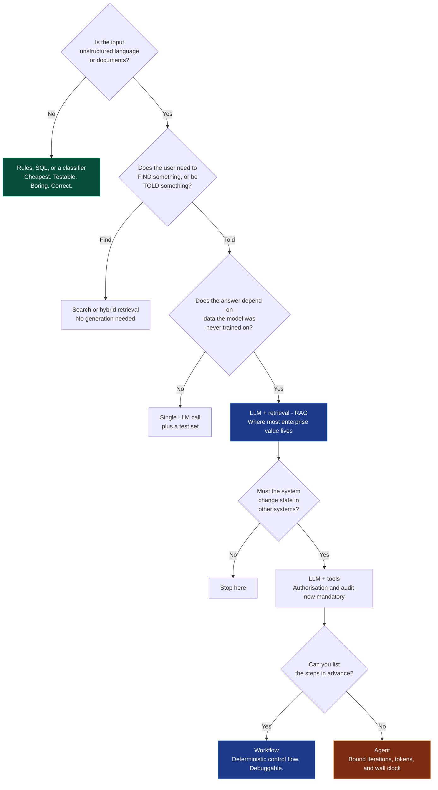

# Chapter 1 — AI Engineering Overview

> **Reading time:** ~30 minutes · **Career weight:** ★★★★★ Essential · **Prerequisites:** none
>
> **In one line:** AI Engineering is wrapping an unpredictable component in enough ordinary engineering that the system as a whole behaves predictably.

This is the map chapter. Everything after it zooms into one part of it.

---

## 1. Why This Matters

**The demo takes a weekend. Shipping it takes nine months. This chapter is about the gap.**

You have seen the pattern, or you are about to. An engineer wires up a model over the company's documents in a weekend. It answers questions impressively. Leadership sees it on a Tuesday and it is on a roadmap by Friday.

Then it takes nine months to ship, or it never ships at all. And the model was never the problem.

What happened in those nine months is that the prototype met reality: documents nobody owns, answers that are wrong in ways nobody can characterise, a cost line nobody forecast, a security review nobody prepared for, and no way to answer *"is it working?"* with anything better than an opinion.

**That gap is the entire job.** And your background is unusually good preparation for it — the hard problems here are distributed systems problems, failure-mode problems, observability problems, and cost problems. You have been solving those for years.

---

## 2. The Problem

**Four assumptions you have relied on for a decade quietly stop holding.**

| Behaviour | What breaks |
| --- | --- |
| **It is not deterministic** | Same input, different output. Every technique you have for testing, caching, and reproducing bugs assumes otherwise |
| **It fails silently** | No error, no timeout, no red health check. Just HTTP 200 and a confident, fluent, wrong answer. There is no status code for *wrong* |
| **Correctness is not binary** | Ask the same thing 100 times: 94 good answers, 4 mediocre, 2 embarrassing. "Is this better?" becomes a statistical question, which changes what CI means |
| **Cost tracks input, not your infrastructure** | You are billed per word. One developer adding a document to a prompt can raise the monthly bill 40% without touching infrastructure |

Put them together and the engineering problem is:

> **How do you build a predictable system out of a component that is unpredictable, fails silently, cannot be unit tested, remembers nothing, takes no responsibility for being right, and bills you by the word?**

The answer is not a better model. It is architecture. Everything reliable about a production AI system lives *outside* the model — the retrieval that grounds it, the tools that let it act, the evaluation that proves it works, the guardrails that stop it, and the tracing that tells you why. That "everything" is the discipline.

---

## 3. Mental Model

> **A language model is a stateless service you do not own, staffed by a brilliant, extremely well-read contractor who has no memory, no access to your systems, cannot say "I don't know", and will invent details with total confidence.**

Each clause maps to something you will have to build.

| The model… | So you build | Chapter |
| --- | --- | --- |
| Keeps no state | Memory, explicitly | 18 |
| Is not yours | A gateway, so it stays replaceable | 25 |
| Knows the public internet, not your business | Retrieval | 10 |
| Cannot reach your systems | Tools and MCP | 6, 7 |
| Never says "I don't know" | Grounding and guardrails | 10, 23 |
| Invents confidently | Evaluation, citation, validation | 21, 23 |

And one framing that matters for your confidence:

> **AI Engineering is to Machine Learning what backend engineering is to database internals.**

You do not implement a B-tree to build a transactional system. You need to know indexes exist, roughly what they cost, and how they fail — then you build on top. Same relationship here. **You consume the model; someone else builds it.** Confusing these two is why experienced engineers wrongly assume the field is closed to them without a maths degree.

**Where the analogy leaks.** Retrying a normal API gives you the same resource; retrying a model gives you a *different answer*. And when Postgres returns the wrong row, someone will fix that bug — when a model returns a wrong answer, that is the product working as designed. **The accountability is entirely yours.**

---

## 4. The ML Bit, in Plain English

> **Skippable.** Here so you can place yourself in the landscape.

There are two halves to working with models, and they are different jobs.

**Training** is building the model — collecting data, running expensive compute for weeks, producing a set of weights. That is **ML Engineering**. It needs maths, and it is not what this playbook is about.

**Inference** is using the finished model — sending it text, getting text back. That is **AI Engineering**. It needs systems thinking, and it is what you will do every day.

Before about 2020, getting language capability into a product meant the first half: months of work and a specialist team, for a model that did one thing. Foundation models collapsed that into an API call.

**So the scarce skill moved.** It is no longer creating capability — it is integrating capability safely, cheaply, and verifiably into systems that already exist. That is a software engineering problem, and it needed a name.

---

## 5. Architecture

**Almost every production AI system has the same layers. The layer nobody owns is where it will fail.**

Support agents, document pipelines, coding assistants, claims triage — they all resolve into this shape.


Blue is the request path — the layers you own. Grey is what you depend on. Amber spans everything.

**1. Guardrails in.** Everything arriving is untrusted, including content the user did not write — a pasted email, an uploaded PDF, a fetched web page. Screening, PII redaction, first line of injection defence. Cheap, fast, and the first thing a prototype skips.

**2. Orchestration.** The control plane. What runs, what state carries between steps, whether a tool is called, whether to loop. This is where the difference between a *workflow* (steps you defined) and an *agent* (steps the model chooses) gets decided. Most systems should be workflows.

**3. Context assembly.** The highest-leverage layer, and the most underinvested. It decides what text the model actually sees: retrieved documents, history, instructions, tool descriptions. **When a system "hallucinates", nine times in ten the correct information was simply never retrieved.**

**4. Tools and integrations.** How the model reaches your systems. Also your entire blast radius — a model that only writes text is a content risk; one that can call `refund_customer()` is an operational one.

**5. Model access.** Not "the model" — *access* to models. One place for credentials, retries, fallback, caching, and cost-aware routing. Treating this as a layer rather than an SDK import is what lets you swap providers in an afternoon.

**6. Guardrails out.** Schema validation, grounding checks, safety filtering. Critically: **model output is untrusted input to everything downstream.** If it reaches a renderer, a shell, or a SQL string, treat it exactly like a form field from the public internet.

**7. Evaluation and observability.** Cross-cutting, and the layer that separates a system from a demo. Without it you are improving a black box by superstition.

Underneath sits infrastructure you already know: compute, networking, secrets, CI/CD, identity. That part is not new, and it is not where AI projects fail.

> **Use this as a checklist.** In an architecture review, walk the layers and ask "who owns this one?" The unclaimed layer is your next incident.

---

## 6. See It in Code

**The distance between a demo and a system is six lines.**

Here is **CaseMate** — the assistant we build across this playbook — as a weekend demo. A support engineer asks a question, it answers.

```python
r = client.chat.completions.create(
    model="gpt-5.5",
    messages=[{"role": "user", "content": question}],
)
return r.choices[0].message.content
```

That genuinely works, and it will impress people. It also has no idea what your products are, cannot look anything up, cannot be tested, and cannot be debugged.

Here is the same feature with the layers in place. Still short — that is the point.

```python
def answer(question: str, user: User) -> Answer:
    check_input(question)                       # 1  guardrails in
    docs = retrieve(question, as_user=user)     # 3  context assembly, permission-filtered
    messages = build_context(question, docs)    # 3  what the model actually sees
    reply = call_model(messages)                # 5  gateway: retries, fallback, cache
    validate(reply, grounded_in=docs)           # 6  schema and grounding checks
    trace(question, docs, messages, reply)      # 7  the whole story, queryable later
    return reply
```

Seven lines, six layers, and one honest observation: **the model call is one line out of seven.** The other six are the job.

Two details worth flagging now, because both are load-bearing later. `as_user=user` means retrieval filters documents by that engineer's permissions — you never rely on the model to be discreet about what it read. And `trace(...)` captures the *assembled* messages, not the template, because "what exactly did the model see?" is the question you will need answered three weeks from now.

**Where frameworks come in.** LangChain and LangGraph exist to give you layers 2, 3, and 5 without writing them yourself. That is a genuine saving and a genuine trade — Part V covers what they add and what they hide. Read it after Part IV, not before: **choosing a framework before you understand the problem is the most expensive mistake in this field.**

---

## 7. Engineering Decisions

**Every AI project has at least four alternatives, and one of them is usually right.**

| Alternative | When it wins | Why teams skip it |
| --- | --- | --- |
| **Do nothing** | The process works and nobody is complaining | Nobody gets promoted for it |
| **Ordinary software** | The rules are stable and expressible | Less interesting than the alternative |
| **Classical ML** | You have labels and need a score, rank, or forecast | Requires data work nobody wants to fund |
| **Buy a product** | The capability is generic — transcription, OCR, support deflection | "We're an engineering company" |

If a rule, a SQL query, or a search index solves it, use it. A deterministic solution is faster, cheaper, testable, explainable, and needs no eval suite, no guardrails, and no security review.

**What AI Engineering genuinely solves:** unstructured input at scale — documents, tickets, transcripts, emails; tasks where the rules are too numerous or too fuzzy to enumerate; natural-language interfaces to systems you already run; and any process where a person currently reads text and writes a judgement.

**What it is wrongly believed to solve:** arithmetic and aggregation (give it a tool — it should query, not calculate); problems where nobody has defined "correct"; bad data, where retrieval over an ungoverned document store returns confidently-cited garbage; and organisational dysfunction, which no technology has ever fixed.

### Where the disciplines sit

| Discipline | Owns | Starts when |
| --- | --- | --- |
| **Data Science** | Answering business questions | There is data and a question |
| **ML Engineering** | Training and serving custom models | You have proprietary data and need a prediction |
| **AI Platform** | The paved road others build on | Several teams are doing this independently |
| **AI Engineering** | Products built on models that already exist | The model exists and needs to become a product |

The tell in a job advert: PyTorch, distributed training, and feature stores mean ML Engineering. Retrieval, evals, agents, and vector stores mean AI Engineering.

---

## 8. Decision Matrix

### Should this problem use an LLM?

| | |
| --- | --- |
| ✅ **YES if** | Input is unstructured language, images, or documents · Output tolerates different wording · A wrong answer is recoverable or reviewed · A person currently does this by reading and writing · The rules are too fuzzy to enumerate |
| ❌ **NO if** | The answer must be exactly reproducible · A wrong answer is unrecoverable and unreviewed · A rule already works · It is arithmetic, aggregation, or a query · Nobody can define "correct" · The latency budget is under ~200ms |
| ⚠️ **Depends on** | Whether you can produce a test set. **If nobody can give you 50 examples with agreed-correct answers, the project is not ready** — regardless of technology |

### The escalation ladder

Start at the bottom. Climb only when you can say precisely why the rung below fails.



Green is the answer nobody finds exciting and everybody underuses. Most enterprise value sits in the blue boxes. **Most enterprise disappointment comes from starting in the orange one.**

Expanded version, with the four questions that kill bad projects in week one: [decision-matrices/do-you-need-an-llm.md](../decision-matrices/do-you-need-an-llm.md).

---

## 9. Technology Landscape

The ecosystem by category. Names are illustrative of a *shape*, not a shopping list.

| Category | What it is for | Representative | Decide on |
| --- | --- | --- | --- |
| **Model APIs** | Capability with no infrastructure | OpenAI, Anthropic, Google | Capability on your tests, latency, data terms |
| **Cloud platforms** | Models inside your existing boundary | Bedrock, Vertex AI, Azure AI Foundry | Data residency, procurement |
| **Gateways** | One control point for keys, retries, fallback, cost | LiteLLM, Portkey, cloud-native | Whether you will ever use two providers. You will |
| **Orchestration** | Workflow, state, agent loops | LangGraph, LangChain, provider SDKs | Complexity of your control flow — Part V |
| **Retrieval** | Grounding answers in your data | pgvector, Elasticsearch, Pinecone, Qdrant | Whether you need a new datastore at all |
| **Evaluation** | Knowing whether a change helped | Braintrust, Ragas, promptfoo | CI integration, not feature count |
| **Observability** | Seeing what actually happened | LangSmith, Langfuse, Phoenix, Datadog | Whether it emits OpenTelemetry |
| **Guardrails** | Boundaries on input and output | NeMo Guardrails, Bedrock Guardrails, Azure Content Safety | Latency added per call |
| **Protocols** | Interoperability instead of glue | MCP, A2A, OpenTelemetry GenAI | Adopt early — protocols outlive frameworks |

Three observations that save time.

**The gateway is the highest-value early investment.** Thin, takes days, and buys provider portability, cost attribution, caching, and one place for quotas. Skip it and you get provider SDK calls in forty services.

**Protocols outlive frameworks.** MCP and the OpenTelemetry GenAI conventions are bets on interoperability. Frameworks are bets on one vendor's abstraction surviving your requirements.

**You probably do not need a new database.** If you run Postgres or Elasticsearch, they do vector search well enough for most workloads. "We need a vector database" is a conclusion, not a starting position.

> Ages fastest. Reviewed quarterly.

---

## 10. Production Notes

| Concern | What to get right |
| --- | --- |
| **Security** | Instructions and data share one channel — there is no `PreparedStatement` for prompts. The control is architectural: keep untrusted content away from tools with side effects, or put a policy check or a human between them. Enforce permissions **at retrieval**, never by asking the model to be discreet |
| **Scaling** | Rate limits are in **tokens per minute**, not requests per second. Keep the reasoning core stateless and hold conversation state externally. Anything long-running needs a queue and status polling — multi-step workflows routinely blow past HTTP timeouts |
| **Observability** | The unit is the **trace**, not the log line. Capture the assembled context, model and prompt versions, token counts, latency per step, tool calls, guardrail triggers, and cost. Use [OpenTelemetry GenAI conventions](https://opentelemetry.io/docs/specs/semconv/gen-ai/) so it stays portable |
| **Cost** | Model it before you build. Multipliers people miss: conversation length (history is resent every turn), agent iterations, and retries. The only term working for you is cache hit rate |

**Failure scenarios**

| Failure | What you see | Mitigation |
| --- | --- | --- |
| Provider outage or 429 | Errors, latency spikes | Gateway fallback to another provider or tier |
| Silent model update | Behaviour changes with no deploy | Pin dated versions; evals in CI |
| Retrieval returns nothing useful | Confident, uncited, wrong | Grounding check; abstain rather than generate |
| Runaway agent loop | Cost and latency spike, no output | Hard caps on iterations, tokens, and wall clock |
| Prompt injection | Unexpected tool calls, data leaving | Isolate untrusted content from side-effecting tools |

**The governing principle: a production AI system degrades, it does not collapse.** A cheaper model, a cached answer, or an honest "I can't help, here's a human" all beat a timeout.

---

## 11. Best Practices and Common Mistakes

**Do this**

- **Build the test set before you optimise anything.** Fifty representative cases with agreed answers, including the hard ones. The highest-return hour on any AI project, and the one teams defer.
- **Start deterministic and escalate deliberately.** Rules → search → one model call → retrieval → tools → a loop. Never skip a rung because the next one is more interesting.
- **Put a gateway in front of models in week one.** Days of work; makes the model replaceable rather than structural.
- **Version prompts like code and pin model versions.**
- **Log the assembled context, not the template.**
- **Design the degraded path before the happy path.** Otherwise the default behaviour is a timeout.
- **Ship with a human in the loop, and remove them with data.** Measure the override rate; automate when it stays low.
- **Make the system able to say "I don't know."** It is the difference between a tool people trust and one they quietly stop using.

**Not this**

| Mistake | What it looks like | Do instead |
| --- | --- | --- |
| Framework first | Week one spent choosing between LangGraph and CrewAI | Understand the problem. The choice is easy afterwards, and irrelevant if the answer is a workflow |
| Vibes-driven development | "This prompt feels better" | Build the test set. Gate merges on it |
| Blaming the model | "It hallucinates" as the standing explanation | Open the trace. Check what was retrieved. It is usually retrieval |
| Agent when a workflow would do | Non-deterministic control flow for four known steps | If you can draw the flowchart, code the flowchart |
| Bigger context instead of better retrieval | "Just put all the documents in" | Attention is not uniform. Retrieve well, then trim |
| Trusting model output | Output flows into a renderer or shell unvalidated | Validate, check grounding, escape on render |
| No cost model until the invoice | Pilot costs nothing; production costs £40k/month | Estimate tokens × volume during design |
| Skipping the gateway | Provider SDK calls in forty services | Abstract before the second service |
| Security as a filter | A prompt saying "ignore malicious instructions" | Injection is an architecture problem, not a wording problem |

---

## 12. Forward Deployed Engineer Notes

**What customers say, and what it means**

| They say | It means | Ask |
| --- | --- | --- |
| "We need an AI strategy" | Someone senior read something | "Which process is expensive because a person reads text?" |
| "We want an agent" | They saw a demo | "What decision must it make that you cannot pre-define?" |
| "We want to use our data" | Real, but unscoped | "Which questions? Whose documents? Who may see them?" |
| "It's not accurate enough" | Almost always retrieval or context | "Show me the trace for one failing case" |
| "Our competitor launched a copilot" | Feature anxiety | "What do your users spend too long on today?" |

**Discovery questions for week one**

1. **"Show me fifty examples with the correct answers."** If they cannot, this is a requirements problem, not an AI problem. This question ends more doomed projects than anything else you can ask.
2. **"What happens when it is confidently wrong, and who is accountable?"** If the answer is "catastrophic" and there is no human in the loop, the scope must change.
3. **"Where does this data live, who owns it, and how stale is it?"** Usually four systems, one of which is a SharePoint nobody has curated since 2019.
4. **"What must never leave your network?"** Determines your whole deployment topology. Expensive to discover in month three.
5. **"Who decides it is good enough to ship, and against what bar?"** No named person and no threshold means you will pilot forever.

**Decisions you will make on site**

Deployment topology (hosted, cloud-native, or self-hosted — usually decided by data residency before engineering gets a vote). Whether retrieval extends the search infrastructure they already run or introduces a vector store, which is a political act as much as a technical one. How the end user's authorisation reaches the retrieval filter and the tool call — get this wrong and you have built a data-leak engine with a chat interface. Which actions need human approval. And who operates it after you leave.

**Integration challenges.** Legacy SOAP or mainframe interfaces with no test environment. Document stores with no consistent access model. Six-week SSO integration. Egress rules that block the provider outright. A change advisory board that meets fortnightly. **Budget more time for integration and approvals than for the AI work — on most engagements it is the larger half, and you should say so at the start, in writing.**

**Build vs buy.** Buy the commodity layers — guardrails, observability, evaluation tooling, gateways. Build the layer that encodes the customer's specific business logic. Teams that build their own tracing infrastructure have chosen a hobby, not a differentiator.

**Before go-live**

- [ ] Test set exists, threshold agreed with a named business owner
- [ ] Evals run in CI and block regressions
- [ ] Model versions pinned
- [ ] End-to-end tracing, queryable weeks later, capturing assembled context
- [ ] Cost per request measured; quotas enforced per tenant and feature
- [ ] Authorisation enforced at retrieval
- [ ] Injection threat model written for every untrusted input path
- [ ] Degraded path defined and tested
- [ ] Rollback is a config change, not a redeploy
- [ ] A named human owns quality

Full version: [templates/PRODUCTION_READINESS_CHECKLIST.md](../templates/PRODUCTION_READINESS_CHECKLIST.md).

**Enterprise considerations.** Procurement and legal will ask where data is processed, whether it trains anyone's model, retention periods, sub-processors, and what happens on termination. Have answers before the meeting. Regulated customers will map your system onto NIST AI RMF, ISO/IEC 42001, or the EU AI Act's risk tiers — knowing the vocabulary turns months into weeks, and the risk-classification conversation belongs in discovery, not legal review.

---

## 13. Career Notes

**Importance: ★★★★★ Essential.** This is the framing everything else hangs from. An engineer who can name which layer a problem belongs to is immediately distinguishable from one who has read framework tutorials.

**In interviews.** These are systems design interviews with an unpredictable component, not ML theory exams. The common opener is *"design an AI assistant over our internal documentation."* Strong candidates answer in layers, raise evaluation before being asked, and treat failure modes as design inputs. Weak candidates start naming frameworks.

Three behaviours that correlate with senior offers:

1. **Raising evaluation unprompted.** The clearest seniority signal in the field.
2. **Arguing against AI for a specific use case.** Judgement, not enthusiasm.
3. **Localising a failure.** Given "the answer was wrong," asking what was retrieved rather than proposing a prompt change.

**Seniority signal.** A senior engineer talks about the system; a junior talks about the model. When something breaks, the junior reaches for the prompt and the senior reaches for the trace.

---

## 14. One Minute Summary

> **If you remember one thing: the model is the easy part. AI Engineering is wrapping an unpredictable component in enough ordinary engineering that the system behaves predictably.**

- **Four assumptions break:** determinism, loud failure, binary correctness, and cost you control. Everything else you know still applies.
- **Every production AI system has the same seven layers.** The one nobody owns is where it will fail.
- **Context assembly is the highest-leverage layer**, and the most underinvested. Most "hallucinations" are retrieval failures in disguise.
- **Evaluation is what makes this engineering** rather than guesswork.
- **Escalate deliberately** — rules, search, one call, retrieval, tools, agent. Most value sits in the middle.
- **Your distributed systems experience is the asset.** The scarce skill here is not prompting. It is knowing what happens at 3am.

---

## 15. Interview Questions and References

1. What distinguishes AI Engineering from ML Engineering, and where is the boundary in practice?
2. A stakeholder asks for an AI feature. What do you ask before agreeing it should use a language model?
3. Walk through the layers of a production AI system. Which is most often underinvested, and what happens as a result?
4. A user reports a wrong answer. How do you localise the fault?
5. Why can't you test an AI system with conventional unit tests, and what replaces them?
6. Give an example of a problem that looks like it needs AI but should not use it. Justify the alternative.
7. Why is prompt injection not solvable with a better system prompt? What controls actually work?
8. How would you estimate cost per request during design, before writing code?
9. What is the difference between a workflow and an agent, and how do you decide which one a problem needs?
10. Your team wants to switch model providers. What determines whether that takes a day or a quarter?
11. What should a trace capture that a conventional HTTP trace would not?
12. What does "the system should degrade rather than collapse" mean for an AI feature specifically?
13. Who is accountable when a customer acts on a wrong answer, and how does that change your design?
14. Why should authorisation be enforced at retrieval rather than in the prompt?
15. What is the first thing you would build on a new AI project, and why?

---

## References

**Foundational**

- [Anthropic — Building Effective Agents](https://www.anthropic.com/engineering/building-effective-agents) — the clearest statement of workflows versus agents. Read before Part IV.
- [Chip Huyen — Building a Generative AI Platform](https://huyenchip.com/2024/07/25/genai-platform.html) — the layered architecture from first principles.
- [Hamel Husain — Your AI Product Needs Evals](https://hamel.dev/blog/posts/evals/) — why evaluation is the discipline, not a phase.
- [Eugene Yan — Patterns for Building LLM-based Systems](https://eugeneyan.com/writing/llm-patterns/)

**Documentation**

- [OpenAI Platform](https://platform.openai.com/docs) · [Anthropic](https://docs.anthropic.com/) · [Vertex AI](https://cloud.google.com/vertex-ai/generative-ai/docs) · [Bedrock](https://docs.aws.amazon.com/bedrock/) · [Azure AI Foundry](https://learn.microsoft.com/azure/ai-foundry/)

**Standards**

- [Model Context Protocol](https://modelcontextprotocol.io) — the tool integration standard. Chapters 7 and 8.
- [OpenTelemetry GenAI Semantic Conventions](https://opentelemetry.io/docs/specs/semconv/gen-ai/) — adopt before choosing an observability vendor.
- [OWASP Top 10 for LLM Applications](https://genai.owasp.org/) — the security baseline.
- [NIST AI Risk Management Framework](https://www.nist.gov/itl/ai-risk-management-framework) — the vocabulary your risk committee uses.

**Security**

- [Simon Willison — The Lethal Trifecta](https://simonwillison.net/2025/Jun/16/the-lethal-trifecta/) — private data, untrusted content, and external communication. Remove one leg and the exfiltration path closes.

---

[Contents](../SUMMARY.md) · [Chapter 2 — How LLMs Behave](02-how-llms-behave.md) →
