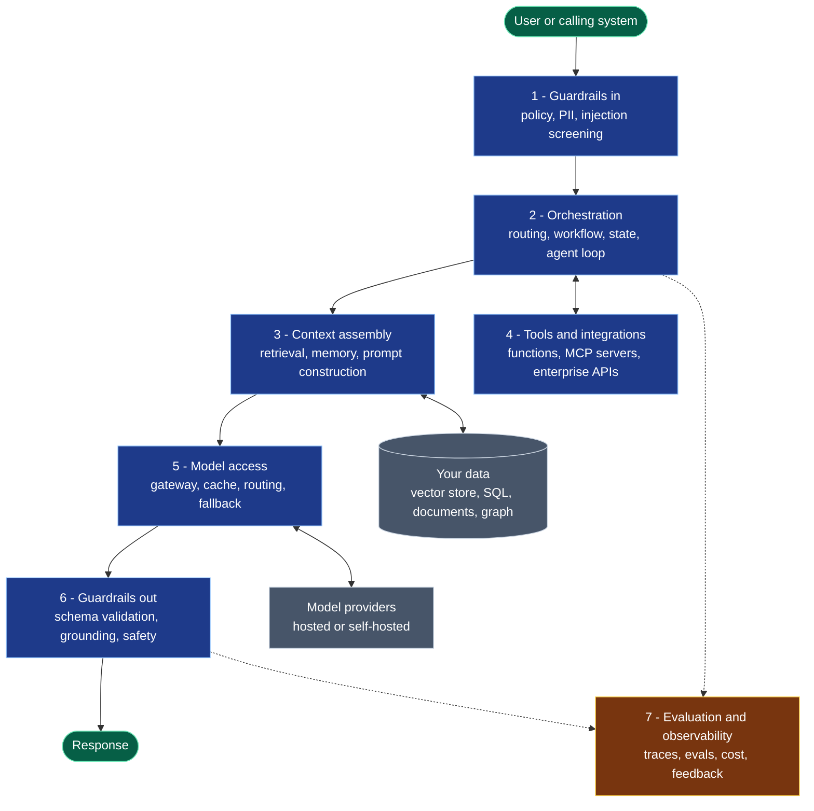
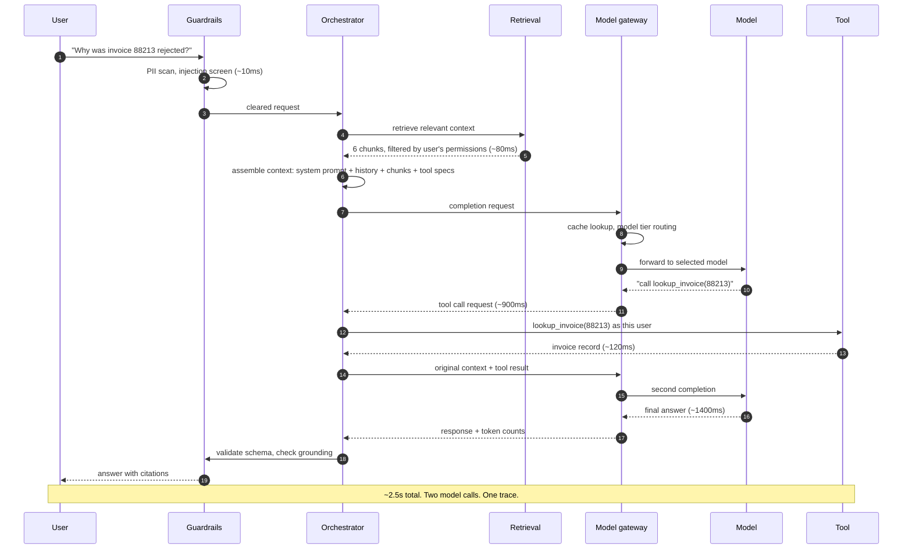
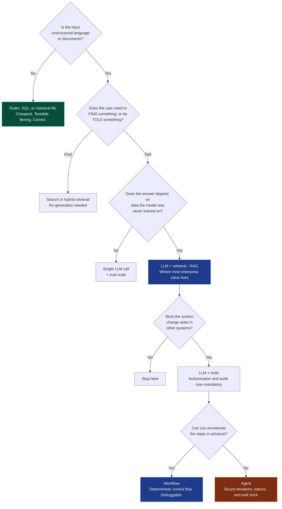

# Chapter 1 — AI Engineering Overview

> **Reading time:** ~40 minutes · **Career weight:** ★★★★★ Essential · **Prerequisites:** none
>
> **In one line:** AI Engineering is the discipline of wrapping a probabilistic component in enough deterministic engineering that the system as a whole behaves predictably.

This is the map chapter. Everything that follows is a zoom-in on one part of it.

---

## 1. Why This Matters

Here is the pattern, and you will see it at every company you work for.

An engineer builds a prototype over a weekend. It reads the company's documents and answers questions about them. It is genuinely impressive — leadership sees it on a Tuesday, and by Friday it is on a roadmap. Then it takes nine months to ship, or it never ships at all.

Nothing about the model changed in those nine months. What changed is that the prototype met reality: documents nobody owns, answers that are wrong in ways nobody can characterise, a cost line that nobody forecast, a security review nobody prepared for, and a fundamental inability to answer the question *"is it working?"* with anything better than an opinion.

The gap between those two states is the entire job.

This matters to you specifically because of where you are standing. You have a decade or more of building systems that stay up. That experience is worth more in AI Engineering than most people entering the field realise — the hard problems here are distributed systems problems, failure-mode problems, observability problems, and cost problems. You have been solving those for years.

But four assumptions you have relied on for that entire decade quietly stop holding, and if you do not notice them breaking, you will design systems that fail in ways your instincts do not predict. This chapter is about noticing.

---

## 2. The Problem

A language model, viewed as a component in your architecture, has four properties that no dependency you have integrated with before combines all at once.

**It is non-deterministic.** The same input produces different output. Not occasionally — routinely. You can reduce variance by setting the sampling temperature to zero, but you cannot eliminate it: floating-point non-associativity across batched GPU inference means even "deterministic" settings drift. Every technique you have for testing, caching, reproducing bugs, and reasoning about correctness assumes `f(x)` returns the same thing twice.

**It fails silently and confidently.** Your systems fail loudly. A database returns an error, a service times out, a queue backs up, a health check goes red. A language model returns HTTP 200, in fluent prose, with a plausible answer that happens to be false. There is no exception to catch. There is no status code for *wrong*. The failure mode looks exactly like the success mode, which means the only way to detect it is to independently evaluate the content of the answer.

**Correctness is a distribution, not a boolean.** Your test suite is binary — it passes or it fails, and you gate merges on it. Ask a model the same question a hundred times and you get ninety-four good answers, four mediocre ones, and two that would embarrass you. "Is this prompt better than the old one?" is a statistical question, answerable only over a population of cases. Which means your CI needs to change shape.

**Cost is coupled to input, not to compute you control.** You are used to cost scaling with instances, storage, and egress — things you provision. Here, cost scales with *tokens*, and tokens scale with how much text you put in and get out. A developer who adds one extra retrieved document to a prompt can raise your monthly bill by 40% without touching infrastructure. An agent that loops can spend more in an afternoon than the rest of the platform spends in a month.

Put those together and the engineering problem is:

> **How do you build a system that behaves predictably out of a component that is non-deterministic, fails silently, cannot be tested with pass/fail assertions, has no memory, has no accountability for correctness, and bills you by the word?**

The answer is not a better model. The answer is architecture. Everything reliable about a production AI system lives *outside* the model: the retrieval that grounds it in your data, the tools that let it act, the evaluation that measures whether it worked, the guardrails that stop it when it goes wrong, and the observability that lets you find out why. That "everything" is the discipline.

---

## 3. Mental Model

Three analogies. The first is the load-bearing one.

### The primary model

> **A language model is a stateless microservice you do not own, operated by a brilliant, extraordinarily well-read contractor with no memory, no access to your systems, no ability to say "I don't know", and a habit of inventing details with complete confidence.**

Unpack each clause, because each one maps to a chapter.

| Clause | What it forces you to build | Chapter |
| --- | --- | --- |
| **Stateless** | Every request re-sends the entire conversation. There is no session on the other end. Memory is something *you* build | 14 |
| **You do not own it** | It is versioned, deprecated, and rate-limited on someone else's schedule. Abstract behind a gateway | 24 |
| **Extraordinarily well-read** | It knows the public internet up to a cutoff date. It does not know your business | 2 |
| **No memory** | Conversation history is an input you manage and pay for, not state it holds | 5, 14 |
| **No access to your systems** | Every action it takes is a function you exposed and authorised | 10, 11 |
| **Cannot say "I don't know"** | It is trained to produce plausible continuations. Abstention is behaviour you must engineer | 3, 22 |
| **Invents details confidently** | Grounding, citation, and validation are not optional features | 7, 22 |

### The disciplinary model

> **AI Engineering is to Machine Learning what backend engineering is to database internals.**

You do not implement a B-tree to build a transactional system. You need to know that indexes exist, roughly how they behave, when they help, and how they fail — then you build systems on top. AI Engineering has the same relationship to model training. You consume the model as an artifact; someone else builds it. Confusing these two is the most common reason experienced engineers think the field is closed to them without a maths degree. It is not.

### The interface model

> **A prompt is an API contract written in prose, and neither side has a compiler.**

There is no type checking, no schema validation at the boundary, no IDE warning when you break it. Change three words and the behaviour changes in ways you did not intend, and nothing tells you until a user complains. This is why prompts are versioned like code, tested like code, and reviewed like code — and why treating them as a text box in a config file is a mistake teams make exactly once.

### Where the analogies leak

Every analogy leaks. Naming the leak is what stops it becoming misleading.

- **Retry does not mean idempotent.** Retrying a failed HTTP call gives you the same resource. Retrying a model call gives you a *different answer* — which is occasionally a legitimate strategy (sample three, take the majority) and occasionally a way to turn one wrong answer into three.
- **The contract is unversioned on their side.** Providers update models behind the same endpoint name. Your "stable dependency" can change behaviour without a deploy on your part. Pin versions explicitly and treat undated model aliases as a production risk.
- **Correctness has no owner.** When Postgres returns the wrong row, that is a bug someone will fix. When a model returns a wrong answer, that is the product working as designed. The accountability sits entirely with you.

---

## 4. Architecture

Almost every production AI system — a support agent, a document pipeline, a coding assistant, a claims triage tool — resolves into the same layers. This is useful for a blunt reason: **a missing layer is almost always where the system fails.**



Blue is the request path — the layers you own. Grey is what you depend on. Amber spans everything.

**Guardrails, inbound.** Everything entering the system is untrusted, including content the user did not write — a pasted email, an uploaded PDF, a web page the system fetched. This layer screens for policy violations, redacts PII before it leaves your boundary, and applies the first line of injection defence. Cheap, fast, and the first thing skipped in a prototype.

**Orchestration.** The control plane. It decides what happens: which workflow runs, what state is carried between steps, whether a tool is called, whether to loop, and when to stop. This is where your actual application logic lives, and where the difference between a *workflow* (steps you defined) and an *agent* (steps the model chooses) is decided. Most systems should be workflows. Chapter 13 argues that point properly.

**Context assembly.** The highest-leverage layer in the stack, and the one most teams underinvest in. It decides what text goes into the model's context window: retrieved documents, conversation history, system instructions, tool descriptions, few-shot examples. Answer quality is dominated by what you put here — far more than by which model you chose. When a system "hallucinates", nine times in ten the real fault is that the correct information was never retrieved.

**Tools and integrations.** How the model reaches your systems: functions it may call, MCP servers, enterprise APIs. This layer is also your entire blast radius. A model that can only produce text is a content risk. A model that can call `refund_customer()` is an operational one.

**Model access.** Not "the model" — *access* to models. A gateway centralising credentials, retries, fallbacks, caching, rate limits, and cost-aware routing between model tiers. Treating this as a layer rather than an SDK import is what lets you swap providers in an afternoon instead of a quarter.

**Guardrails, outbound.** Schema validation, grounding checks (does the answer actually follow from the retrieved sources?), safety filtering, and PII scrubbing on the way out. Critically: **output from a model is untrusted input to everything downstream.** If it reaches a renderer, a shell, a SQL string, or another agent, it needs the same treatment you would give a form field from the public internet.

**Evaluation and observability.** Cross-cutting, and the layer that separates a system from a demo. Traces that capture what actually went into the context window, not just the prompt template. Evaluation suites that gate changes. Cost attribution. Feedback capture joined back to the trace that produced it. Without this layer you are operating a black box and improving it by superstition.

Underneath all of it sits infrastructure you already know how to run: compute, networking, secrets, CI/CD, identity. That part is not new, and it is not where AI projects fail.

> **Read the layers as a checklist.** In an architecture review, walk them in order and ask "who owns this one?" The layer nobody claims is your next incident.

---

## 5. Internal Working

Follow one request through the stack. This is where the abstraction becomes concrete, and where the cost and latency actually go.



Four things this reveals that are not obvious from the outside.

**The model is stateless, so you pay for history twice over.** There is no session. On the second call, the orchestrator resends the entire context — system prompt, conversation, retrieved chunks, tool definitions — *plus* the tool result. Nothing is remembered between calls. In a twenty-turn conversation, the cost of turn twenty includes re-sending turns one through nineteen, which is why long-conversation cost grows roughly quadratically and why context management is a budget discipline, not a formatting concern.

```
# The shape of every "conversation", underneath the SDK
turn_1 = model(system + user_1)
turn_2 = model(system + user_1 + turn_1 + user_2)
turn_3 = model(system + user_1 + turn_1 + user_2 + turn_2 + user_3)
#                ^-- you send, and pay for, all of this every single time
```

**Tool calling is not the model executing anything.** The model does not call your function. It emits a structured request saying it *would like* `lookup_invoice` called with argument `88213`. Your orchestrator decides whether to honour that, executes it under the *user's* authorisation, and feeds the result back as more context. That gap — between the model's request and your execution — is where every authorisation check, policy gate, and human approval lives. It is the single most important control point in agentic systems.

**Latency is dominated by model calls, and they serialise.** Retrieval took 80ms; the two model calls took 2.3 seconds. Each additional reasoning step adds a full round trip that cannot be parallelised, because step *n+1* depends on the output of step *n*. This is why an agent that takes eight steps takes fifteen seconds, and why "just let the agent figure it out" is a latency decision as much as an architectural one.

**One request, one trace.** Notice that a single user question produced two model calls, one retrieval, one tool execution, and two guardrail passes. When the answer is wrong, "the model hallucinated" is not a diagnosis — the fault could be in retrieval (wrong chunks), permissions (correct chunk filtered out), context assembly (right chunk, buried in the middle where attention is weakest), the tool (stale data), or generation. Without a trace capturing all of it, you cannot tell these apart, and you will spend your time tuning prompts to fix retrieval bugs.

---

## 6. Engineering Decisions

### Why does this discipline exist?

Until roughly 2020, getting a language capability into a product meant an ML project: collect data, label it, train a model, deploy it, monitor for drift. Months of work, a specialist team, and a model that did one thing.

Foundation models collapsed that. Broad language capability became an API call. The scarce skill moved — from *creating* capability to *integrating it safely, cheaply, and verifiably into systems that already exist*. That is a software engineering problem, and it needed a name.

The corollary matters for your career: the bottleneck in enterprise AI is not model quality. Models are, for most business tasks, already good enough. The bottleneck is engineering — retrieval quality, evaluation discipline, security posture, cost control, and integration with systems built over twenty years. Which is precisely the work you have been doing.

### Where AI Engineering sits

| Discipline | Owns | Typical artifact | Starts when |
| --- | --- | --- | --- |
| **Data Science** | Answering business questions | Analysis, dashboard, memo | There is data and a question |
| **ML Engineering** | Training and serving custom models | Trained model, feature store, retraining pipeline | You have proprietary data and need a prediction |
| **MLOps / AI Platform** | The paved road others build on | Gateway, eval harness, tracing, governance | Several teams are doing this independently |
| **AI Engineering** | Products built on models that already exist | RAG pipeline, agent, copilot, eval suite | The model exists and needs to become a product |

The tell in a job description: PyTorch, distributed training, drift monitoring, and feature stores mean ML Engineering. Retrieval, evals, agents, vector stores, and prompt versioning mean AI Engineering.

### What alternatives exist?

Every AI project has at least four alternatives, and one of them is usually correct.

| Alternative | When it wins | Why teams skip it |
| --- | --- | --- |
| **Do nothing** | The process works and nobody is complaining | Nobody gets promoted for it |
| **Deterministic software** | The rules are enumerable and stable | Less interesting than the alternative |
| **Classical ML** | You have labels and need a score, rank, or forecast | Requires data work nobody wants to fund |
| **Buy a product** | The capability is generic — transcription, OCR, support deflection | "We're an engineering company" |

If a rule, a SQL query, or a search index solves the problem, use it. A deterministic solution is faster, cheaper, testable, explainable, and does not need an evaluation suite, a guardrail layer, or a security review. Reaching for a language model when `WHERE status = 'REJECTED'` would do is not innovation, it is expense.

### What AI Engineering actually solves

**It genuinely solves:** unstructured input at scale (documents, tickets, transcripts, emails); tasks where the rules are too numerous or too fuzzy to enumerate; natural-language interfaces to existing systems; and any process where a human currently reads text and writes a judgement.

**It is wrongly believed to solve:** arithmetic and aggregation (use a tool — the model should query, not calculate); problems where nobody has defined what "correct" means; bad data (retrieval over a poorly-governed document store returns confidently-cited garbage); and organisational dysfunction, which no technology has ever solved.

---

## 7. Decision Matrix

### Should this problem use an LLM?

| | |
| --- | --- |
| ✅ **YES if** | Input is unstructured language, images, or documents · Output tolerates variation in wording · A wrong answer is recoverable or human-reviewed · A person currently does this by reading and writing · The rules are too fuzzy to enumerate |
| ❌ **NO if** | The answer must be exactly reproducible · A wrong answer is unrecoverable and unreviewed · A deterministic rule already works · The task is arithmetic, aggregation, or a query · Nobody can define "correct" · Latency budget is under ~200ms |
| ⚠️ **It depends on** | Whether you can produce an evaluation set. If nobody can give you 50 examples with agreed-correct answers, the project is not ready — regardless of technology |

### The escalation ladder

Start at the bottom. Climb only when you can say precisely why the rung below fails. Every rung upward buys capability with latency, cost, non-determinism, and a new class of failure.



Green is the answer nobody finds exciting and everybody underuses. Most enterprise value sits in the blue boxes. Most enterprise disappointment comes from starting in the orange one.

The expanded version of this matrix, with the four discovery questions that kill bad projects in week one, is in [decision-matrices/do-you-need-an-llm.md](../decision-matrices/do-you-need-an-llm.md).

---

## 8. Technology Landscape

The ecosystem, by category. What each layer is for, not how to call it. Names are illustrative of a category, not endorsements — and this section ages fastest, so treat it as a map of *shapes*, not a shopping list.

| Category | Purpose | Representative options | Choose on |
| --- | --- | --- | --- |
| **Frontier model APIs** | General capability, no infrastructure | OpenAI, Anthropic, Google Gemini | Capability per pound, latency, data-handling terms |
| **Cloud AI platforms** | Models inside your existing cloud boundary and billing | AWS Bedrock, Google Vertex AI, Azure AI Foundry | Data residency, procurement, existing commitment |
| **Open-weight models** | Control, privacy, no per-token cost | Llama, Mistral, Qwen, DeepSeek | Whether you can run GPUs well enough to beat API pricing |
| **Inference servers** | Self-hosted serving at throughput | vLLM, TGI, SGLang, Ollama (local dev) | Throughput per GPU, batching, quantisation support |
| **LLM gateways** | One control point for keys, retries, fallback, routing, cost | LiteLLM, Portkey, cloud-native gateways | Whether you will ever use more than one provider. You will |
| **Orchestration frameworks** | Workflow, state, agent loops | LangGraph, provider agent SDKs, CrewAI, Semantic Kernel | Complexity of your control flow — see Part V |
| **Retrieval and vector storage** | Grounding answers in your data | pgvector, Elasticsearch, Pinecone, Qdrant, Weaviate, Milvus | Whether you need a new datastore at all — often you do not |
| **Data / indexing frameworks** | Ingestion, chunking, parsing, index construction | LlamaIndex, Unstructured, Docling | Document variety. PDFs are harder than everyone expects |
| **Evaluation** | Deciding whether a change made things better | Braintrust, Ragas, DeepEval, promptfoo, OpenAI Evals | Integration with your CI, not feature count |
| **Observability and tracing** | Seeing what actually happened | LangSmith, Langfuse, Arize Phoenix, Datadog LLM Observability | Whether it emits OpenTelemetry. Lock-in here is painful |
| **Guardrails** | Enforcing boundaries on input and output | NeMo Guardrails, Guardrails AI, Bedrock Guardrails, Azure AI Content Safety | Latency added per call, and whether policies are testable |
| **Protocols** | Interoperability instead of bespoke glue | MCP (tools and data), A2A (agent to agent), OpenTelemetry GenAI (telemetry) | Adopt protocols early; they outlive frameworks |

Three observations that will save you time.

**The gateway is the highest-value early investment.** It is a thin layer, it takes days, and it buys you provider portability, cost attribution, caching, and a single place to enforce quotas. Teams that skip it end up with provider SDK calls scattered through forty services and a migration project when pricing or terms change.

**Protocols outlive frameworks.** MCP and the OpenTelemetry GenAI conventions are bets on interoperability. Frameworks are bets on a vendor's abstraction surviving contact with your requirements. Weight your commitments accordingly.

**You probably do not need a new database.** If you already run Postgres or Elasticsearch, they do vector search well enough for the overwhelming majority of workloads. "We need a vector database" is a conclusion, not a starting position. Chapter 8 makes the case in detail.

> Reviewed quarterly. If something here looks stale, [open an issue](../CONTRIBUTING.md).

---

## 9. Production Notes

### Security

The category that has no equivalent in your previous work is **prompt injection**. Instructions and data travel in the same channel — there is no `PreparedStatement` for prompts, and no known complete fix. Any untrusted text that reaches the context window (a support ticket, a PDF, a web page, a code comment) can attempt to redirect the model's behaviour.

The practical control is not a cleverer system prompt. It is architectural: keep untrusted content away from tools that have side effects, or put a policy check or a human between them. Simon Willison's "lethal trifecta" is the cleanest formulation — danger appears when a system combines *access to private data*, *exposure to untrusted content*, and *the ability to communicate externally*. Remove any one leg and the exfiltration path closes.

Two more that catch teams out: **authorisation must be enforced at retrieval**, filtering documents by the requesting user's permissions rather than trusting the model to be discreet about what it read. And **model output is untrusted input** to everything downstream — renderers, shells, SQL builders, and other agents.

### Scaling

Model providers rate-limit by tokens per minute, not requests per second, so your capacity planning is in an unfamiliar unit. Long generations occupy a slot for seconds, so concurrency behaves more like long-polling than like a typical REST service.

Keep the reasoning core **stateless** and hold conversation state in an external store — then the layer you scale is ordinary and your existing playbooks apply. For anything long-running, move to an **asynchronous** pattern with a queue and status polling; multi-step agent workflows routinely exceed synchronous HTTP timeouts, and discovering that in production is a bad afternoon.

### Observability, logging, and tracing

The unit of observability is the **trace**, not the log line. One user request fans out into retrieval, several model calls, and tool executions; only a trace ties them together.

Capture, per request: the **fully-assembled context** (not the prompt template — the actual text sent, including retrieved chunks), model and prompt versions, token counts in and out, latency per step, tool calls with arguments and results, guardrail triggers, and computed cost. Use the [OpenTelemetry GenAI semantic conventions](https://opentelemetry.io/docs/specs/semconv/gen-ai/) so this data is portable rather than trapped in one vendor's UI.

Two things engineers consistently regret not doing on day one: **logging the assembled context** (without it, a wrong answer from three weeks ago is undebuggable), and **capturing user feedback joined to the trace** (it becomes your evaluation dataset, and it is the only quality signal that reflects reality).

Retention deserves an explicit decision. Traces contain user data — often the most sensitive text in your system — so they inherit your PII, retention, and deletion obligations.

### Failure scenarios

| Failure | What you see | Mitigation |
| --- | --- | --- |
| Provider outage or 429 | Elevated errors, latency spikes | Gateway-level fallback to a second provider or tier |
| Silent model update | Behaviour changes with no deploy | Pin dated model versions; eval suite in CI catches drift |
| Retrieval returns nothing useful | Confident, wrong, uncited answers | Grounding check; abstain and say so rather than generate |
| Context overflow | Truncation, or the middle of the context ignored | Budget context explicitly; rank and trim before assembling |
| Runaway agent loop | Cost and latency spike, no output | Hard caps on iterations, tokens, and wall-clock time |
| Prompt injection | Unexpected tool calls, data leaving the system | Isolate untrusted content from side-effecting tools |
| Tool failure | Model improvises around the missing result | Return explicit structured errors; never a silent empty response |

The governing principle: **a production AI system degrades, it does not collapse.** A cheaper model, a cached answer, or an honest "I can't help with that, here is a human" all beat a timeout.

### Cost

Model your cost per request before you build, not after the first invoice:

```
cost ≈ (input_tokens × input_rate) + (output_tokens × output_rate)

# Non-obvious multipliers:
#   × conversation length  (history is resent every turn)
#   × agent iterations     (each loop is a full round trip)
#   × retry and self-critique passes
#   ÷ cache hit rate       (the only term that helps you)
```

Output tokens typically cost several times more than input tokens, so verbosity is expensive at both ends. The three levers that matter, in order of impact: **caching** (a hit costs nothing), **model tiering** (default to the cheapest model that passes your eval suite and escalate only when needed — most traffic does not need the frontier tier), and **context discipline** (every retrieved chunk you include is paid for on every turn it survives).

Enforce per-tenant and per-feature token quotas at the gateway. Without them, one runaway loop or one enthusiastic customer can consume a quarter's budget. And instrument cost attribution by feature, tenant, and route from day one — finding out *where* the money went after the invoice arrives is an archaeology project.

---

## 10. Best Practices

**Build the evaluation set before you optimise anything.** Fifty representative cases with agreed-correct answers, including the hard ones. Without it, every prompt change is a coin flip and nobody can sign off on quality. This is the highest-return hour you will spend on any AI project, and it is the one teams defer.

**Start deterministic and escalate deliberately.** Rules, then search, then a single model call, then retrieval, then tools, then a loop. Every rung up buys capability with debuggability. Never skip a rung because the one above is more interesting.

**Put a gateway in front of models from the first week.** One place for credentials, retries, fallback, caching, quotas, and cost attribution. Days of work, and it makes the model a replaceable component rather than a structural dependency.

**Version prompts like code and pin model versions explicitly.** Prompts belong in version control, in code review, and in your trace metadata. Undated model aliases are a production risk — your dependency should not change behaviour without a deploy on your side.

**Keep the reasoning core stateless.** State lives in an external store you control. Everything about scaling, restarting, and debugging gets easier.

**Log the assembled context, not the template.** The question you will actually need to answer is "what exactly did the model see when it produced this?"

**Design the degraded path before the happy path.** Decide now what the system does when the provider is down, retrieval is empty, or the guardrail fires. If you leave it, the default behaviour will be a timeout.

**Default to the cheapest model that passes your evals.** Reserve frontier models for the requests that genuinely need them. This is usually a 3–10× cost difference for a quality difference your users cannot detect.

**Ship with a human in the loop, and remove them with data.** Start with review on high-consequence actions. Measure the override rate. When it is low enough for long enough, automate — and keep sampling.

**Make the system able to say "I don't know."** Abstention is a feature, and it is the difference between a tool people trust and one they quietly stop using.

---

## 11. Common Mistakes

Seen repeatedly, across organisations and industries.

| Mistake | What it looks like | Do this instead |
| --- | --- | --- |
| **Framework first** | Week one is spent choosing between LangGraph and CrewAI | Understand the problem. The framework decision is easy afterwards and irrelevant if the answer is "a workflow" |
| **Vibes-driven development** | "This prompt feels better." Quality is whatever the last demo showed | Build the eval set. Measure. Gate merges on it |
| **Blaming the model** | "It hallucinates" becomes the standing explanation | Open the trace. Check what was retrieved. Nine times in ten it is retrieval, not generation |
| **Agent when a workflow would do** | Non-deterministic control flow for a process with four known steps | If you can draw the flowchart, code the flowchart |
| **Bigger context instead of better retrieval** | "Just put all the documents in, the window is huge now" | Attention is not uniform across a long context. Retrieve well, then trim |
| **Trusting model output** | Output flows into a renderer, a shell, or another agent unvalidated | Validate schema, check grounding, escape on render. Treat it as user input |
| **Demo-driven scoping** | The prototype answers ten questions beautifully; the requirement was ten thousand | Scope against a representative sample from day one, including the ugly cases |
| **No cost model until the invoice** | Pilot costs nothing; production costs £40k/month | Estimate tokens × volume during design. Instrument attribution before launch |
| **One metric for quality** | A single accuracy number that nobody trusts | Measure per failure mode: retrieval quality, grounding, format compliance, refusal correctness |
| **Skipping the gateway** | Provider SDK calls in forty services | Abstract behind a gateway before the second service |
| **Ignoring the boring option** | An LLM doing something a SQL query does better | Ask "what would this look like without AI?" and mean it |
| **Treating security as a filter** | A system prompt that says "ignore malicious instructions" | Prompt injection is an architecture problem. Separate untrusted content from side-effecting tools |

---

## 12. Forward Deployed Engineer Notes

The FDE role is where AI Engineering meets an organisation that has twenty years of accumulated systems, politics, and constraints nobody wrote down. This section appears in every chapter. Here is the general shape.

### Real customer problems

What customers actually say, and what it means:

| They say | They mean | What you should probe |
| --- | --- | --- |
| "We need an AI strategy" | Someone senior read something | Which process is expensive because a human reads text? |
| "We want an agent" | They saw a demo | What decision must it make that you cannot pre-define? |
| "We want to use our data" | Real, but entirely unscoped | Which questions? Whose documents? Who may see them? |
| "It's not accurate enough" | Almost always retrieval or context | Show me the trace for one failing case |
| "Our competitor launched a copilot" | Feature anxiety | What do your users spend too long on today? |

### Discovery questions for week one

The five that change the shape of the engagement:

1. **"Show me fifty examples with the correct answers."** If they cannot, you have a requirements problem, not an AI problem. This question alone ends more doomed projects than anything else you can ask.
2. **"What happens when it is confidently wrong, and who is accountable?"** If the answer is "that would be catastrophic" and there is no human in the loop, the scope must change.
3. **"Where does this data live, who owns it, and how stale is it?"** The answer is usually four systems, one of which is a SharePoint nobody has curated since 2019.
4. **"What must never leave your network?"** This determines your entire deployment topology and is expensive to discover in month three.
5. **"Who decides this is good enough to ship, and against what bar?"** If there is no named person and no threshold, you will pilot forever.

### Architecture decisions you will make on site

- **Deployment topology.** Hosted API, cloud-native platform (Bedrock/Vertex/Foundry), or fully self-hosted. Data residency and procurement usually decide this before engineering gets a vote.
- **Where retrieval lives.** Extend the search infrastructure they already run, or introduce a vector store. Adding a datastore to an enterprise estate is a political act as much as a technical one.
- **Identity propagation.** How does the end user's authorisation reach the retrieval filter and the tool call? Get this wrong and you have built a data-leak engine with a chat interface.
- **Human-in-the-loop placement.** Which actions require approval, and how does approval reach the person? This is usually the difference between "approved for production" and "approved for pilot indefinitely."
- **Who operates it after you leave.** Design for the team that will inherit it, not for the one you wish they had.

### Integration challenges

The estate is where prototypes die. Expect: legacy SOAP or mainframe interfaces with no test environment; document stores with no consistent access model; SSO integration that takes six weeks; egress restrictions that block the model provider entirely; a change advisory board that meets fortnightly; and a data classification policy that nobody can produce in writing but everybody enforces.

Budget more time for integration and approvals than for the AI work. On most engagements it is the larger half.

### Build vs buy

| Build | Buy |
| --- | --- |
| The workflow is your differentiator | The capability is generic — transcription, OCR, translation, support deflection |
| Deep integration with proprietary systems | A vendor already integrates with their stack |
| Data cannot leave the boundary | Compliance is satisfied by the vendor's certifications |
| You have a team to operate it for years | You do not, and pretending otherwise is how orphaned systems happen |

The honest version: buy the commodity layers (guardrails, observability, evaluation tooling, gateways) and build the layer that encodes your customer's specific business logic. Teams that build their own tracing infrastructure have chosen a hobby, not a differentiator.

### Production checklist

Before go-live, all of these must be true. The full version is in [templates/PRODUCTION_READINESS_CHECKLIST.md](../templates/PRODUCTION_READINESS_CHECKLIST.md).

- [ ] Golden dataset exists, threshold agreed with a named business owner
- [ ] Eval suite runs in CI and blocks regressions
- [ ] Model versions pinned; a provider update cannot silently change behaviour
- [ ] End-to-end tracing, queryable weeks later, with assembled context captured
- [ ] Cost per request measured, quotas enforced per tenant and per feature
- [ ] Authorisation enforced at retrieval, not delegated to the model
- [ ] Prompt injection threat model written for every untrusted input path
- [ ] Degraded path defined and tested: provider down, retrieval empty, guardrail fired
- [ ] Rollback is a config change, not a redeploy
- [ ] Runbook exists and on-call can read a trace
- [ ] A named human owns quality, with a review cadence

### Enterprise considerations

Procurement and legal will ask questions engineering does not anticipate: where is data processed, is it used for training, what is the retention period, which sub-processors are involved, what happens on contract termination. Have the answers before the meeting.

Regulated customers will map your system onto a framework — NIST AI RMF, ISO/IEC 42001, or the EU AI Act's risk tiers. You do not need to be a compliance expert, but knowing the vocabulary shortens these conversations from months to weeks. And in the EU, whether a system is classified "high risk" changes its obligations substantially; that classification conversation should happen in discovery, not in legal review.

---

## 13. Career Notes

**Importance: ★★★★★ Essential.** This is the framing every other topic hangs from. An engineer who can articulate the layered architecture and reason about which layer a problem belongs to is immediately distinguishable from one who has read framework tutorials.

**In interviews.** AI Engineering interviews in 2026 are systems design interviews with a probabilistic component, not ML theory exams. The most common opener is some variant of *"design an AI assistant over our internal documentation."* Strong candidates answer in layers, raise evaluation before being asked, and name failure modes as design inputs. Weak candidates start naming frameworks.

Three behaviours correlate with senior offers, consistently:

1. **Raising evaluation unprompted.** The clearest seniority signal in the field. Junior answers describe what to build; senior answers describe how you would know it works.
2. **Arguing against AI for a specific use case.** Demonstrates judgement rather than enthusiasm.
3. **Localising a failure.** Given "the answer was wrong", asking to see what was retrieved rather than proposing a prompt change.

**In enterprise projects.** This vocabulary is what you use with architecture review boards, risk committees, and sceptical principal engineers. The layered model in particular is the fastest way to move a conversation from "AI is magic" or "AI is nonsense" to "which layer are we discussing?"

**Signal of seniority.** A senior engineer talks about the system; a junior talks about the model. When something goes wrong, the junior reaches for the prompt and the senior reaches for the trace.

---

## 14. One Minute Summary

> **If you remember one thing: the model is the easy part. AI Engineering is wrapping a probabilistic component in enough deterministic engineering that the system behaves predictably.**

- **Four assumptions break:** determinism, loud failure, binary correctness, and cost you control. Everything else you know still applies.
- **Every production AI system has the same layers** — guardrails, orchestration, context assembly, tools, model access, evaluation and observability. The layer nobody owns is where it will fail.
- **Context assembly is the highest-leverage layer**, and the most underinvested. Most "hallucinations" are retrieval failures wearing a disguise.
- **Evaluation is what makes this engineering** rather than guesswork. Without it, every change is a coin flip.
- **Escalate deliberately** — rules, search, one model call, retrieval, tools, agent. Most value sits in the middle; most disappointment comes from starting at the top.
- **Your distributed systems experience is the asset here.** The scarce skill in this field is not prompting. It is knowing what happens at 3am.

---

## 15. Interview Questions

Conceptual, as asked in real loops. If you can answer all of these clearly, you are ready for Chapter 2.

1. What distinguishes AI Engineering from ML Engineering, and where does the boundary sit in practice?
2. A stakeholder asks for an AI feature. What do you ask before agreeing it should use a language model?
3. Walk through the layers of a production AI system. Which one do teams most often underinvest in, and what happens as a result?
4. A user reports a wrong answer. Describe how you would localise the fault.
5. Why can't you test an AI system with conventional unit tests, and what replaces them?
6. What does it mean that a language model is stateless, and what does that imply for cost in a long conversation?
7. When a model requests a tool call, what has actually happened? Why does that distinction matter for security?
8. Give an example of a problem that looks like it needs AI but should not use it. Justify the alternative.
9. Why is prompt injection not solvable with a better system prompt? What controls actually work?
10. How would you estimate the cost per request of an AI feature during design, before writing code?
11. What is the difference between a workflow and an agent, and how do you decide which one a problem needs?
12. Your team wants to switch model providers. What determines whether that takes a day or a quarter?
13. What should a trace capture for an AI request that a conventional HTTP trace would not?
14. A provider silently updates a model behind the same endpoint. How does your system find out?
15. What does "the system should degrade rather than collapse" mean for an AI feature specifically?

---

## References

**Foundational engineering writing**

- [Anthropic — Building Effective Agents](https://www.anthropic.com/engineering/building-effective-agents) — the clearest published statement of workflows versus agents. Read it before Part IV.
- [Anthropic — Effective Context Engineering for AI Agents](https://www.anthropic.com/engineering/effective-context-engineering-for-ai-agents)
- [Chip Huyen — Building a Generative AI Platform](https://huyenchip.com/2024/07/25/genai-platform.html) — the layered architecture, argued from first principles.
- [Hamel Husain — Your AI Product Needs Evals](https://hamel.dev/blog/posts/evals/) — why evaluation is the discipline, not a phase.
- [Eugene Yan — Patterns for Building LLM-based Systems and Products](https://eugeneyan.com/writing/llm-patterns/)
- [a16z — Emerging Architectures for LLM Applications](https://a16z.com/emerging-architectures-for-llm-applications/) — dated now, but the reference architecture that shaped the vocabulary.

**Official documentation**

- [OpenAI Platform Documentation](https://platform.openai.com/docs)
- [Anthropic Documentation](https://docs.anthropic.com/)
- [Google Cloud — Generative AI on Vertex AI](https://cloud.google.com/vertex-ai/generative-ai/docs)
- [AWS Bedrock Documentation](https://docs.aws.amazon.com/bedrock/)
- [Microsoft Azure AI Foundry](https://learn.microsoft.com/azure/ai-foundry/)

**Specifications and standards**

- [Model Context Protocol](https://modelcontextprotocol.io) — the tool and data integration standard.
- [OpenTelemetry GenAI Semantic Conventions](https://opentelemetry.io/docs/specs/semconv/gen-ai/) — adopt these before choosing an observability vendor.
- [OWASP Top 10 for LLM Applications](https://genai.owasp.org/) — the security baseline.
- [NIST AI Risk Management Framework](https://www.nist.gov/itl/ai-risk-management-framework) — the vocabulary your risk committee uses.

**Security**

- [Simon Willison — The Lethal Trifecta](https://simonwillison.net/2025/Jun/16/the-lethal-trifecta/) — the most useful mental model for agentic security risk.

**Papers that changed practice**

- [Retrieval-Augmented Generation for Knowledge-Intensive NLP Tasks](https://arxiv.org/abs/2005.11401) (2020) — named the pattern carrying most enterprise AI value.
- [ReAct: Synergizing Reasoning and Acting in Language Models](https://arxiv.org/abs/2210.03629) (2022) — the loop underneath every agent framework.
- [Lost in the Middle: How Language Models Use Long Contexts](https://arxiv.org/abs/2307.03172) (2023) — why a bigger context window is not a substitute for good retrieval.

---

[Table of Contents](../SUMMARY.md) · **Next: Chapter 2 — LLM Fundamentals** *(not yet published — see [ROADMAP.md](../ROADMAP.md))*
