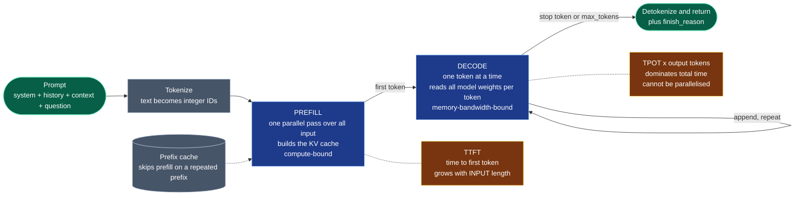

# Chapter 2 — LLM Fundamentals

> **Reading time:** ~40 minutes · **Career weight:** ★★★★★ Essential · **Prerequisites:** [Chapter 1](01-ai-engineering-overview.md)
>
> **In one line:** A language model is a function from text to a probability distribution over the next token, called in a loop — and almost every production behaviour that surprises you follows from that one sentence.

---

## 1. Why This Matters

You are going to be asked "why did it do that?" more often than any other question, by product managers, by customers, and by yourself at 2am. You need to be able to answer it.

Four incidents, all real, all traceable to a missing fundamental:

- A team ships structured extraction. It works for months, then starts returning malformed JSON for roughly 3% of requests. Nobody changed anything. **They never monitored `finish_reason`** — those responses were hitting the output token limit and being truncated mid-object.
- A RAG system gets *better* retrieval and *worse* answers. The team adds more retrieved documents, quality drops, and they blame the model. **Attention dilutes as context grows**; they made the haystack bigger while making the needle no easier to find.
- A team sets `temperature=0` for reproducibility, builds a regression suite around exact-match assertions, and watches it fail intermittently in CI. **Temperature zero is not determinism**, and the reason has nothing to do with their code.
- A feature launches in Germany and the per-request cost is 60% higher than the UK pilot with identical traffic. **German tokenizes worse than English.** Same words, more tokens, more money.

None of these require knowing how a transformer works mathematically. All of them require knowing what a token is, what the loop does, and where the money and time actually go.

This is also the chapter that inoculates you against the two failure modes engineers fall into when they enter this field. The first is treating the model as magic — you cannot debug magic, so you tune prompts by superstition. The second is going too deep, spending three months on attention mechanisms and backpropagation, and arriving at production still unable to explain why the answer got truncated. Neither produces a working engineer.

There is a middle layer that is *predictive*: enough mechanism that you can anticipate behaviour in situations this chapter never mentions. That layer is small. It fits in one chapter.

---

## 2. The Problem

You need a mental model of the model.

Not a mathematical one. A **predictive** one — the kind you already have for databases. You do not know how Postgres implements a hash join, but you know roughly what it costs, when the planner will choose it, and why your query got slow when the table grew. That knowledge is what lets you debug a system you did not write.

You have no equivalent for language models. Without it, every unexpected behaviour looks like the same undifferentiated problem: "the model did something weird." With it, the same behaviours separate cleanly into distinct causes with distinct fixes.

The whole of that model rests on five things:

1. **Tokens** — the unit the model actually operates on, and the unit you are billed in
2. **Next-token prediction** — the only operation the model performs
3. **The context window** — the model's entire world, and why bigger is not better
4. **Sampling** — how a probability distribution becomes one specific word
5. **Prefill and decode** — the two-phase economics that explain your latency and your bill

Everything else in this playbook is built on top of these. If a later chapter ever feels like arbitrary convention, the reason is almost always here.

---

## 3. Mental Model

> **A language model is a pure function from a sequence of tokens to a probability distribution over the next token. That function is called in a loop, one token at a time. There is nothing else.**

That is genuinely the whole mechanism. Written out, the entire behaviour of every chatbot, agent, and copilot you have ever used:

```
tokens = tokenize(everything_you_sent)

while True:
    distribution = model(tokens)        # scores for every token in the ~200k vocabulary
    next_token   = sample(distribution) # pick one
    if next_token == STOP: break
    tokens.append(next_token)           # <-- the only memory that exists
```

Look at the last line. The only thing carried between iterations is the growing token list. There is no hidden state, no session, no accumulating understanding. **The model's entire world is the token list you hand it.** That single fact explains statelessness, why conversation history must be resent every turn, why context is a budget, and why "memory" is a system you build rather than a feature you enable.

### The analogy

> **It is autocomplete that has read everything.**

Facile, but precise in the way that matters. Your phone's keyboard predicts the next word from the last few. This predicts the next token from the last two hundred thousand, having been trained on a substantial fraction of written human output. The *mechanism* is the same. Scale changed the quality beyond recognition; it did not change the operation.

For engineers, the more useful framing is a **pure function**: no side effects, no internal state, same conceptual signature every call. The conversation is entirely your construction, assembled client-side and re-sent — statelessness pushed to the caller, exactly like HTTP before cookies.

### What this immediately explains

Hallucination stops being mysterious. The model is not looking anything up and failing. It is doing what it always does — producing a plausible continuation — in a region where plausibility and truth happen to diverge. A confident, fabricated case citation is not the mechanism breaking. **It is the mechanism working exactly as designed on input where the pattern does not correspond to a fact.** There is no internal state that distinguishes "recalling" from "inventing", which is why you cannot fix hallucination by asking the model to be more careful, and why grounding it in retrieved sources works.

### Where the analogy leaks

**"It's just autocomplete" understates what emerges at scale.** Predicting the next token well enough, over a large enough corpus, requires representations that support translation, code synthesis, and multi-step deduction. Dismissing the capability because the mechanism is simple is as wrong as being mystified by it. Hold both: simple mechanism, genuinely surprising capability.

**Reasoning models complicate the picture without changing it.** Models with extended thinking generate a long chain of intermediate tokens before the visible answer. It looks like deliberation. Mechanically it is the same loop — the model is conditioning its final answer on tokens it generated itself, which measurably improves multi-step accuracy. You pay for every one of those hidden tokens at output rates. Same loop, more iterations, bigger invoice.

**Chat is a fiction, and a useful one.** There is no "assistant" on the other end. There is a text format with role markers that the model was trained to continue. Understanding that chat is a convention rather than a capability is what makes the mechanics of context and memory obvious later.

---

## 4. Architecture

One request, two phases with completely different performance characteristics. This diagram explains your latency graph, your bill, and why prompt caching works.



**Prefill** reads your entire prompt in a single parallel pass and builds the KV cache — the intermediate state that lets later tokens attend to earlier ones without recomputing them. It is *compute-bound*, and it is the reason a long prompt makes you wait before anything appears.

**Decode** then generates one token at a time. Each step reads the full set of model weights out of GPU memory to produce a single token, which makes it *memory-bandwidth-bound* rather than compute-bound. The steps are strictly sequential — token *n+1* cannot start until token *n* exists.

Three consequences follow directly, and they are the practical payload of this chapter:

**Input is cheap, output is expensive.** Prefill processes thousands of input tokens in one pass; decode pays a full weight-read per output token. That asymmetry is why providers price output tokens several times higher than input — commonly around 4–8×. Verbosity costs you at both ends: in money, and in the latency your user actually feels.

**Long prompts hurt TTFT; long answers hurt everything else.** These are separate problems with separate fixes, and conflating them means tuning the wrong thing. If the first word is slow, look at prompt length. If the stream crawls, look at output length and concurrency. A 500-token answer at 80ms per token is 40 seconds of decode; the 200ms of prefill is noise beside it.

**Prompt caching is a real architectural lever, not a micro-optimisation.** If a request shares a *prefix* with a recent one — the same system prompt, the same tool definitions, the same retrieved documents — the provider can reuse that portion of the KV cache and skip re-prefilling it, typically at a large discount. This is why prompt layout matters: **put the stable content first and the variable content last.** Reordering a prompt so the changing part is at the end can cut cost and TTFT substantially, and costs you nothing.

---

## 5. Internal Working

### Tokens are not words

The model has a fixed vocabulary, typically 100,000–200,000 entries, of subword fragments. Text is split into these before the model sees it, and the model never sees characters at all.

Rough English figures worth memorising: **~4 characters per token, ~0.75 tokens per word.** A 500-word page is roughly 650 tokens. Use these to sanity-check a cost estimate in your head during a meeting; use the provider's real tokenizer when it matters.

The uneven parts are where the engineering lives:

| Content | Tokenizes | Consequence |
| --- | --- | --- |
| Common English | Efficiently | Your baseline |
| German, Japanese, Hindi, Arabic | 1.5–3× worse | Same feature, materially higher cost per user in other markets |
| Code, JSON, XML | Poorly — punctuation and indentation each cost tokens | Structured output is more expensive than it looks |
| UUIDs, hashes, base64 | Terribly — near one token per few characters | Never put raw identifiers in a prompt you can avoid |
| Whitespace and formatting | Real tokens | Pretty-printed JSON costs more than compact JSON |

This also explains a class of behaviour that looks like stupidity and is actually blindness. Ask a model how many times a letter appears in a word and it may miscount, because **it cannot see letters** — it sees a handful of subword fragments. Frontier models now answer the famous examples correctly because those examples are in their training data, which is worth understanding precisely: the specific question was memorised, the underlying limitation was not removed. Character-level manipulation, exact string surgery, and counting are tasks to hand to a tool, permanently.

Multilingual cost asymmetry deserves a flag of its own for enterprise work. If you are pricing a product for a global rollout, per-request cost is not uniform across markets, and nobody discovers this before the second invoice.

### One distribution per step

At every step the model produces a score (a *logit*) for every token in its vocabulary, converted to a probability distribution. Given `The capital of France is`, the distribution might put 0.94 on ` Paris`, 0.02 on ` a`, 0.01 on ` the`, and spread the remainder across the other 199,997 possibilities.

Two things follow. First, **the model always has an answer** — the distribution always sums to one, and something always wins. There is no null. Abstention is not a state the model can enter; it is a behaviour that must be trained or engineered in. Second, **the distribution shape is information you are usually throwing away.** A 0.94-on-one-token distribution and a 0.31/0.29/0.27 distribution represent very different levels of confidence, and some providers expose these as log-probabilities. It is an underused signal for routing uncertain cases to a human.

### Sampling: how a distribution becomes a word

| Parameter | What it actually does | Practical setting |
| --- | --- | --- |
| **temperature** | Reshapes the distribution before sampling. Below 1 sharpens it toward the top candidate; above 1 flattens it | 0–0.2 for extraction, classification, structured output. 0.7–1.0 where variation is wanted |
| **top_p** (nucleus) | Samples only from the smallest set of tokens whose probabilities sum to *p* | Leave at 1 if you are using temperature. Tuning both at once makes the effect uninterpretable |
| **max_tokens** | Hard stop on output length | Set it deliberately, and **monitor when you hit it** |
| **stop sequences** | Strings that end generation | Useful; remember the stop string itself is usually excluded from output |

Temperature does not control creativity, accuracy, or confidence, however often it is described that way. It is a single scalar reshaping a probability distribution. Low temperature makes the model pick the likeliest continuation more often, which reads as consistent and occasionally as repetitive.

### Temperature zero is not determinism

This trips up experienced engineers specifically, because they build test suites that assume it.

Setting temperature to zero makes *sampling* deterministic — it takes the argmax. But the logits it takes the argmax over are not bit-identical between calls, so when the top two candidates are close, the winner can flip. One flipped token changes the context for every subsequent token, and the outputs diverge completely from there.

The folk explanation is "GPUs and floating point are non-deterministic." That is not quite it. The actual cause, characterised precisely by Thinking Machines Lab, is **a lack of batch invariance**. Inference servers batch your request with whatever other requests arrived in the same window. High-performance kernels for matrix multiplication, attention, and normalisation change their internal reduction strategy — how they split and sum values — depending on batch shape. Different reduction order, different final bit, different logit.

And the batch size is a function of *how busy the server was when your request arrived* — other people's traffic, which you cannot see or control.

> **The practical consequence:** never write exact-match assertions against model output. Your evaluation suite must score semantically or structurally, not by string equality. This is not a workaround for a temporary limitation; it is a permanent property of shared inference infrastructure.

### The context window, and why bigger is not better

The context window is the maximum number of tokens — input plus output — the model can operate on. It is a hard architectural limit, and it holds *everything*: system prompt, tool definitions, conversation history, retrieved documents, the current question, and the space reserved for the answer.

Every token attends to every previous token, so attention cost grows quadratically with sequence length. That is the engineering reason windows are bounded at all.

The more important point is that **the advertised window is not the usable window.** Three well-evidenced effects:

- **Lost in the middle.** Models attend most reliably to the beginning and end of a long context, and least reliably to the middle. Information buried at 60% depth is materially less likely to be used.
- **Attention dilution.** As the sequence grows, attention spreads more thinly. Adding marginally relevant documents makes the relevant one harder to attend to.
- **Length alone degrades performance.** The most uncomfortable finding, and the most useful. Controlled experiments across open and closed models show accuracy dropping substantially — in some tasks dramatically — as input length grows, *even when the model retrieves the relevant information perfectly, even when the distractors are replaced with whitespace, and even when the evidence sits immediately before the question.* Length itself is a cost, independent of retrieval quality.

The engineering conclusion is blunt and it shapes Chapters 5 and 7: **a million-token window is not a substitute for good retrieval.** "Just put all the documents in, the window is huge" is the most expensive wrong instinct in this field — it costs more, it is slower, and it produces worse answers. Curate the context. Put the most important material at the beginning or the end. Treat window capacity as a budget you spend deliberately, not a bucket you fill.

### Reasoning models

Reasoning models generate a long chain of intermediate tokens before the visible answer, spending inference compute to improve accuracy on problems where a wrong intermediate step ruins the result.

The engineering facts that matter:

- **Thinking tokens are billed at output rates** — the expensive kind. A visible 500-token answer can hide 20,000 tokens of reasoning.
- **Cost multipliers are large and non-uniform**, commonly 5–30×. Harder problems generate longer chains, so you cannot estimate spend without knowing your task distribution.
- **Latency moves from seconds to tens of seconds.** Fine for a nightly batch job, user-hostile in a chat widget.
- **The budget is controllable** — providers expose effort levels or explicit token budgets. Treat it as a per-task decision, not a global default.
- **The benefit is task-shaped.** Large gains on multi-step maths, code, and planning. Negligible on summarisation, classification, extraction, and lookup — where it is pure waste, and can make output worse by overthinking.

The failure pattern is a team enabling extended thinking globally because "smarter is better", then discovering a 10× invoice. Route to it; do not default to it.

---

## 6. Engineering Decisions

### Why is generation one token at a time?

Because each token conditions the next. The model cannot produce token 50 without knowing tokens 1–49, since its only input is the sequence so far. That sequential dependency is why decode cannot be parallelised for a single request, why latency scales with output length, and why every technique for making generation faster is either about doing more per step or guessing ahead and verifying.

It is also why **streaming is not a nice-to-have**. Tokens exist one at a time whether or not you show them. Streaming converts a 20-second wait into a 400ms wait followed by a readable flow, with no change in total time. For any user-facing generation of more than a sentence, non-streaming is a self-inflicted wound.

### Why are input and output priced so differently?

Prefill amortises: thousands of input tokens in one parallel pass. Decode does not: one full weight-read per output token. Pricing follows the hardware. Once you internalise this, a set of decisions become obvious — ask for concise output, avoid asking the model to echo its input back, prefer structured formats over prose when the consumer is a machine, and never have a model reformat a document it was given when code can do it.

### What else could you use?

The most common mistake in this chapter's territory is reaching for a generative model when something smaller does the job better.

| Alternative | Wins when | Why teams skip it |
| --- | --- | --- |
| **Encoder models** (BERT-family classifiers) | Fixed-label classification, sentiment, routing, NER. Milliseconds, pennies, deterministic, fine-tunable on modest data | Unfashionable. Often 10–100× cheaper and *more accurate* on the narrow task |
| **Embeddings + logistic regression** | You have a few hundred labelled examples and a stable label set | Requires labels, which requires deciding what you want |
| **Small local models** | High volume, simple transformation, privacy constraints | Ops burden, and it feels like a downgrade |
| **String processing** | Format conversion, extraction with reliable structure | It is not exciting |

A recurring, genuinely useful review question: *"we are paying a frontier model to do classification into five fixed categories — is that the right tool?"* Frequently it is not.

### Choosing a model class

Three axes, decided independently:

1. **Capability tier** — small, mid, or frontier. Start with the cheapest and escalate only when your eval suite shows it failing.
2. **Reasoning or standard** — governed entirely by whether intermediate logic must be correct.
3. **Hosted or open-weight** — a data-boundary, cost-at-volume, and operational-capability decision, not a capability one.

---

## 7. Decision Matrix

### Should I use a reasoning model?

| | |
| --- | --- |
| ✅ **YES if** | A wrong intermediate step ruins the answer · Multi-step maths, complex code, planning, agent step sequencing · The task runs asynchronously or in batch · Accuracy gain is demonstrated *on your eval set*, not on benchmarks |
| ❌ **NO if** | Summarisation, classification, extraction, rewriting, lookup · Interactive latency budget under a few seconds · High-volume, low-stakes traffic · You have not measured the gain |
| ⚠️ **It depends on** | Your task distribution. Cost multipliers of 5–30× are non-uniform — hard inputs generate far longer chains — so measure token consumption on representative inputs before committing |

### Which capability tier?

| | Choose it when | Watch out for |
| --- | --- | --- |
| **Small / fast** | Classification, routing, extraction, high-volume simple transforms | Instruction-following degrades on complex multi-part prompts |
| **Mid tier** | The default for most production traffic. Usually the best cost/quality point | Nothing structural — start here |
| **Frontier** | Genuinely hard reasoning, long-context synthesis, high-stakes output | Cost. Reserve it for the requests that need it rather than the whole workload |

The operating rule: **default to the cheapest model that passes your eval suite, and escalate per-request rather than per-application.** Most production traffic does not need the frontier tier, and users cannot detect the difference on the traffic that does not.

### Hosted API or open-weight?

| | |
| --- | --- |
| ✅ **Open-weight if** | Data genuinely cannot leave your boundary · Volume is high and steady enough that GPU economics beat per-token pricing · You need a frozen model that cannot change under you · You have the operational capability to run inference well |
| ❌ **Hosted if** | Traffic is spiky or modest · You want frontier capability without an ML infrastructure team · Time to market matters more than unit cost |
| ⚠️ **It depends on** | Honest utilisation. Reserved GPUs are paid for whether or not you use them; the break-even is usually far higher than teams estimate |

The full model-selection matrix, formatted for an architecture review, is in [decision-matrices/choosing-a-model.md](../decision-matrices/choosing-a-model.md).

---

## 8. Technology Landscape

| Category | Purpose | Representative options | What actually decides it |
| --- | --- | --- | --- |
| **Frontier hosted models** | Best capability, zero infrastructure | OpenAI GPT family, Anthropic Claude, Google Gemini | Capability on *your* evals, latency, data-handling terms |
| **Reasoning variants** | Test-time compute for hard multi-step problems | Provider reasoning modes and effort/budget controls | Whether your task is multi-step and verifiable |
| **Open-weight models** | Control, privacy, fixed cost at volume | Llama, Mistral, Qwen, DeepSeek, Gemma | Whether you can run GPUs well enough to beat API pricing |
| **Small / edge models** | High-volume simple tasks, on-device | Small variants of the above families | Instruction-following quality at your prompt complexity |
| **Encoder models** | Classification, NER, reranking, embeddings | BERT-family, cross-encoder rerankers | Often the correct answer for fixed-label tasks. Underused |
| **Inference servers** | Self-hosted serving at throughput | vLLM, SGLang, TensorRT-LLM, Ollama (local dev only) | Continuous batching, prefix caching, quantisation support |
| **Tokenizers / counters** | Estimating cost and fitting the window before you call | `tiktoken`, Hugging Face `tokenizers`, provider count endpoints | Must match your model's tokenizer exactly, or the estimate is fiction |
| **Cloud model platforms** | Models inside your existing boundary and billing | AWS Bedrock, Google Vertex AI, Azure AI Foundry | Data residency, procurement, existing commitment |

Two things worth internalising rather than looking up.

**Benchmarks and leaderboards are close to useless for your decision.** They measure aggregate performance on public tasks, they are stale within weeks, and they are increasingly contaminated by training data. The only benchmark that predicts anything about your system is your own eval set on your own traffic. Building it is Chapter 20 and it is the highest-leverage work in the discipline.

**Model capability is not the bottleneck for most enterprise use cases, and has not been for a while.** When a project is failing, the probability that a better model fixes it is low. Retrieval, context construction, and problem framing are where the fault almost always lies.

> Reviewed quarterly. Specific model names age fastest; the categories do not.

---

## 9. Production Notes

### Security

The context window is an attack surface, because instructions and data arrive in the same channel with no separator the model can be relied upon to respect. That is Chapter 23 in full, but two fundamentals-level points belong here.

**Tokenization is a bypass vector.** Unicode homoglyphs, zero-width characters, and unusual encodings tokenize differently from what a human reviewer or a naive regex filter sees. Content filters that operate on the visible string can be evaded by input that tokenizes into something else entirely. Normalise input before filtering.

**Token counts leak information.** Response length and timing are observable side channels in a multi-tenant system. Rarely the top risk, occasionally the one that matters in a regulated review.

### Scaling

Capacity is denominated in **tokens per minute**, not requests per second — a unit your existing capacity planning does not speak. Two systems with identical RPS can have wildly different token throughput.

Long generations hold a slot for seconds, so concurrency behaves more like long-polling than like a typical REST service. Plan for that, and note that TTFT degrades under load before TPOT does: queueing hits prefill first. **Target and alert on TTFT and TPOT separately** — a single end-to-end latency number hides which phase is broken and will send you optimising the wrong one.

### Observability

Capture per request, without exception:

| Field | Why you will need it |
| --- | --- |
| `prompt_tokens`, `completion_tokens` | Cost attribution and the only way to spot context creep |
| **`finish_reason`** | The single most under-monitored field in AI engineering |
| `model` and version | You cannot compare anything across a silent provider update without it |
| TTFT and total latency, separately | Distinguishes a prefill problem from a decode problem |
| Cached prefix token count | Tells you whether your caching strategy is actually working |
| Temperature and sampling parameters | Otherwise irreproducible investigations |

**Alert on `finish_reason == "length"`.** It means output was truncated by the token limit — which for prose looks like a slightly odd ending, and for JSON means a malformed object your parser will reject. Teams routinely run for months with a few percent of requests silently truncating, and discover it from a customer report.

### Failure scenarios

| Failure | Symptom | Fix |
| --- | --- | --- |
| Output truncation | Malformed JSON, sentences cut mid-word | Monitor `finish_reason`; raise `max_tokens`; ask for less |
| Context overflow | Hard API error, or silent history truncation in a framework | Count tokens before sending; budget the window explicitly |
| Degeneration | Repetitive loops, especially at low temperature on long output | Raise temperature slightly; add repetition penalty; shorten the target |
| Silent model update | Behaviour shifts with no deploy on your side | Pin dated versions; run evals in CI |
| Cost spike from thinking tokens | Invoice grows, output length looks unchanged | Log reasoning token counts separately; set explicit budgets |
| Multilingual cost surprise | Per-request cost varies by market | Measure tokens per request per locale, not globally |

### Cost

```
cost = (input_tokens × input_rate) + (output_tokens × output_rate)

where  output_rate ≈ 4-8 × input_rate
       reasoning tokens bill at output_rate, and are invisible in the response
       cached prefix tokens bill at a large discount
       non-English input inflates input_tokens by 1.5-3x
```

The levers, in order of impact: **prefix caching** (restructure prompts so stable content comes first), **model tiering** (cheapest model that passes evals, escalating per request), **output discipline** (ask for less; every word is priced at the expensive rate), and **context curation** (every retrieved chunk is paid for on every turn it survives).

---

## 10. Best Practices

**Count tokens before you send.** Not estimate — count, with the model's actual tokenizer. Enforce a context budget with explicit allocations: so much for system prompt, so much for history, so much for retrieved context, and a reserve for output. Systems without a budget degrade silently as history grows.

**Structure prompts for prefix caching.** Stable content first — system prompt, tool definitions, few-shot examples. Volatile content last — the user's question, the retrieved chunks. Free money, and better TTFT.

**Set `max_tokens` deliberately and alert on hitting it.** Default limits are arbitrary. Your limit should come from the longest legitimate response you expect, plus headroom.

**Stream anything longer than a sentence.** Total time is unchanged; perceived latency collapses.

**Pin dated model versions.** Undated aliases are a dependency that changes without a deploy on your side.

**Never assert exact-match equality on model output.** Score semantically or structurally. This is permanent, not a temporary limitation.

**Set temperature per task, not per application.** Near zero for extraction, classification, and structured output. Higher only where variation has value. Tune temperature *or* top_p, never both.

**Put the most important context at the beginning or the end.** The middle is where information goes to be ignored.

**Route to reasoning models; do not default to them.** The gain is task-shaped and the cost multiplier is large.

**Test at realistic context length.** A prompt that works at 2k tokens can degrade badly at 50k. If production will run long, evaluate long.

---

## 11. Common Mistakes

| Mistake | What it looks like | Do this instead |
| --- | --- | --- |
| **Treating `temperature=0` as deterministic** | Exact-match tests failing intermittently in CI | Score semantically. Accept that shared inference is not reproducible |
| **Ignoring `finish_reason`** | Malformed JSON in a small percentage of requests, discovered by a customer | Alert on `length` from day one |
| **Filling the context window because it is big** | More documents, worse answers, higher bill | Curate. Length itself degrades accuracy, independent of retrieval quality |
| **Estimating tokens by word count** | Cost forecast off by 2× in non-English markets | Use the real tokenizer, per locale |
| **Volatile content early in the prompt** | Cache hit rate near zero without anyone noticing | Stable prefix first, variable content last |
| **Reasoning models everywhere** | 10× invoice, no measurable quality change | Route by task. Measure thinking tokens on real inputs |
| **Asking the model to count or do arithmetic** | Confidently wrong numbers | Give it a tool. It cannot see characters and does not calculate |
| **Frontier model for classification** | Paying premium rates for a five-label decision | Try an encoder model or a small model first |
| **Not streaming** | Users staring at a spinner for 20 seconds | Stream. Same total time, entirely different product |
| **Benchmark-driven model selection** | Choosing on a leaderboard, then finding it worse on your traffic | Your eval set is the only benchmark that predicts anything |
| **Assuming a bigger model fixes quality** | Model upgrades that change nothing | Check retrieval and context construction first. That is usually the fault |

---

## 12. Forward Deployed Engineer Notes

### Real customer problems

| They say | It usually means | Probe with |
| --- | --- | --- |
| "It gives different answers to the same question" | They expected determinism and built a process around it | "What decision changes if the wording differs but the meaning does not?" |
| "It's too slow" | Almost always long output with no streaming, or a bloated prompt | "Is it slow to start, or slow to finish?" — that one question splits the diagnosis |
| "It's too expensive" | Uncurated context, no caching, over-specified model | Get the token counts. The answer is visible within an hour |
| "It can't count / does bad maths" | They are asking a token predictor to do arithmetic | Move it to a tool. Not fixable by prompting |
| "It worked last month" | An unpinned model version, or context growth | Check the model version and the token counts over time |

### Discovery questions

1. **"What languages will this run in?"** Asked in week one, it changes your cost model. Asked in month three, it changes your business case.
2. **"How long is a typical input, and what is the longest legitimate one?"** Determines model choice, window budget, and whether chunking is needed before you design anything.
3. **"Is this interactive or batch?"** Splits reasoning models, streaming, and async architecture in one question.
4. **"What is the acceptable wait before the first word, and before the last?"** Customers have never separated these and always have different tolerances for each.
5. **"Does anything here need to be exactly reproducible for audit?"** In regulated environments this surfaces a requirement that cannot be met the way they expect — and it is far cheaper to reframe in discovery than in UAT.

### Architecture decisions on site

- **Model tier per use case, not per project.** Enterprises want one approved model. Push for an approved *set* with routing, or you will pay frontier rates for classification forever.
- **Where token counting happens.** Centralise it in the gateway. Every team doing its own produces four different numbers and no cost attribution.
- **Streaming through their infrastructure.** Corporate proxies, API gateways, and WAFs buffer responses and silently break server-sent events. Test this in week one, not before go-live.
- **Context budget policy.** Someone must own the rule for what gets dropped when history grows. If nobody does, a framework default will decide it silently and badly.

### Integration challenges

Corporate egress rules that block streaming. API gateways with 30-second timeouts that a reasoning model exceeds. Proxies that buffer and defeat the entire point of streaming. Token counting libraries that need a model file they cannot download in an air-gapped environment. Legal teams that need to know whether prompts are retained, and by whom.

The recurring pattern: **the AI part works in week two; the enterprise plumbing takes until week ten.** Say so at the start, in writing.

### Build vs buy

Not a real decision at this layer. You are not training a model. The genuine decision is **hosted versus self-hosted**, and it turns on data boundary, sustained volume, and whether the customer has anyone who can operate GPU inference. Most enterprises overestimate all three.

Be direct about it: self-hosting a model is not a weekend project, and a reserved GPU costs the same whether it serves a million requests or none. Run the break-even honestly, including the engineer who maintains it. It is usually higher than the customer expects.

### Production checklist

- [ ] Token counting uses the model's actual tokenizer, measured per locale
- [ ] Context budget defined with explicit allocations and an eviction policy
- [ ] `max_tokens` set deliberately; `finish_reason == "length"` alerts configured
- [ ] Model version pinned to a dated identifier
- [ ] Streaming verified end to end through the customer's proxies and gateways
- [ ] TTFT and TPOT tracked and alerted separately, at p95
- [ ] Reasoning token consumption measured on representative inputs, if used
- [ ] Cost per request measured per locale and per use case
- [ ] Prefix cache hit rate monitored
- [ ] Behaviour evaluated at the longest realistic context, not just typical

### Enterprise considerations

Data residency determines whether hosted models are viable at all, and the answer differs by region and by provider. Prompt and completion retention policies will be asked about by legal in precise terms — know the answer for your provider and tier before the meeting. Model deprecation schedules matter to a customer signing a three-year contract: providers retire models with months of notice, and "we will just keep using this version" is not available indefinitely.

---

## 13. Career Notes

**Importance: ★★★★★ Essential.** This is the layer that makes everything above it debuggable. An engineer who understands tokens, the loop, and the two-phase cost model can reason about a system they have never seen. One who does not is permanently dependent on trial and error.

**In interviews.** Rarely asked directly — nobody wants a lecture on transformers. It surfaces as diagnosis. *"Your latency doubled after adding retrieval, why?"* (prefill grew with prompt length). *"Costs tripled, output looks the same length, why?"* (reasoning tokens, or history growth, or cache misses). *"How would you make this reproducible for audit?"* (you cannot make it bit-reproducible; here is what you can do instead). Candidates who reach for the mechanism answer these in a sentence.

**In enterprise projects.** Daily, mostly as cost and latency conversations. The engineer who can say "we are paying output rates for content we could cache, and here is the prompt restructure" is immediately credible with the people who approve budgets.

**Signal of seniority.** Precision about non-determinism. Junior engineers say "LLMs are random." Mid-level engineers say "set temperature to zero." Senior engineers explain that sampling is deterministic at zero but the logits are not, because batching varies with server load — and then design an evaluation strategy that does not depend on reproducibility. Same with hallucination: the senior framing is that it is the mechanism working as designed, not a defect awaiting a fix.

---

## 14. One Minute Summary

> **If you remember one thing: the model is a function from tokens to a distribution over the next token, called in a loop. The token list you send is its entire world.**

- **Tokens, not words.** ~4 characters each in English, 1.5–3× worse in other languages, terrible for UUIDs and JSON. Cost and limits are denominated here.
- **Two phases, two economics.** Prefill is one parallel pass over your input and sets TTFT. Decode is one weight-read per output token and sets everything after. This is why output costs several times more than input, and why prefix caching pays.
- **Temperature zero is not determinism.** Batch composition varies with server load, logits shift, close calls flip. Never assert exact-match equality.
- **A bigger context window is not better retrieval.** Length alone degrades accuracy, even with perfect retrieval and no distractors. Curate; put what matters at the edges.
- **Reasoning models are a routing decision, not a default.** 5–30× cost, tens of seconds, and only on multi-step verifiable tasks.
- **Hallucination is the mechanism working, not failing.** Which is why grounding fixes it and asking nicely does not.

---

## 15. Interview Questions

1. Describe what happens between sending a prompt and receiving the first token, then between the first token and the last.
2. Why do providers charge several times more for output tokens than input tokens?
3. You set `temperature=0` and still get different outputs. Explain precisely why.
4. Why can a model struggle to count characters in a word, and what does that tell you about what it operates on?
5. Your p95 latency doubled after adding retrieval, but tokens generated stayed flat. What happened?
6. What is prompt caching, and how should it change the way you lay out a prompt?
7. A model advertises a one-million-token context window. Why is filling it usually a bad idea?
8. What is `finish_reason`, and why is it the most important field most teams ignore?
9. When is a reasoning model worth 10× the cost, and how would you decide for a specific task?
10. Explain hallucination in terms of the generation mechanism. Why doesn't instructing the model to be accurate fix it?
11. Your feature costs 60% more per request in Japan than in the UK with identical traffic. Why?
12. What does temperature actually do to the probability distribution, and when would you deliberately raise it?
13. Why can't you parallelise the generation of a single response, and what does that imply for latency budgets?
14. How would you decide between a hosted API and a self-hosted open-weight model?
15. A stakeholder wants bit-for-bit reproducible outputs for audit. What do you tell them, and what do you offer instead?

---

## References

**Mechanism**

- [Andrej Karpathy — Deep Dive into LLMs like ChatGPT](https://www.youtube.com/watch?v=7xTGNNLPyMI) — the clearest explanation of the loop that exists, from someone who has built them.
- [Tiktokenizer](https://tiktokenizer.vercel.app/) — paste text, see tokens. Ten minutes here beats an hour of reading about tokenization.
- [Hugging Face — LLM Inference Optimization](https://huggingface.co/docs/transformers/en/llm_optims) — prefill, decode, and KV cache in practical terms.

**Non-determinism**

- [Thinking Machines Lab — Defeating Nondeterminism in LLM Inference](https://thinkingmachines.ai/blog/defeating-nondeterminism-in-llm-inference/) — the definitive treatment of batch invariance. Read this before designing an eval strategy.

**Context behaviour**

- [Lost in the Middle: How Language Models Use Long Contexts](https://arxiv.org/abs/2307.03172) — positional bias in long contexts.
- [Context Length Alone Hurts LLM Performance Despite Perfect Retrieval](https://arxiv.org/abs/2510.05381) — length degrades accuracy independent of retrieval quality. The most load-bearing result for RAG design.
- [Chroma — Context Rot](https://research.trychroma.com/context-rot) — degradation measured across frontier models.

**Latency and serving**

- [Databricks — LLM Inference Performance Engineering Best Practices](https://www.databricks.com/blog/llm-inference-performance-engineering-best-practices) — where TTFT and TPOT come from, with numbers.
- [vLLM documentation](https://docs.vllm.ai/) — continuous batching and prefix caching, the concepts behind hosted-provider behaviour.

**Provider documentation**

- [OpenAI — Reasoning models](https://platform.openai.com/docs/guides/reasoning) · [Prompt caching](https://platform.openai.com/docs/guides/prompt-caching)
- [Anthropic — Extended thinking](https://docs.anthropic.com/en/docs/build-with-claude/extended-thinking) · [Prompt caching](https://docs.anthropic.com/en/docs/build-with-claude/prompt-caching)
- [Google — Gemini thinking](https://ai.google.dev/gemini-api/docs/thinking)

**Papers**

- [Attention Is All You Need](https://arxiv.org/abs/1706.03762) (2017) — read section 3 for the architecture, skip the experiments.
- [The Curious Case of Neural Text Degeneration](https://arxiv.org/abs/1904.09751) (2019) — why greedy decoding produces repetitive text, and where nucleus sampling came from.

---

← [Chapter 1 — AI Engineering Overview](01-ai-engineering-overview.md) · [Table of Contents](../SUMMARY.md) · **Next: Chapter 3 — Prompt Engineering** *(not yet published — see [ROADMAP.md](../ROADMAP.md))*
