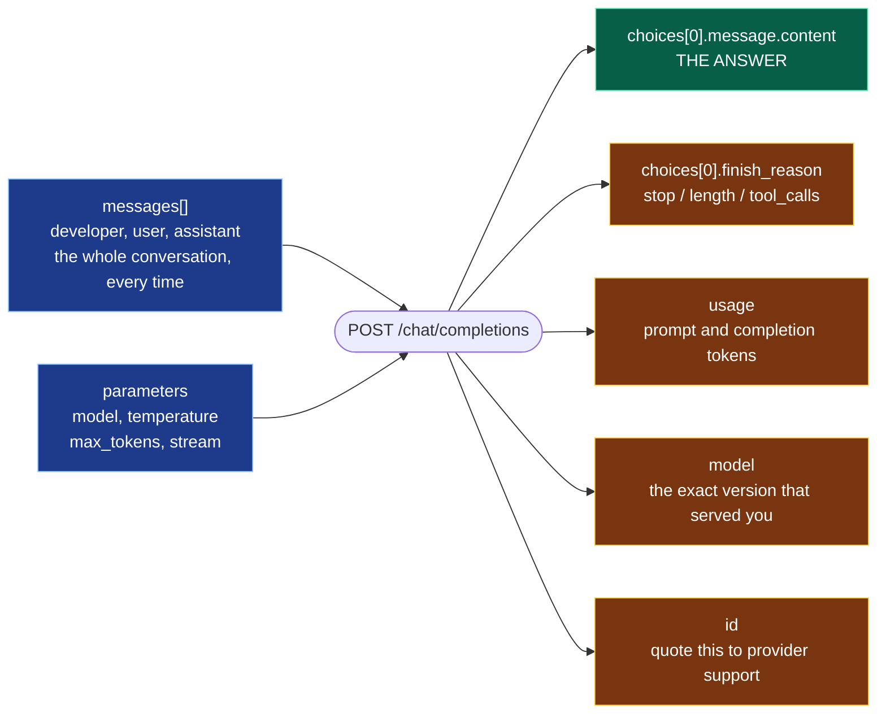

# Chapter 3 — The OpenAI API, Properly

> **Reading time:** ~30 minutes · **Career weight:** ★★★★★ Essential · **Prerequisites:** [Chapter 2](02-how-llms-behave.md)
>
> **In one line:** The API looks like three lines of code, and the fields those three lines ignore are where your production bugs will live.

---

## 1. Why This Matters

**Everything in the rest of this playbook assumes you can read a request and a response fluently.**

Tool calling, structured outputs, MCP, agents, LangGraph — all of them are variations on this one HTTP call. If the response object is a black box to you, every later chapter becomes memorisation instead of understanding.

There is a more immediate reason too. The minimal version of this call is three lines, and it works. That is exactly the problem: **it works well enough that nobody reads the rest of the response**, which is where the information you actually need in production lives.

CaseMate's four incidents in Chapter 2 were all diagnosable from fields that were sitting in the response object the whole time, unread.

This chapter is short on theory and long on the specific fields that matter.

---

## 2. The Problem

**A deceptively simple API hides six decisions.**

Here is the whole thing:

```python
r = client.chat.completions.create(model="gpt-5.5", messages=[...])
```

One function, two required arguments. Nothing about that signature warns you that you have just made six decisions by accident:

| Decision made for you | What it defaults to | Why it matters |
| --- | --- | --- |
| How long to wait | **10 minutes** | Your user is gone. Your thread is not |
| Whether to retry | Twice, on HTTP errors only | A wrong answer returns 200 and is never retried |
| How long the answer can be | Model-dependent | Silent truncation is the top cause of broken JSON |
| How varied the answer is | Usually 1.0 | Too high for extraction, fine for chat |
| Which exact model version | Whatever is behind the alias today | Behaviour can change with no deploy on your side |
| Whether you learn what it cost | You do not, unless you read `usage` | You find out from the invoice |

None of these are exotic. They are all one keyword argument or one field away. But the API is friendly enough that you can ship without ever meeting them.

---

## 3. Mental Model

> **The request is a document you assemble. The response is a receipt with an answer stapled to it.**

That framing gets two things right that trip people up.

**There is no conversation object.** You are not appending to a thread the server maintains. You are assembling a fresh document every time and posting it. The `messages` list *is* the conversation — Chapter 2's diagram, in code.

**The interesting part of the response is not the answer.** The answer is one field. The other fields tell you whether the answer is complete, what it cost, which model version produced it, and how to reference it later. Engineers read the answer and discard the receipt, then wonder why production is opaque.

### Roles are labels, not permissions

The `messages` list has roles: `developer` (formerly `system`), `user`, and `assistant`. It is tempting to read these as a privilege model — the developer role gives instructions, the user role gives input, and the model obeys the hierarchy.

**It does not work that way.** Roles are a formatting convention the model was trained to respect strongly. They are not enforced. A sufficiently persuasive user message can override a developer message, and this is the root of prompt injection.

> **A role is a strong hint, not an access control.** If a security property depends on the model honouring a role boundary, you do not have that security property. Chapter 24.

---

## 4. The ML Bit, in Plain English

> **Skippable.** Explains why the API has roles at all.

The base model out of training does one thing: continue text. It has no concept of a conversation, a question, or an instruction.

To make it useful, the labs did a second, much smaller round of training on **transcripts** — text laid out as an exchange between a person asking and an assistant answering, with the assistant's turns written or rated by humans to be helpful and safe.

So when you send `messages` with roles, the SDK is rendering them into roughly that transcript format and asking the model to continue it. The model plays the assistant's next turn because that is the pattern it was trained to complete.

**That is why roles are conventions rather than guarantees.** They are a shape the model learned to follow, not a rule the system enforces. Very well-learned, but learned.

---

## 5. Architecture

**Six fields do the work. Most code reads one of them.**



Green is what everyone reads. **Amber is what everyone ignores, and where your production answers live.**

- **`finish_reason`** — `"stop"` means it finished. `"length"` means truncated. `"tool_calls"` means it wants you to run a function (Chapter 6). `"content_filter"` means it was blocked.
- **`usage`** — prompt and completion token counts. Your cost, and your early warning that a prompt has quietly grown.
- **`model`** — the *exact* version that served the request, which may differ from what you asked for if you used an alias. This is how you detect a silent provider update.
- **`id`** — the request identifier. When you open a support ticket with the provider, this is the first thing they ask for. Log it.

One more thing not on the diagram: **`message.content` can be `None`.** It is `None` when the model refuses, and when the model wants to call a tool instead of answering. Code that does `content.strip()` without checking will throw in production on a path you did not test.

---

## 6. See It in Code

### Raw OpenAI — the full picture

```python
from openai import OpenAI

client = OpenAI(timeout=30.0, max_retries=3)   # NOT the 10-minute default

r = client.chat.completions.create(
    model="gpt-5.5",
    messages=[
        {"role": "developer", "content": "You help support engineers. Be concise."},
        {"role": "user", "content": "What does error BILL-4021 mean?"},
    ],
    temperature=0.2,
    max_tokens=500,
)
```

Then read the receipt, not just the answer:

```python
choice = r.choices[0]

if choice.finish_reason == "length":
    log.warning("truncated", extra={"id": r.id})     # your JSON is broken
if choice.message.content is None:
    return handle_refusal(choice.message.refusal)    # content is Optional

log.info("llm_call", extra={
    "id": r.id, "model": r.model,                    # exact version served
    "in": r.usage.prompt_tokens, "out": r.usage.completion_tokens,
})
return choice.message.content
```

**What to notice:** the `timeout` and `max_retries` on the client, the two guards before touching `content`, and `r.model` — logging the version that actually served you is how you find out a provider changed something under you.

### Streaming

Streaming does not make anything faster. It changes when the user sees the first word, which for anything longer than a sentence is the difference between a usable feature and a spinner.

```python
stream = client.chat.completions.create(
    model="gpt-5.5",
    messages=messages,
    stream=True,
    stream_options={"include_usage": True},   # else you get NO token counts
)

for chunk in stream:
    if chunk.choices and chunk.choices[0].delta.content:
        yield chunk.choices[0].delta.content
```

**The trap:** by default a streamed response gives you **no `usage` at all**. Teams turn on streaming, cost observability silently disappears, and nobody notices until the invoice. `stream_options={"include_usage": True}` sends a final chunk carrying the totals.

The second trap is that `finish_reason` only arrives on the last chunk. If you stream straight to the user, you can be halfway through rendering before you learn the answer was truncated.

### Errors, and what retries actually cover

The SDK retries automatically on 408, 409, 429, and 5xx, with backoff. That is genuinely useful and covers most transient failure.

Here is the part that matters:

> **The SDK retries HTTP errors. It does not retry bad answers.** A confident, wrong, or empty response arrives as HTTP 200 and sails straight through every retry mechanism you have.

That single sentence is why evaluation and guardrails exist as separate layers. No amount of retry configuration protects you from the failure mode that actually characterises AI systems.

```python
from openai import APITimeoutError, RateLimitError, APIStatusError

try:
    r = client.chat.completions.create(...)
except RateLimitError:
    return fallback_to_cheaper_model(...)   # already retried and still failing
except APITimeoutError:
    return degraded_response()              # a real answer beats a stack trace
except APIStatusError as e:
    log.error("provider error", extra={"status": e.status_code})
    raise
```

### With LangChain

```python
from langchain.chat_models import init_chat_model

model = init_chat_model("gpt-5.5", temperature=0.2, max_tokens=500, timeout=30)
msg = model.invoke([
    {"role": "system", "content": "You help support engineers. Be concise."},
    {"role": "user", "content": "What does error BILL-4021 mean?"},
])

print(msg.text)                                  # the answer
print(msg.usage_metadata)                        # normalised across providers
print(msg.response_metadata["finish_reason"])    # provider-specific, in a dict
```

**What LangChain adds:** one interface across providers, so switching to Anthropic is a one-line change. `usage_metadata` is normalised, which means your cost tracking keeps working after a provider switch — genuinely valuable. Streaming becomes `model.stream(...)` with the same shape everywhere. And it is the on-ramp to LangGraph, which is where agents live.

**What it hides:** provider-specific fields land in `response_metadata`, an untyped dictionary. `finish_reason` is in there but no longer in your face. Retry and timeout behaviour is now the framework's, layered on top of the SDK's — worth knowing about before you debug a request that took four minutes to fail.

**Use the raw SDK when** you are learning a concept, or need a provider feature the abstraction has not reached yet. **Use LangChain when** you want portability or you are heading toward agents.

### In CaseMate

CaseMate v0.2 — same feature, production-shaped:

```python
client = OpenAI(timeout=30.0, max_retries=3)
MODEL = "gpt-5.5-2026-04-14"          # pinned. an alias can change under you

def ask(question: str, history: list) -> Iterator[str]:
    messages = [DEVELOPER_MSG] + history + [{"role": "user", "content": question}]
    stream = client.chat.completions.create(
        model=MODEL, messages=messages, temperature=0.2,
        max_tokens=500, stream=True, stream_options={"include_usage": True},
    )
    yield from emit_and_record(stream)   # streams text, logs usage + finish_reason
```

Four things changed from v0.1, and none of them are clever: a real timeout, a pinned model version, streaming so the engineer sees words immediately, and usage still being recorded despite streaming.

CaseMate still cannot look anything up or read your documentation. That starts in Chapter 6.

---

## 7. Engineering Decisions

### Chat Completions or the Responses API?

OpenAI now offers two endpoints. **Chat Completions** is the older, universal one — every provider and every framework speaks its shape, and OpenAI has committed to supporting it indefinitely. **Responses** is the newer one, with built-in state handling and native support for hosted tools.

For a playbook like this, Chat Completions is the right thing to learn first: it is the lingua franca. Anthropic, Google, Mistral, vLLM, and every gateway expose something close to it, so the mental model transfers everywhere. Learn Responses when you specifically want an OpenAI-hosted feature it offers.

### Where do retries belong?

The SDK retries. Your gateway probably retries. LangChain can retry. Stack all three unthinkingly and one rate-limit event becomes eight requests.

**Pick one layer and turn the others down.** For most teams that layer is the gateway, because it is the only one that can fail over to a different provider. Chapter 25.

### Streaming or not?

| | |
| --- | --- |
| ✅ **Stream if** | A human is waiting · The answer is longer than a sentence · You want the option to cancel mid-generation |
| ❌ **Do not stream if** | The consumer is code, not a person · You need the complete object before acting — structured output, tool calls · It is a batch job |
| ⚠️ **Watch for** | Corporate proxies and API gateways that buffer responses and silently break streaming. **Test through the customer's infrastructure early** |

### Sync, async, or batch?

Sync for simple request/response. Async when one user request fans out into several model calls, which is most agent work. **Batch APIs** deserve more attention than they get — for anything not user-facing, providers offer large discounts on jobs that can complete within a longer window. If CaseMate summarises yesterday's cases overnight, that is a batch job at a fraction of the price.

---

## 8. Decision Matrix

### Which parameters should I set explicitly?

Every one of these has a default that is wrong for at least one common use case.

| Parameter | Default | Set it to | Why |
| --- | --- | --- | --- |
| `timeout` | **10 minutes** | 15–60s | Nothing sensible waits ten minutes |
| `max_retries` | 2 | 0–3 | Zero if your gateway retries. Otherwise 2–3 |
| `max_tokens` | Model-dependent | Longest legitimate answer, plus headroom | Prevents silent truncation and caps runaway cost |
| `temperature` | ~1.0 | 0–0.2 for extraction and classification | The default is too varied for anything structured |
| `model` | — | A **dated** version | An alias can change behaviour with no deploy |
| `stream_options` | Off | `{"include_usage": True}` when streaming | Otherwise cost tracking silently disappears |

### Raw SDK or a framework?

| | |
| --- | --- |
| ✅ **Raw SDK if** | You are learning the concept · You need a brand-new provider feature · The application is small and single-provider · You want no abstraction between you and the failure |
| ✅ **Framework if** | You want provider portability · You are heading toward agents and LangGraph · You want normalised usage tracking across providers |
| ⚠️ **Either way** | Put a gateway in front. That is where portability really comes from, and it works regardless of which SDK you chose |

---

## 9. Technology Landscape

| Category | What it is for | Representative | Watch out for |
| --- | --- | --- | --- |
| **Provider SDKs** | Direct access, newest features first | `openai`, `anthropic`, `google-genai` | Each has its own response shape |
| **Compatibility layers** | One shape across providers | LiteLLM, OpenAI-compatible endpoints | Feature drift — the shape matches, the capabilities do not always |
| **Frameworks** | Normalised messages plus everything else | LangChain, LlamaIndex | You inherit their retry and timeout behaviour too |
| **Gateways** | Keys, retries, fallback, caching, quotas, cost | LiteLLM Proxy, Portkey, cloud-native | The single highest-value thing you can add early |
| **Token counters** | Cost estimates before you call | `tiktoken`, provider endpoints | Must match your model's tokenizer or the number is fiction |
| **Local runtimes** | Development without spending money | Ollama, LM Studio, vLLM | Behaviour differs from frontier models — never your only test |

**The one recommendation:** most providers expose an OpenAI-compatible endpoint, so the shape you learn in this chapter is close to universal. That is exactly why learning it raw first is worth thirty minutes.

> Ages fastest. Reviewed quarterly.

---

## 10. Production Notes

| Concern | What to get right |
| --- | --- |
| **Security** | Never put secrets in a prompt. Everything in `messages` may be logged by you, by the provider, and by your tracing tool. Treat user-supplied content as untrusted regardless of role |
| **Scaling** | Rate limits are tokens-per-minute *and* requests-per-minute, and you can hit either. Respect `Retry-After` rather than hammering. One tenant should not be able to consume everyone's quota |
| **Observability** | Log per call: `id`, `model`, `usage`, `finish_reason`, latency, and the assembled messages. The `id` is what provider support will ask for |
| **Failure modes** | Timeout, rate limit, provider 5xx, truncation, refusal, `content is None`. Only the first three raise exceptions. **The other three arrive as HTTP 200** |
| **Cost** | Output tokens cost several times input. `max_tokens` is a cost cap as well as a correctness control. Batch APIs are heavily discounted for non-interactive work |

**Two things to set up today, both about ten minutes of work:** alert on `finish_reason == "length"`, and log `r.model` on every call so a silent version change is visible rather than mysterious.

---

## 11. Best Practices and Common Mistakes

**Do this**

- **Set `timeout` explicitly.** The default is ten minutes. There is no realistic scenario where that is right.
- **Pin a dated model version.** Aliases move.
- **Read `finish_reason` before you use `content`.** Truncated JSON is not a rare edge case.
- **Guard against `content is None`.** Refusals and tool calls both produce it.
- **Log `id`, `model`, and `usage` on every call.** Three fields, and they answer most production questions.
- **Turn on `include_usage` when streaming.** Otherwise cost tracking vanishes silently.
- **Decide which layer retries** — SDK, framework, or gateway. Not all three.
- **Use batch APIs for anything not user-facing.** Same result, large discount.

**Not this**

| Mistake | What it looks like | Do instead |
| --- | --- | --- |
| Leaving the default timeout | Threads held for minutes; connection pool exhausted under load | `timeout=30` |
| Reading `content` without checking `finish_reason` | Broken JSON in a small percentage of requests | Two lines of guard |
| Assuming retries protect you | Confident wrong answers reach users; retries never fired | Retries handle HTTP errors, not bad answers. Different problem, different layer |
| Streaming without `include_usage` | Cost dashboard goes flat and nobody notices | Set `stream_options` |
| Using an undated model alias | Behaviour shifts overnight with no deploy | Pin, and log `r.model` |
| Treating the developer role as a security boundary | "Ignore previous instructions" works | Roles are hints. Architecture is the control |
| Stacked retries | One rate-limit event becomes eight requests | Retry at one layer |
| Leaving `temperature` at default for extraction | Inconsistent field values from identical documents | `temperature=0.2` or lower |

---

## 12. Forward Deployed Engineer Notes

**What customers say, and what it means**

| They say | It means | Ask |
| --- | --- | --- |
| "It hangs sometimes" | Default timeout, ten minutes | "What timeout is set on the client?" — usually none |
| "Streaming doesn't work here" | Their proxy or WAF is buffering | "Can we test SSE through your gateway today?" |
| "We can't tell what it costs" | Nobody logs `usage`, or streaming is on without `include_usage` | Add the log line. You will have an answer this afternoon |
| "It changed behaviour and we changed nothing" | Unpinned model alias | "Which model string is in the config?" |
| "Our security team needs to review every prompt" | Reasonable. They fear data leaving | Show them exactly what is in `messages`, and where it is logged |

**Discovery questions**

1. **"Can this environment reach the provider at all?"** Egress rules, proxies, and TLS inspection break API clients in ways that look like bugs. Test on day one, not in week six.
2. **"Is there an approved gateway, or are we going direct?"** Large enterprises often already have one. Finding out late means rework.
3. **"What is the acceptable wait before the first word?"** This decides streaming, and streaming decides whether their infrastructure needs changing.

**Build vs buy** — do not write your own SDK wrapper. Every team is tempted, and what they build is a worse gateway. If you need cross-cutting behaviour, use a gateway; it is a solved problem with off-the-shelf options.

**Before go-live**

- [ ] `timeout` and `max_retries` set explicitly, and only one layer retries
- [ ] Model pinned to a dated version, and `r.model` logged
- [ ] `finish_reason` checked and alerting on `"length"`
- [ ] `content is None` handled
- [ ] `usage` logged, including when streaming
- [ ] Streaming tested end to end through *their* proxies
- [ ] Rate limit behaviour tested — deliberately trigger a 429 and watch what happens
- [ ] No secrets in any prompt, and prompt logging reviewed with their security team

---

## 13. Career Notes

**Importance: ★★★★★ Essential.** Not because the API is difficult, but because everything else assumes it. Engineers who never read the response object properly stay dependent on trial and error for years.

**In interviews.** Comes up as debugging: *"the API returns 200 but the JSON is malformed 3% of the time"* — the answer is `finish_reason`. Or *"requests occasionally hang for minutes"* — the answer is the default timeout. These are quick, and getting them instantly signals you have run this in production.

**On the job.** Daily.

**Seniority signal.** Which fields someone logs. A junior logs the answer. A senior logs `id`, `model`, `usage`, and `finish_reason` — and can tell you what each one saved them.

---

## 14. One Minute Summary

> **If you remember one thing: read the whole response, not just the answer. Four fields nobody reads are where your production answers are.**

| Field | Tells you |
| --- | --- |
| `finish_reason` | Whether you got a complete answer, or a truncated one |
| `usage` | What it cost, and whether your prompt is quietly growing |
| `model` | Which version actually served you — how you spot a silent update |
| `id` | What provider support will ask for first |

And four defaults to override on day one:

- **`timeout`** — ten minutes by default. Set it to 30 seconds.
- **`max_tokens`** — set it from your longest real answer.
- **`temperature`** — too high by default for anything structured.
- **`model`** — pin a dated version, never an alias.

One thing to carry into every later chapter: **retries handle HTTP errors, not wrong answers.** A confident, incorrect response is a successful HTTP call. That gap is why evaluation and guardrails exist.

---

## 15. Interview Questions and References

1. Walk through what is in a chat completion response. Which fields do you log, and why each one?
2. What are the possible values of `finish_reason`, and what does your code do differently for each?
3. When can `message.content` be `None`, and what should happen then?
4. What is the default timeout in the OpenAI Python SDK, and why is it a problem?
5. What does the SDK retry automatically, and what critical failure does it *not* cover?
6. Why is a model alias risky in production, and how would you detect that it changed?
7. What breaks about cost tracking when you turn on streaming?
8. Are the `developer`, `user`, and `assistant` roles a security boundary? Explain.
9. Your gateway retries, the SDK retries, and the framework retries. What goes wrong?
10. When would you deliberately not stream a response?
11. How would you decide between the raw SDK and LangChain for a new service?
12. What is a batch API good for, and roughly what does it save you?
13. A request hangs for four minutes in production. Walk through your diagnosis.
14. What would you never put in a `messages` array, and why?
15. Why is Chat Completions worth learning even if your provider has a newer API?

---

## References

**Official documentation**

- [OpenAI — Chat Completions API reference](https://platform.openai.com/docs/api-reference/chat) — the endpoint this chapter is about.
- [OpenAI — Streaming](https://platform.openai.com/docs/guides/streaming-responses) · [Batch API](https://platform.openai.com/docs/guides/batch) · [Rate limits](https://platform.openai.com/docs/guides/rate-limits)
- [openai-python on GitHub](https://github.com/openai/openai-python) — the README covers timeouts, retries, and errors better than most tutorials.
- [LangChain — Chat models](https://docs.langchain.com/oss/python/langchain/models) · [Messages](https://docs.langchain.com/oss/python/langchain/messages)

**Worth reading once**

- [Anthropic — Messages API](https://docs.anthropic.com/en/api/messages) — the same concepts with different names. Skimming it makes the pattern obvious rather than OpenAI-specific.
- [LiteLLM](https://docs.litellm.ai/) — one OpenAI-shaped interface over a hundred providers. The clearest demonstration of why learning this shape transfers.

---

← [Chapter 2 — How LLMs Behave](02-how-llms-behave.md) · [Contents](../SUMMARY.md) · **Next: Chapter 4 — Prompt Engineering** *(not yet published — see [ROADMAP.md](../ROADMAP.md))*
