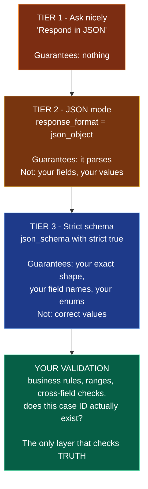

# Chapter 5 — Structured Outputs

> **Reading time:** ~30 minutes · **Career weight:** ★★★★★ Essential · **Prerequisites:** [Chapter 4](04-prompt-engineering.md)
>
> **In one line:** You can now guarantee the *shape* of what a model returns — which makes it a component your code can call, and changes nothing about whether the values are true.

---

## 1. Why This Matters

**This is the chapter where the model stops being a chat feature and becomes a component in your system.**

As long as output goes to a human, prose is fine — a person can cope with a slightly odd answer. The moment output feeds code, everything changes. Your parser does not cope. It throws, at 3am, on the one input nobody tested.

CaseMate is at exactly that point. It has answered questions for four chapters. Now support engineers want it to triage: read a case and return a severity, a product area, and whether billing is involved, so the routing system can act on it. That output is consumed by code.

**There is also a second reason, and it is the bigger one.** Structured outputs are the same mechanism as tool calling. Once you understand how a model is made to emit a specific JSON shape, Chapter 6 is that plus a function call, and MCP and agents follow from there. This is the foundation the whole second part of the playbook is built on.

---

## 2. The Problem

**"Respond in JSON" is a request, not a guarantee — and the failure rate is exactly high enough to hurt.**

You write a careful prompt asking for JSON. It works. You test twenty cases and every one parses. You ship.

Then production shows you what the tail looks like:

| What comes back | Why it breaks |
| --- | --- |
| ` ```json ... ``` ` | Wrapped in a markdown fence |
| `Sure! Here's the JSON you asked for: {...}` | Helpful preamble |
| `{"severity": "high", "area": "billing"` | Truncated. `max_tokens` |
| `{"severity": "High"}` vs `"high"` vs `"HIGH"` | Casing drifts between calls |
| `{"severity": "high", "urgency": "medium"}` | A field you never defined |
| `{"severity": "quite serious"}` | Not one of your four valid values |

Each is rare. Together they are a small but steady percentage, and at ten thousand requests a day a small percentage is a lot of pages.

The instinct is to write defensive parsing — strip the fences, find the first `{`, regex out the preamble, normalise the casing. Teams accumulate a hundred lines of this, and it works right up until the model finds a new way to be creative.

> **The engineering problem: how do you make a text generator emit something your type system can rely on?**

The good news is that this is largely solved, and the solution is better than you expect. The important part of this chapter is understanding precisely what it solves and what it very much does not.

---

## 3. Mental Model

> **A strict schema is a grammar enforced while the text is being generated — not a validator run afterwards.**

This is the distinction that makes the feature make sense. Defensive parsing checks the output after the fact and fails when it is wrong. A strict schema makes the wrong output *impossible to generate in the first place*. The model is physically prevented from producing a token that would break the schema.

So the shape is not a request that usually succeeds. It is a guarantee.

**And now the part that matters more than anything else in this chapter:**

> **The schema guarantees the shape. It says nothing at all about whether the values are correct.**

`{"severity": "critical", "product_area": "billing"}` is perfectly valid against your schema and may be completely wrong about the case. You have eliminated parse errors. You have not eliminated wrong answers — you have made them *look* more trustworthy, because they now arrive as clean typed objects instead of messy prose.

**This is a genuine and underrated risk.** Well-formed output invites trust that the mechanism does not justify. Nothing about strict mode reduces hallucination. Chapter 2's five behaviours all still apply; they are now wearing a type annotation.

---

## 4. The ML Bit, in Plain English

> **Skippable.** Explains how the guarantee is actually possible.

From Chapter 2: the model generates one chunk of text at a time, each time picking from a ranked list of plausible next options.

**Constrained decoding simply removes the options that would break the schema.**

Say the schema requires `severity` to be one of `low`, `medium`, `high`, or `critical`. The model has just produced `{"severity": "`. Ordinarily anything could come next. With a strict schema in force, every option that does not begin one of those four words is struck off the list before the model picks. It chooses freely — among only the legal continuations.

That is the whole trick. Not "the model tries harder to follow your schema." **The illegal outputs are removed from consideration.** Which is why the shape is a guarantee and not a strong tendency.

Two consequences fall straight out of this, and both matter in production.

**The model must still pick something.** Constraining the options does not create knowledge. If the case genuinely does not indicate a severity, the model still has to emit one of your four values, because those are the only legal tokens. **A required field with no "unknown" option does not prevent uncertainty — it converts uncertainty into a confident wrong value.**

**The constraint applies token by token, so an interrupted generation is still broken.** If the response is cut off at `max_tokens`, you get valid-so-far JSON that is nonetheless incomplete. The guarantee is about legality, not completion.

---

## 5. Architecture

**Three tiers of reliability, and a fourth thing that no tier provides.**



**Tier 1 — ask nicely.** A prompt requesting JSON. Works most of the time, which is the worst possible property: good enough to ship, bad enough to page you. This is where the six failures in section 2 come from.

**Tier 2 — JSON mode.** The provider guarantees the response parses as JSON. That removes markdown fences and chatty preambles, which is real progress. It does not guarantee your field names, your types, or your enum values. Useful mainly where a strict schema is unavailable.

**Tier 3 — strict schema.** You supply a JSON Schema, the provider enforces it during generation. You get your exact shape. **Go straight here.** There is very little reason to stop at tier 2 with current models.

**And then validation, which is not optional.** The green box is the only layer that touches correctness. Severity is one of four legal values — but is it the *right* one? The case ID is a well-formed string — but does that case exist? Two dates are both valid dates — is the second after the first?

> **Tier 3 ends your parsing problems. It does not begin to address your correctness problems.** Those are Chapter 21.

### Schema design decides your failure rate

The schema is an interface, and the same design instincts apply — with two additions specific to this setting.

| Do | Instead of | Because |
| --- | --- | --- |
| `enum: [low, medium, high, critical]` | `severity: string` | Turns "quite serious" into an impossibility |
| A flat object | Deeply nested structures | Fewer places to go wrong; easier to validate |
| An explicit `"unknown"` enum value | A required field with no out | Otherwise uncertainty becomes fabrication |
| `confidence` or `needs_human` | Assuming every answer is usable | Gives you a routing signal for free |
| Field descriptions | Bare field names | They are prompt content — the model reads them |

**That third row is the one that will bite you.** Give the model a legal way to express uncertainty or you have designed a schema that requires it to guess. It is the escape hatch from Chapter 4, expressed as a type.

---

## 6. See It in Code

### Raw OpenAI

Define the shape in Pydantic and hand the class straight to the SDK:

```python
from pydantic import BaseModel, Field
from typing import Literal

class Triage(BaseModel):
    severity: Literal["low", "medium", "high", "critical", "unclear"]
    product_area: Literal["billing", "provisioning", "reporting", "other"]
    summary: str = Field(description="One sentence, under 20 words")
    needs_human: bool = Field(description="True if the case is ambiguous or angry")

completion = client.chat.completions.parse(
    model=MODEL, messages=messages, response_format=Triage,
)
```

Then read it. There are exactly two outcomes worth handling:

```python
message = completion.choices[0].message

if message.parsed:
    triage: Triage = message.parsed        # a real typed object, validated
    route(triage)
else:
    handle_refusal(message.refusal)        # the model declined. This is normal
```

**What to notice.** `response_format=Triage` converts your Pydantic class into a strict JSON Schema for you — you never hand-write the schema. `message.parsed` is an actual `Triage` instance, so your IDE and type checker work normally from here. And `Literal[...]` becomes an enum in the schema, which is what makes `"quite serious"` unrepresentable.

Two behaviours of `.parse()` that differ from `.create()` and will surprise you otherwise:

- **It raises `LengthFinishReasonError` if the response was truncated**, rather than handing you half an object. Better than silent corruption, but it means `max_tokens` needs to fit your largest realistic output — this is now a correctness setting, not just a cost cap.
- **It raises `ContentFilterFinishReasonError` if content was filtered.** Both are exceptions to catch, not conditions to check.

Note `"unclear"` in the severity enum and the `needs_human` flag. Without them, an ambiguous case still gets a confident severity, because the constraint leaves the model no alternative.

### With LangChain

```python
model_with_structure = model.with_structured_output(Triage)
triage = model_with_structure.invoke(messages)   # a Triage instance
```

Two lines, same result, and portable across providers.

**What it adds:** one call that works whether the provider supports strict schemas natively or not — LangChain falls back to `method="function_calling"` or `"json_mode"` as needed. That is genuinely valuable if you support several providers. You can also pass `include_raw=True` to get both the parsed object and the underlying message, which you want in production so you keep access to `usage` and `finish_reason`.

**What it hides:** *which* mechanism you actually got. A strict schema is a hard guarantee; `json_mode` with a schema described in the prompt is tier 2 wearing tier 3's clothing. The call looks identical and the reliability is not. **Set `method="json_schema"` explicitly** rather than accepting the default, so a silent downgrade is impossible.

It also hides validation differences: a Pydantic schema gets validated, while a raw JSON Schema or `TypedDict` does not. Use Pydantic and you get the check for free.

### In CaseMate

CaseMate v0.4 can triage a case:

```python
def triage(case_text: str) -> Triage | None:
    try:
        c = client.chat.completions.parse(
            model=MODEL, max_tokens=300,          # correctness setting now, not just cost
            messages=[{"role": "developer", "content": TRIAGE_PROMPT},
                      {"role": "user", "content": delimit(case_text)}],
            response_format=Triage,
        )
    except LengthFinishReasonError:
        log.error("triage truncated"); return None

    t = c.choices[0].message.parsed
    if t is None or t.needs_human or t.severity == "unclear":
        return escalate_to_human(case_text)      # the schema gave us this route
    return t
```

The typed object is nice. **The routing is the point.** Because the schema includes `needs_human` and `unclear`, uncertainty arrives as a value your code can branch on rather than as a confident guess you cannot distinguish from a good answer.

Also note `delimit(case_text)`. The case text is written by a customer and may contain instructions. A strict schema is incidentally helpful here — the output shape cannot be hijacked — but it does not stop the *content* being manipulated. Chapter 24.

### The bridge to Chapter 6

Look at what just happened: you described a shape, and the model produced an object matching it.

**Tool calling is that, plus a name and a function.** You describe a function's arguments as a schema, the model emits an object matching it, and your code runs the function with those arguments. Same machinery, one step further. That is the whole of Chapter 6, and it is why this chapter comes first.

---

## 7. Engineering Decisions

### Structured output or tool calling?

They use the same underlying mechanism, so the choice is about intent rather than capability.

| Use | When |
| --- | --- |
| **Structured output** | You want *data back*. Extraction, classification, triage. One shape, always |
| **Tool calling** | You want *something done*. The model chooses whether and which function to call |

If the model has no decision to make and you always want the same shape, structured output says so more clearly. Chapter 6 covers the other case.

### One big schema or several small calls?

A single call returning fifteen fields is cheaper and faster than five calls. It is also harder to evaluate, because one field regressing is invisible in an overall pass rate, and harder to debug when one field is consistently wrong.

**Start with one call.** Split when a specific field turns out to be hard — it usually deserves its own prompt and its own eval anyway.

### How do you version a schema?

Schemas change, and unlike a prompt change, a schema change can break every consumer downstream.

Treat it exactly as you would an API contract: additive changes are safe, removals and type changes are breaking, and new required fields are breaking unless they have a default. **Version the schema alongside the prompt version from Chapter 4 and log both.** A change in either can move quality, and you want to be able to tell which.

### Where does validation live?

The schema handles shape. Everything else is yours, and it splits into two kinds:

**Pydantic validators** for anything self-contained — ranges, formats, cross-field consistency. These run automatically and cost nothing.

**Business validation** for anything requiring the outside world — does this case exist, does this customer have this product, is this engineer allowed to see it. This cannot live in the schema and is where the real errors are caught.

---

## 8. Decision Matrix

### Which tier do I need?

| | |
| --- | --- |
| ✅ **Strict schema if** | Output is consumed by code · You need specific field names or enum values · It feeds a database, a queue, or an API · Basically always |
| ⚠️ **JSON mode if** | Your provider or model has no strict schema support · The shape is genuinely dynamic and cannot be described |
| ❌ **Neither if** | Output goes to a human as prose · The value is the writing itself — a summary, a draft reply |

### Should this field be an enum?

| | |
| --- | --- |
| ✅ **YES if** | The valid values are known and finite · It drives routing or a branch in your code · You would otherwise normalise the casing |
| ❌ **NO if** | It is genuinely free text — a summary, a customer name · The value set changes often enough that deploys would be painful |
| ⚠️ **Always** | Include an `unknown` or `other` member. **A closed enum with no escape value guarantees a wrong answer on ambiguous input** |

### Raw SDK or `with_structured_output`?

| | |
| --- | --- |
| ✅ **Raw SDK if** | Single provider · You want certainty about which mechanism is enforcing the schema · You need `usage` and `finish_reason` without extra arguments |
| ✅ **LangChain if** | Multiple providers, or providers with uneven support · You are already in a LangChain pipeline |
| ⚠️ **Either way** | Pin the method explicitly and use Pydantic, so you get validation and no silent downgrade |

---

## 9. Technology Landscape

| Technology | What it is for | Use when | Watch out for |
| --- | --- | --- | --- |
| **Provider native** — OpenAI, Google, Anthropic | Schema enforced during generation | Default. Strongest guarantee available | Support and schema-feature coverage differ by provider |
| **Pydantic** | Define the shape once; get schema, parsing, and validation | Always, in Python | Very deep nesting and exotic types are not all supported in strict mode |
| **Instructor** | Structured output plus validation-driven retries across providers | You want automatic retry on validation failure | Retries cost tokens; cap them |
| **Outlines** | Constrained decoding you run yourself | Self-hosted models, or you need grammars beyond JSON | You are operating inference |
| **LangChain `with_structured_output`** | One interface across providers | Multi-provider, or already in LangChain | Silent fallback to a weaker method — pin it |
| **Zod / TypeScript** | The same pattern in the JS ecosystem | Node services | Same reasoning applies throughout |

**The one thing worth knowing beyond the table:** self-hosted models can do this too. Constrained decoding is a property of the serving stack, not a proprietary feature — vLLM and similar can enforce a grammar. So "we need structured output" is not by itself an argument for a hosted provider.

> Ages fastest. Reviewed quarterly.

---

## 10. Production Notes

| Concern | What to get right |
| --- | --- |
| **Security** | A guaranteed shape is not guaranteed content. A `summary` field can contain anything a customer wrote, including markup and injection attempts. **Escape on render and validate before use.** Model output is untrusted input to everything downstream |
| **Scaling** | Strict schemas add a little latency on first use of a new schema while it is prepared, then it is cached. Reusing the same schema keeps this negligible; generating schemas dynamically per request does not |
| **Observability** | Log the schema version, validation failures by field, and enum distribution. **A field that returns the same value 98% of the time is either a useless field or a broken one** — and you will not notice without the distribution |
| **Failure modes** | Truncation (`LengthFinishReasonError`), refusals, and — most importantly — valid output containing wrong values. Only the first two raise |
| **Cost** | Schemas are tokens too: field names, descriptions, and enum members all get sent. A large schema on every request adds up. Descriptions earn their place; verbose ones do not |

**Two things to instrument on day one.** Alert on `LengthFinishReasonError`, because it means `max_tokens` is too small for real inputs. And track the distribution of every enum field — the fastest way to discover that a classifier has quietly collapsed to always returning `"other"`.

---

## 11. Best Practices and Common Mistakes

**Do this**

- **Go straight to tier 3.** There is rarely a reason to use JSON mode with a current model.
- **Define the schema in Pydantic**, once, and derive everything from it.
- **Use enums for anything that drives a branch** in your code.
- **Always include an `unknown` or `other` value.** Without it, ambiguity becomes fabrication.
- **Add a `needs_human` or `confidence` field.** Routing signal, nearly free.
- **Write field descriptions.** The model reads them — they are prompt content.
- **Set `max_tokens` from your largest realistic output.** Truncation is now a correctness bug.
- **Keep schemas flat.** Nesting adds failure surface and makes validation harder.
- **Validate business rules after parsing.** The schema has not checked anything true.
- **Track enum distributions in production.** Cheapest quality signal you will get.

**Not this**

| Mistake | What it looks like | Do instead |
| --- | --- | --- |
| Defensive parsing | 100 lines stripping fences and regexing braces | Delete it. Use a strict schema |
| Trusting valid output | Clean typed objects, wrong values, no checks | Validate business rules separately |
| Closed enum with no escape | Confident severity on cases that state none | Add `unknown` |
| Ignoring truncation | `LengthFinishReasonError` in the logs, unhandled | Raise `max_tokens`; alert on it |
| Free-text where an enum belongs | `"High"`, `"high"`, `"HIGH"`, `"quite high"` | `Literal[...]` |
| Deeply nested schemas | Hard to validate, hard to evaluate, more failure surface | Flatten, or split the call |
| Unversioned schemas | A field type changes and three consumers break | Version it like an API contract |
| Assuming structured means accurate | Auto-approving typed output | Shape is guaranteed; truth is not |
| Accepting LangChain's default method | Silent downgrade to `json_mode` | `method="json_schema"` |
| Huge schemas on every request | Token cost nobody attributed | Trim fields and descriptions to what you use |

---

## 12. Forward Deployed Engineer Notes

**What customers say, and what it means**

| They say | It means | Ask |
| --- | --- | --- |
| "It returns broken JSON sometimes" | They are on tier 1 with defensive parsing | "Which model? Strict schemas will delete that whole file" |
| "The output is structured now, so we can automate it" | Shape and truth are being conflated | "What happens when a field is confidently wrong?" |
| "We need it to match our existing schema" | Reasonable, and it may be over-nested for this | Map to a flat intermediate, then transform |
| "It always says 'other'" | The enum has no good option, or the prompt lacks context | Check the enum distribution — the answer is usually obvious |
| "Can it output our XML format?" | Possibly, but not with the same guarantee | Generate JSON under a strict schema, transform to XML in code |

**Discovery questions**

1. **"What does your code do with this output?"** Determines everything. Output that populates a form needs different guarantees from output that triggers a refund.
2. **"What should happen when the model isn't sure?"** Most people have not considered it, and the answer becomes a field in your schema. Asking early prevents the most common design fault in this chapter.
3. **"Who consumes this schema, and what breaks if a field changes?"** Turns the schema into a contract with named owners before it is one by accident.

**Build vs buy** — nothing to build. Use the provider's native support and Pydantic. Any team writing a JSON repair library in 2026 is solving a problem that no longer exists.

**Before go-live**

- [ ] Strict schema in use, and confirmed — not silently downgraded
- [ ] Every enum has an `unknown` or `other` member
- [ ] `needs_human` or equivalent exists, and something acts on it
- [ ] `max_tokens` sized from the largest real output; truncation alerting
- [ ] Refusals handled as a normal path, not an exception log
- [ ] Business validation runs after parsing, and its failures are logged by field
- [ ] Enum distributions on a dashboard
- [ ] Schema versioned, with consumers identified
- [ ] Text fields escaped wherever they are rendered

---

## 13. Career Notes

**Importance: ★★★★★ Essential.** It is the mechanism underneath tool calling, MCP, and every agent. Not knowing it means the rest of the playbook is memorisation.

**In interviews.** Often the fastest way to separate candidates. *"How do you get reliable JSON from a model?"* — a weak answer describes prompt tricks and a repair library. A good answer names constrained decoding. **A strong answer volunteers, without being asked, that this guarantees shape and not correctness, and describes what they validate afterwards.** That one distinction is a reliable seniority signal.

**On the job.** Constantly. Nearly every non-chat feature returns structured output.

**Seniority signal.** Schema design. A junior defines the fields the feature needs. A senior adds the `unknown` member and the `needs_human` flag, because they are designing for the input that does not fit — and they can explain why a closed enum without an escape value is a hallucination generator.

---

## 14. One Minute Summary

> **If you remember one thing: a strict schema guarantees the shape and tells you nothing about the truth. Well-formed output invites trust the mechanism has not earned.**

- **Three tiers.** Ask nicely, JSON mode, strict schema. Go straight to strict.
- **It works by removing illegal options during generation**, which is why the shape is a guarantee rather than a strong tendency.
- **The model still has to pick something.** A closed enum with no `unknown` converts uncertainty into a confident wrong value.
- **Design for the input that does not fit:** an `unknown` member and a `needs_human` flag give you routing instead of guesses.
- **Truncation is now a correctness bug.** `max_tokens` matters more here than anywhere else.
- **Validation is still yours.** The schema checked shape; business rules and cross-references check truth.
- **This is the mechanism behind tool calling.** Chapter 6 is this, plus a function.

---

## 15. Interview Questions and References

1. How do strict structured outputs actually work? Why is the shape a guarantee rather than a strong tendency?
2. What does a strict schema guarantee, and what does it explicitly not guarantee?
3. What is the difference between JSON mode and a strict JSON Schema?
4. Why does every enum need an `unknown` or `other` value?
5. What happens if a structured response hits the token limit, and how do you find out?
6. When would you use structured output rather than tool calling? They share a mechanism
7. How would you design a schema for classifying support cases? Walk through the fields
8. Why is `max_tokens` a correctness setting for structured output and not just a cost control?
9. What would you validate after the schema has been satisfied?
10. A field returns the same value 98% of the time. What are the possible explanations?
11. How do you version a schema without breaking consumers?
12. Why can structured output still be a security concern?
13. What are the risks of deeply nested schemas?
14. Your framework silently falls back from strict schema to JSON mode. How would you notice?
15. Is structured output available with self-hosted models? Explain.

---

## References

**Official documentation**

- [OpenAI — Structured Outputs](https://platform.openai.com/docs/guides/structured-outputs) — the primary source, including current schema limitations.
- [openai-python — Structured output helpers](https://github.com/openai/openai-python/blob/main/helpers.md) — how `.parse()` differs from `.create()`, including the exceptions it raises.
- [LangChain — Structured output](https://docs.langchain.com/oss/python/langchain/models) — the `method` parameter and why you should set it.
- [Anthropic — Tool use](https://docs.anthropic.com/en/docs/build-with-claude/tool-use) · [Google — Structured output](https://ai.google.dev/gemini-api/docs/structured-output)

**Libraries**

- [Pydantic](https://docs.pydantic.dev/) — the schema, the parsing, and the validation in one place.
- [Instructor](https://python.useinstructor.com/) — validation-driven retries across providers.
- [Outlines](https://dottxt-ai.github.io/outlines/) — constrained decoding for models you run yourself.

**Worth reading once**

- [OpenAI — Introducing Structured Outputs in the API](https://openai.com/index/introducing-structured-outputs-in-the-api/) — the announcement, which explains the constrained-decoding approach clearly.

---

← [Chapter 4 — Prompt Engineering](04-prompt-engineering.md) · [Contents](../SUMMARY.md) · **Next: Chapter 6 — Function and Tool Calling** *(not yet published — see [ROADMAP.md](../ROADMAP.md))*
