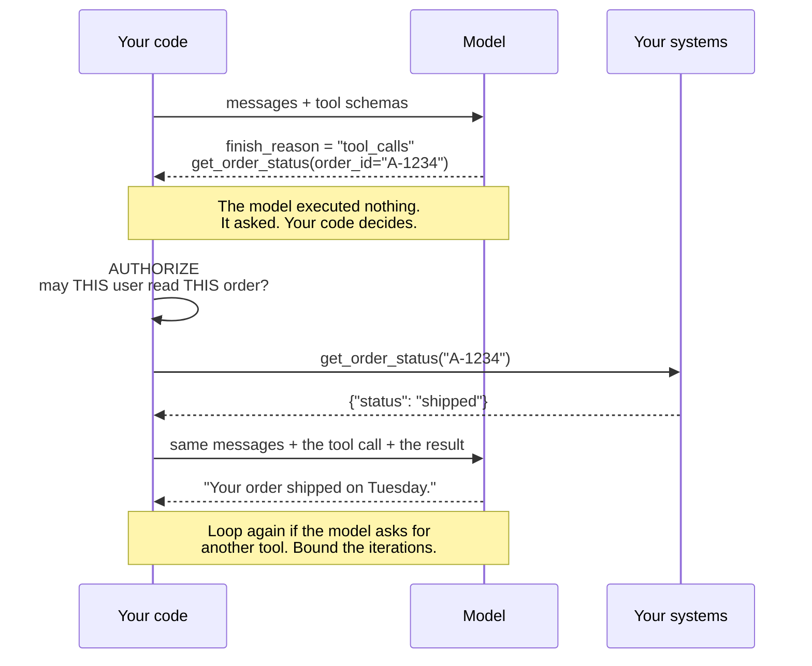

# Chapter 6 — Function and Tool Calling

> **Reading time:** ~30 minutes · **Career weight:** ★★★★★ Essential · **Prerequisites:** [Chapter 5](05-structured-outputs.md)
>
> **In one line:** The model never runs your code — it asks you to, and treating that request as untrusted is the whole of the engineering.

---

## 1. Why This Matters

**This is the chapter where the model stops being a text box and starts touching your systems.**

Everything so far has been text in, text out. Useful, but sealed off. Tool calling is the door: the model can now look up an order, query a database, call your API, send an email.

It is also the point where the risk profile changes completely. A model that only writes text can embarrass you. A model that can call `issue_refund()` can cost you money. Same technology, entirely different review conversation.

Two other reasons this chapter matters more than most:

**Everything after this is built on it.** MCP is a standard way to supply tools. An agent is a loop around tool calling. Multi-agent systems are agents calling agents as tools. Get this chapter right and the next twelve are variations. Get it wrong and they are all mysterious.

**It is where the most common serious security mistake in the field happens** — and it is not exotic. It is forgetting that the model is an anonymous caller.

---

## 2. The Problem

**The model knows a great deal and can do nothing.**

It was trained on text that stopped at some date. It has never seen your database, your ticketing system, or your customer records. It cannot check the time.

Worse — from Chapter 2 — it will not tell you any of that. Ask it for the status of order A-1234 and it will produce something order-status-shaped, because producing plausible text is the only thing it does.

So there are two problems, and the second is the interesting one.

**The easy problem:** how does the model get access to live data and real actions?

**The hard problem:** the model is now asking your code to *do things* — and it is doing so on behalf of a user, based on text that may have come from anywhere, with no credentials, no accountability, and no reliable judgement about whether the action is a good idea.

> **How do you let an unpredictable component initiate real actions in your systems, safely?**

That is not really an AI problem. It is an authorization and blast-radius problem, and your existing instincts are mostly correct. The one thing you must get right is understanding exactly who is calling what.

---

## 3. Mental Model

> **The model does not call your function. It asks you to call it, and you decide whether to comply.**

This is the single most important sentence in the chapter, and the naming works against you — "function calling" and "tool calling" both suggest the model executes something. It does not. It cannot. It has no runtime, no network access, and no ability to run code.

What actually happens is smaller and much less alarming:

1. You describe some functions in your request — names, descriptions, and argument schemas
2. Instead of prose, the model returns a structured object: *"I would like `get_order_status` with `order_id='A-1234'`"*
3. **Your code decides whether to honour that**, and if so, runs it
4. You send the result back as another message
5. The model writes an answer using it

Step 3 is where all your engineering lives. It is a decision point, and most teams do not treat it as one.

**The analogy that gets it right:**

> **A tool call is an inbound API request from an anonymous, unauthenticated client that is very good at sounding reasonable.**

You would never take a JSON body from the public internet and pass it straight to `issue_refund()` because it looked sensible. That is precisely what a naive tool-calling loop does.

**Where it leaks.** An anonymous internet client is at least honestly external. A tool call arrives from inside your own application, wrapped in your own framework, in a variable you named. It *feels* internal. It is not — the argument values were written by a model that may have been influenced by text a customer supplied.

---

## 4. The ML Bit, in Plain English

> **Skippable.** Explains how the model decides which tool to use.

There is no separate reasoning engine picking tools. It is Chapter 5's mechanism, pointed at a different target.

You supply each tool's name, description, and argument schema. Those go into the model's context as text — **your tool descriptions are prompt content.** The model then generates either prose or a structured object matching one of those schemas, with the schema constraining the shape exactly as before.

Two practical consequences fall out immediately.

**Tool descriptions are the single biggest lever on tool selection.** If the model keeps choosing the wrong tool, the problem is almost always that the descriptions do not distinguish them clearly. `"Search"` and `"Lookup"` are indistinguishable; `"Search product documentation by keyword"` and `"Fetch one order by its exact order ID"` are not. This is a writing problem, and it is fixable in minutes.

**Every tool costs tokens on every request.** All the descriptions and schemas are sent each time, whether used or not. Thirty tools is a substantial permanent prompt — which is one reason "just expose everything" goes wrong.

---

## 5. Architecture

**One loop, and one decision point that most implementations skip.**



Five things worth pulling out of that.

**`finish_reason` becomes load-bearing.** In Chapter 3 it told you whether the answer was complete. Now `"tool_calls"` is how you know the model wants something rather than has answered. Your code branches on it.

**You resend everything.** Chapter 2's statelessness has not gone away. The second call includes the original messages, the model's tool request, *and* your result. The conversation grows with every tool call, which is why agents get expensive.

**The result goes back as a message.** The model does not receive a return value. It receives text — the tool result serialised into the conversation, tagged so it can be matched to the request.

**The loop can repeat.** The model may need one tool's result to decide the next call. That is an agent, and it is Chapter 14. **Bound it now anyway:** a cap on iterations, on tokens, and on wall-clock time. A loop with no ceiling is a loop that will one day cost you four figures overnight.

**The authorize step is the one people omit.** It does not appear in most tutorials. It is the entire difference between a demo and something you can put in front of customers.

### The two kinds of tool

Separate these in your head and in your code, because they need different treatment.

| | **Read tools** | **Write tools** |
| --- | --- | --- |
| Example | `get_order_status` | `issue_refund` |
| Worst case | Wrong or leaked information | Money moves, data is destroyed |
| Retry safety | Free | **Must be idempotent** |
| Approval | Not usually | Often, above a threshold |
| Audit | Useful | Mandatory |

**Start read-only.** A system that can only look things up delivers most of the value and carries a fraction of the risk. Add write tools deliberately, one at a time, each with its own review.

---

## 6. See It in Code

### Raw OpenAI

Describing a tool is Chapter 5's schema with a name and a description attached:

```python
tools = [{
    "type": "function",
    "function": {
        "name": "get_order_status",
        "description": "Fetch the current status of one order by its exact order ID. "
                       "Use only when the user gives an order ID.",
        "parameters": {
            "type": "object",
            "properties": {"order_id": {"type": "string", "description": "e.g. A-1234"}},
            "required": ["order_id"],
            "additionalProperties": False,
        },
        "strict": True,
    },
}]
```

Note the description says **when to use it**, not just what it does. That sentence does more for reliability than any other line here.

Now the loop, with the part that matters marked:

```python
r = client.chat.completions.create(model=MODEL, messages=messages, tools=tools)
msg = r.choices[0].message

if msg.tool_calls:
    messages.append(msg)                                    # the request itself
    for call in msg.tool_calls:
        args = json.loads(call.function.arguments)          # model-written. UNTRUSTED
        result = dispatch(call.function.name, args, user)   # authorize INSIDE
        messages.append({
            "role": "tool", "tool_call_id": call.id, "content": json.dumps(result),
        })
    r = client.chat.completions.create(model=MODEL, messages=messages, tools=tools)
```

**What to notice.** `call.function.arguments` is a JSON *string*, not a dict — parse it, and be ready for it to be wrong. Every result needs its `tool_call_id` or the model cannot match request to answer. `msg.tool_calls` is a list, because the model can request several at once and you can run them in parallel. And `user` is passed into `dispatch` — the authorization context, which is the whole point.

Here is `dispatch`, which is the ten lines most tutorials leave out:

```python
def dispatch(name: str, args: dict, user: User) -> dict:
    tool = REGISTRY.get(name)
    if tool is None:
        return {"error": f"unknown tool {name}"}          # return, don't raise
    if not user.may_use(tool):
        return {"error": "not permitted"}                 # the model must not decide this
    try:
        return tool.run(**args, as_user=user)             # permissions enforced downstream too
    except Exception as e:
        log.exception("tool failed")
        return {"error": str(e)}                          # the model can recover from this
```

**Errors are returned, not raised.** This is counter-intuitive and it is right. If a tool fails, telling the model lets it try different arguments, use another tool, or explain the problem to the user. Throwing turns a recoverable situation into a 500. Return the error as the tool result and let the loop continue — while making sure the error text does not leak internals.

### With LangChain

LangChain removes most of the plumbing. The type hints and docstring become the schema:

```python
from langchain_core.tools import tool

@tool
def get_order_status(order_id: str) -> str:
    """Fetch the current status of one order by its exact order ID."""
    return orders.lookup(order_id)

model_with_tools = model.bind_tools([get_order_status])
msg = model_with_tools.invoke(messages)
msg.tool_calls        # [{'name': ..., 'args': {...}, 'id': ...}] - already parsed
```

**What it adds:** schema generation from your signature, so the schema cannot drift from the code. `tool_calls` arrives parsed. And `create_agent` will run the whole loop for you, including iteration limits.

**What it hides — and this one is important.** The docstring is now your tool description, which means **a docstring edit is a behaviour change**. It looks like documentation and it is prompt content. Teams tidy up docstrings and are surprised when tool selection shifts.

It also hides the dispatch step. When the framework executes the tool for you, there is no obvious place to put the authorization check. **There must still be one.** Put it inside the tool function itself, or in framework middleware — but if you cannot point at the line, you do not have it.

**Use the framework when** you have many tools or want the agent loop. **Use the raw SDK when** you are learning, or when the authorization logic is complex enough that you want it explicit.

### A worked contrast

Two tools, same mechanism, completely different engineering:

```python
@tool
def get_order_status(order_id: str) -> str:
    """Fetch the current status of one order by its exact order ID."""
    order = orders.lookup(order_id)
    require(current_user.may_view(order))       # authorize on THIS user
    return order.status

@tool
def issue_refund(order_id: str, amount_pence: int, idempotency_key: str) -> str:
    """Refund an order. Requires human approval above 5000 pence."""
    order = orders.lookup(order_id)
    require(current_user.may_refund(order))     # authorize
    if amount_pence > order.amount_pence:
        return "error: refund exceeds order value"    # validate against reality
    if amount_pence > 5000:
        return queue_for_approval(order, amount_pence)  # human gate
    return payments.refund(order, amount_pence, key=idempotency_key)   # idempotent
```

The refund tool has four protections the read tool does not need: authorization on the acting user, validation of the amount against the real order, a human gate above a threshold, and an idempotency key so a retry cannot double-refund. **None of them are AI-specific.** They are the controls you would put on any endpoint that moves money — the mistake is assuming that because the caller is your own model, they are unnecessary.

---

## 7. Engineering Decisions

### How many tools is too many?

Every tool is permanent prompt cost and one more thing to choose wrongly between. Selection accuracy degrades as the list grows, and the degradation starts earlier than people expect — often somewhere past a dozen or two, depending on the model and how distinct the tools are.

**If you have more tools than that, do not just add them all.** Options, roughly in order of preference: filter the tool list by what the user is doing; route to a small set first and then expose the relevant subset; or group related operations behind fewer, better-described tools.

**Measure it.** Selection accuracy is easy to evaluate and it is the first thing that degrades as a system grows.

### Fine-grained or coarse tools?

| | Many small tools | Fewer broad tools |
| --- | --- | --- |
| Selection | Harder — more to choose between | Easier |
| Authorization | Clean, per-operation | Blunt — one permission for many actions |
| Failure | Small blast radius | Large |
| Prompt cost | Higher | Lower |

**Prefer tools that map to a business operation, not to a database table.** `get_order_status` is right. `execute_sql` is a tool with unlimited blast radius, no meaningful authorization boundary, and a description that cannot tell the model when it is appropriate.

### Who decides whether the call is allowed?

**Never the model.** Three places, and you want all three:

1. **Before dispatch** — is this user allowed to use this tool at all?
2. **Inside the tool** — is this user allowed to touch this specific record?
3. **In the downstream system** — because your AI layer should not be the only thing standing between a user and their data

If the answer to "what stops the model calling `issue_refund` for another customer's order?" is anything other than a line of code you can point at, you do not have an answer.

### What comes back from a tool?

Tool results become prompt text, so size and shape matter more than usual. Returning a 200-field JSON object burns tokens, dilutes attention, and often makes the answer worse.

**Return what the model needs to answer, not everything you have.** Summarise, and trim. Also: tool results are untrusted input. A `customer_note` field can contain instructions aimed at the model. Chapter 24.

---

## 8. Decision Matrix

### Should this be a tool?

| | |
| --- | --- |
| ✅ **YES if** | The data changes, or is specific to your business · It needs a real action · Precision matters — IDs, amounts, dates · The model would otherwise guess |
| ❌ **NO if** | It is stable knowledge the model already has · You always call it anyway — just call it, and put the result in the prompt · It is one of forty near-identical operations |
| ⚠️ **Depends on** | Whether the model genuinely has a choice to make. **If you always want it called, call it yourself.** A tool is for when the model decides |

That last point saves a lot of complexity. Tools exist for decisions. If your code knows the answer, retrieve the data and put it in the context — deterministic, cheaper, and one fewer thing to go wrong.

### Should this tool need human approval?

| | |
| --- | --- |
| ✅ **YES if** | It moves money, deletes data, or contacts a customer · It is irreversible · It is above a value threshold · You are new to production and building trust |
| ❌ **NO if** | Read-only · Trivially reversible · Volume makes review impossible and the risk is genuinely low |
| ⚠️ **Design for** | Approval as a threshold, not a switch. Auto-approve below a limit, escalate above it, and lower the limit as evidence accumulates |

---

## 9. Technology Landscape

| Technology | What it is for | Use when | Watch out for |
| --- | --- | --- | --- |
| **Provider-native tool calling** | The mechanism itself | Always | Shapes differ slightly between providers |
| **LangChain `@tool` / `bind_tools`** | Schema from your function signature | Python or JS, several tools | Docstrings are behaviour |
| **LangGraph** | The loop, with state, limits, and approval gates | Anything beyond a single tool call | Chapter 16 |
| **MCP** | A standard way to *supply* tools across applications | Reusing tools, or third-party tools | Chapter 7 |
| **Provider hosted tools** — web search, code execution | Common capabilities without building them | The capability is generic | Your data goes to their sandbox |
| **Gateways with tool policy** | Central allow-lists, quotas, audit | Several teams shipping tools | Adds a hop |

**Two things worth knowing.** Provider-hosted tools like web search and code execution are genuinely useful and mean you should not build a code sandbox yourself — but understand what leaves your network. And **MCP is not an alternative to tool calling**; it is a standard way to *distribute* tools to whatever is doing the tool calling. The mechanism in this chapter is what runs underneath. That is Chapter 7.

> Ages fastest. Reviewed quarterly.

---

## 10. Production Notes

| Concern | What to get right |
| --- | --- |
| **Security** | Tool arguments are untrusted input written by a model that may have read attacker-controlled text. Authorize every call against the *end user*, never a service account with broad rights. **The dangerous combination is access to private data, exposure to untrusted content, and a way to send data out** — remove one leg and the exfiltration path closes |
| **Scaling** | Parallel tool calls arrive together — run them concurrently. Tool latency is now inside your user-facing latency, and every tool call means another full model request with a longer conversation |
| **Observability** | Log every requested call, every authorization decision including denials, arguments, results, duration, and outcome. **Denials are the interesting signal** — a spike means someone is probing or your prompt has drifted |
| **Failure modes** | Wrong tool chosen, wrong arguments, tool times out, model loops calling the same tool, model ignores the result and invents an answer anyway |
| **Cost** | Every tool schema is sent on every request. Every tool call is another round trip with a longer conversation. A five-step tool sequence can cost far more than five times a single call |

**Idempotency is not optional for write tools.** Tool calls get retried — by the SDK, by your gateway, by a user refreshing, by the model deciding the first attempt did not work. A refund tool without an idempotency key will eventually issue a double refund, and you will find out from finance.

**One alert to set on day one:** the same tool called more than N times in a single conversation. It is the earliest signal of a loop, and it usually shows up before the cost does.

---

## 11. Best Practices and Common Mistakes

**Do this**

- **Write descriptions that say when to use the tool**, not just what it does. Biggest lever on selection accuracy.
- **Start read-only.** Add write tools one at a time, each with its own review.
- **Authorize inside the tool, against the end user.** Not the model, not a service account.
- **Make every write tool idempotent.** Retries are certain.
- **Return errors as tool results**, so the model can recover. Do not leak internals in the text.
- **Bound the loop** — iterations, tokens, and wall clock.
- **Return only what is needed.** Tool results are prompt text.
- **Log authorization denials.** Cheapest early-warning signal you will get.
- **Name tools distinctly.** If two names could be confused by a person, they will be by the model.
- **Evaluate tool selection separately** from answer quality. They fail independently.

**Not this**

| Mistake | What it looks like | Do instead |
| --- | --- | --- |
| Trusting tool arguments | Model-written values passed straight to a query | Validate and authorize every call |
| Service-account permissions | The model can read every customer's data | Scope to the end user |
| No idempotency on writes | A double refund | Idempotency keys |
| Exposing `execute_sql` | Unlimited blast radius, no real permission boundary | Business-operation tools |
| Forty tools at once | Wrong tool chosen; large permanent prompt cost | Filter, route, or consolidate |
| Raising on tool failure | A recoverable problem becomes a 500 | Return the error to the model |
| Unbounded loops | £4,000 overnight | Hard caps on iterations, tokens, and time |
| Vague descriptions | "Search" and "Lookup" chosen at random | Say when each applies |
| A tool for something you always call | Non-determinism where you did not need any | Call it yourself, put the result in context |
| Dumping full API responses | Token cost, diluted attention, worse answers | Trim to what is needed |
| Trusting tool *results* | A record field carries an injection payload | Results are untrusted too |

---

## 12. Forward Deployed Engineer Notes

**What customers say, and what it means**

| They say | It means | Ask |
| --- | --- | --- |
| "It should just be able to do everything in the system" | They have not considered blast radius | "Which of these actions would you want a human to approve?" |
| "We'll give it an API key" | A service account with broad rights | "Whose permissions should apply — the AI's or the user's?" |
| "It calls the wrong function" | Descriptions do not distinguish the tools | Read the descriptions aloud. The overlap is usually obvious |
| "It's slow" | Several sequential tool calls, each a full round trip | Count the round trips in a trace |
| "Can it update the CRM?" | The first write tool. Treat it as a milestone | "What is the rollback if it does that wrongly?" |

**Discovery questions**

1. **"Whose permissions apply when the assistant reads a record?"** Frequently unconsidered, and the answer determines your architecture. If it is "the AI's," you are building a data-leak engine with a chat interface, and this is the single most valuable question in the chapter.
2. **"Which actions are irreversible?"** Gives you your approval gates directly. Ask before you build, because retrofitting an approval flow means re-plumbing the loop.
3. **"Does this API behave correctly if called twice?"** Most legacy enterprise APIs are not idempotent and nobody has needed to care until now.
4. **"What is the audit requirement for automated actions?"** In regulated environments this is a hard constraint on your logging, and it is cheap now and expensive later.

**Integration challenges.** Legacy APIs that are chatty, slow, or need three calls for one useful answer — wrap them into a single tool rather than exposing all three. APIs with no test environment, where your first real write is in production. Rate limits designed for human-paced use meeting a model that fires ten calls in a second. And authorization models that cannot express "act as this user," which is where SSO integration becomes your critical path.

**Build vs buy.** Build the tools — they encode business logic and that is exactly what nobody can buy for you. Do not build the loop, the retries, the approval workflow, or the tracing. LangGraph and its equivalents do those adequately, and a bespoke agent loop is a maintenance liability with no differentiation.

**Before go-live**

- [ ] Every tool authorizes against the end user, with the check visible in code
- [ ] Read and write tools separated, with writes reviewed individually
- [ ] Write tools idempotent, verified by calling twice
- [ ] Approval gates on irreversible and high-value actions, tested
- [ ] Hard caps on iterations, tokens, and wall clock
- [ ] Every call and every denial logged, with arguments and outcome
- [ ] Alert on repeated calls to the same tool in one conversation
- [ ] Tool selection accuracy measured on a real test set
- [ ] Tool results treated as untrusted where they reach a renderer or another tool
- [ ] Downstream systems enforce permissions independently

---

## 13. Career Notes

**Importance: ★★★★★ Essential.** The foundation of agents, MCP, and everything in Part IV. Also the topic where a security-aware answer separates candidates fastest.

**In interviews.** *"How does an agent call a tool?"* is a warm-up. The real question follows: *"what stops it calling that tool for the wrong customer?"* A weak answer says the prompt tells it not to. A good answer describes authorization at dispatch. **A strong answer volunteers that the model executes nothing, that tool arguments are untrusted input, and that permissions belong to the end user rather than the application.**

**On the job.** Constantly. Most enterprise AI work is exposing existing systems as tools, safely.

**Seniority signal.** Where the authorization check lives. A junior engineer writes the tool. A senior engineer writes the tool, the permission check, the idempotency key, and the audit line — and can explain why a service account would have been a serious mistake.

---

## 14. One Minute Summary

> **If you remember one thing: the model never executes anything. It sends your code a request, and every one of those requests is untrusted input from an anonymous caller.**

- **The loop:** describe tools → model asks → **you authorize** → you execute → send the result back → model answers. The authorize step is the one tutorials skip.
- **Descriptions are prompt content.** Say *when* to use a tool, not just what it does. Biggest lever on picking the right one.
- **Read and write tools are different engineering.** Start read-only; add writes one at a time.
- **Permissions belong to the end user**, never to a service account and never to the model.
- **Write tools must be idempotent.** Retries are certain.
- **Bound the loop** — iterations, tokens, wall clock — before you need to.
- **Return errors to the model** so it can recover. Do not raise.
- **Tool results are untrusted too.** They enter the prompt, and they can carry instructions.

---

## 15. Interview Questions and References

1. Walk through what actually happens when a model "calls a function."
2. Does the model execute your code? Explain precisely what it does.
3. What stops a model calling a tool for a customer the user is not allowed to see?
4. Why should tool arguments be treated as untrusted input?
5. Why must write tools be idempotent? Give a concrete failure.
6. Should a tool raise an exception or return an error? Why?
7. What happens to tool selection accuracy as you add tools, and what do you do about it?
8. Why is `execute_sql` usually a bad tool to expose?
9. How would you decide whether an action needs human approval?
10. Why are tool descriptions prompt engineering?
11. What is the risk of returning a full API response as a tool result?
12. How would you detect and stop a runaway tool-calling loop?
13. When should something *not* be a tool, even though the model could call it?
14. Why can tool *results* be a security concern, not just arguments?
15. What would you log for every tool call, and which signal matters most?

---

## References

**Official documentation**

- [OpenAI — Function calling](https://platform.openai.com/docs/guides/function-calling) — the primary reference, including parallel calls and `strict`.
- [Anthropic — Tool use](https://docs.anthropic.com/en/docs/build-with-claude/tool-use) — the same concepts, different shape. Worth skimming to see what is universal.
- [LangChain — Tools](https://python.langchain.com/docs/concepts/tools/) · [Tool calling](https://docs.langchain.com/oss/python/langchain/models)

**Security — read at least the first**

- [Simon Willison — The Lethal Trifecta](https://simonwillison.net/2025/Jun/16/the-lethal-trifecta/) — private data, untrusted content, and a way out. The clearest framing of the risk, and it takes five minutes.
- [OWASP Top 10 for LLM Applications](https://genai.owasp.org/) — excessive agency and insecure output handling are this chapter.

**Worth reading once**

- [Anthropic — Building Effective Agents](https://www.anthropic.com/engineering/building-effective-agents) — where tool calling becomes an agent, and when it should not.
- [Anthropic — Writing effective tools for agents](https://www.anthropic.com/engineering/writing-tools-for-agents) — practical guidance on descriptions and granularity.

---

← [Chapter 5 — Structured Outputs](05-structured-outputs.md) · [Contents](../SUMMARY.md) · [Chapter 7 — MCP Explained](07-mcp-explained.md) →
