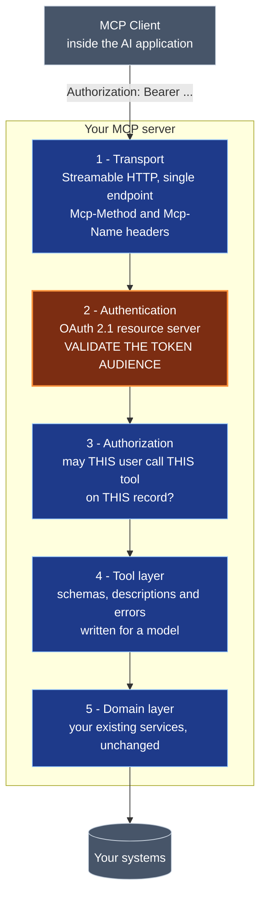

# Chapter 8 — Building MCP Servers and Clients

> **Reading time:** ~22 minutes · **Career weight:** ★★★★☆ Important · **Prerequisites:** [Chapter 7](07-mcp-explained.md)
>
> **In one line:** You are designing an API whose only consumer cannot read your documentation, has no memory, and guesses when unsure — and the one rule you must not get wrong is that your server validates who a token was issued for.

---

## 1. Why This Matters

**A working MCP server takes twenty minutes. A good one is a different discipline entirely, and almost nobody talks about the difference.**

Chapter 7 was the decision. This chapter is the build, and the gap between "it works on my machine with Claude Desktop" and "this is exposed to five teams and holds customer data" is where all the interesting engineering sits.

Two things make this harder than the equivalent REST work you have done many times.

**Your consumer is a model.** It cannot read your API documentation, ask a colleague, or reason about your naming conventions from experience. It sees a name, a description, and a schema, and it guesses. Everything you know about designing for human developers still applies, but the tolerances are much tighter.

**Your server is now an authorization boundary.** It sits between an AI application that may have been manipulated and systems that hold real data. There is one specific mistake here that turns your server into an open door, it is easy to make, and it appears in production systems today. Section 5 covers it.

---

## 2. The Problem

**The SDK makes the protocol trivial, which hides where the actual difficulty is.**

Decorate a function, run the server, and it works. That is genuinely good design — the protocol should be invisible. But it means the tutorial ends exactly where the engineering starts.

Four things the quickstart does not prepare you for:

| Problem | Why it is hard |
| --- | --- |
| **Designing for a model** | Names, descriptions, errors, and response sizes all affect behaviour in ways they never did for human consumers |
| **Authorization** | You are an OAuth 2.1 resource server now, and there is a specific validation step that is mandatory and commonly skipped |
| **Statelessness** | The protocol has no sessions. Anything multi-step has to be designed differently |
| **Testing** | Your caller is non-deterministic. "It returns the right data" is necessary and nowhere near sufficient |

> **How do you build a service whose caller is unpredictable, whose consumer cannot read documentation, and which is exposed to systems that matter?**

The good news: most of the answer is ordinary service engineering applied with unusual care. The parts that are genuinely new are small, and this chapter is mostly about those.

---

## 3. Mental Model

> **You are designing an API for a confident amateur who cannot read your documentation, has no memory of last time, and will guess rather than ask.**

Sit with that, because it reframes decisions you would otherwise make on autopilot.

A human developer integrating with your API reads the docs, sees that `q` means query, notices the pagination convention, and remembers next time. **A model gets one shot with whatever text you put in the schema.** If the description is ambiguous, it guesses. If the error is unhelpful, it guesses again. If two tools sound similar, it picks one at random.

This has a liberating consequence: **your API can be more verbose than you would normally allow.** Long descriptive names and full-sentence descriptions cost tokens but are not ugly to anyone. The aesthetic instincts you have about terse interfaces do not apply.

**A second model, for the security posture:**

> **Your MCP server is a resource server in front of systems that matter, and its callers are only as trustworthy as the text they have read.**

Not a library. Not an internal helper. A boundary — with the obligations that implies.

**Where the first analogy leaks.** An amateur developer learns. A model does not: it will make the same mistake on every request forever. That is bad news for tolerance and good news for testing, because the failure is perfectly reproducible in a way human error never is.

---

## 4. The ML Bit, in Plain English

> **Skippable.** Explains why your error messages are part of your interface.

When a tool call fails, the error text does not go to a log for an engineer to read tomorrow. **It goes back into the model's context, and the model reads it and decides what to do next.**

That makes error messages prompt content, and it makes them unusually high-leverage. An error that says what was wrong and what to do instead gets a corrected retry. An error that says `Error: 400` gets a random retry or a fabricated answer.

The difference in practice:

| Error text | What the model does |
| --- | --- |
| `Error: invalid input` | Retries the same thing, or gives up and invents |
| `order_id must look like A-1234; you sent "last week's order". Ask the user for the order ID.` | Asks the user for the order ID |

The second one is barely more work and changes the behaviour of the whole system. **Write errors as instructions to the caller, because that is exactly what they are.**

Same principle as Chapter 6's point about descriptions, applied to the part everyone treats as an afterthought.

---

## 5. Architecture

**Five layers. The second one contains the rule you cannot get wrong.**



**Layer 5 should already exist.** If you are writing business logic inside your MCP server, something has gone wrong — the server is an adapter over services you already run.

### The one rule: validate the token audience

**Your server must confirm that the access token it received was issued *for your server*, and reject it otherwise.**

The specification is unusually direct about this. Servers MUST validate that tokens were issued specifically for them as the intended audience. Servers MUST only accept tokens valid for their own resources. **Servers MUST NOT accept or transit any other tokens.**

Here is the attack it prevents, because the rule only sticks once you have seen it.

A user authorises an AI application to access some third-party service, and the application holds that token. The application also connects to your MCP server. If your server accepts any well-formed token without checking who it was minted for, then a token issued for somewhere else now opens your server. Worse is the mirror image: your server accepts a token and *passes it through* to a downstream API. You have become a confused deputy — a credential laundering service with a helpful description.

**The rule in one line: your server accepts only tokens minted for your server, and never forwards a token it received.** If it needs to call something downstream, it obtains its own credential for that call.

### How the auth flow actually goes

You do not invent any of this — it is standard OAuth 2.1 with two specific requirements. Worth knowing the shape:

1. Client calls your server with no token. You return **401** with a `WWW-Authenticate` header pointing at your protected resource metadata, and the scope needed.
2. Client fetches that metadata from `/.well-known/oauth-protected-resource`, which names your authorization server.
3. Client does a normal OAuth 2.1 authorization code flow with PKCE, including a `resource` parameter naming your server. **That parameter is what makes the resulting token audience-bound to you.**
4. Client retries with `Authorization: Bearer ...`. You validate the signature *and the audience*.

Two more details that save time later. **401 means "no valid token"; 403 means "valid token, insufficient scope"** — and a 403 should carry `error="insufficient_scope"` plus the scopes required, so the client can perform a step-up authorization rather than simply failing. And **stdio servers should not do any of this**: they run as a subprocess of a user who is already authenticated, and take credentials from the environment.

---

## 6. See It in Code

### A server worth using

The mechanics take four lines. The care goes into names, descriptions, and errors:

```python
from mcp.server import MCPServer

mcp = MCPServer("orders")

@mcp.tool()
async def get_order_status(order_id: str) -> str:
    """Fetch the current status of one order by its exact order ID.

    Use when the user supplies an order ID like A-1234. For finding an order
    when the ID is unknown, use search_orders instead.
    """
    if not ORDER_ID.match(order_id):
        return (f"Invalid order_id {order_id!r}. Expected format A-1234. "
                f"If the user did not give an ID, use search_orders.")
    order = await orders.get(order_id, as_user=current_user())
    return f"Order {order.id}: {order.status}, updated {order.updated:%Y-%m-%d}"
```

Five deliberate choices in twelve lines.

**The description says when *not* to use it** and names the alternative. This is the single most effective thing you can do for tool selection when you have more than a couple of similar tools.

**The validation error is an instruction.** It states the expected format and the recovery path. The model will act on it.

**`as_user=current_user()`** — authorization on the acting user, at the point of data access.

**The response is a sentence, not a JSON dump.** The order record probably has forty fields. Three of them answer the question, and the rest cost tokens and dilute attention.

**Returning an error, not raising.** Chapter 6's rule, and it matters more here because the model is further from your code.

### Resources, which almost everyone skips

Reference data that the application always wants is a resource, not a tool. Making it a tool means the model has to remember to fetch something it always needs:

```python
@mcp.resource("orders://status-codes")
async def status_codes() -> str:
    """The full list of order status codes and what each one means."""
    return STATUS_CODE_REFERENCE
```

The application can pull this into context directly. No model decision, no tool call, no token spent on a schema.

### State without sessions

The protocol is stateless — there is no session to hang a multi-step operation on. **The replacement is a server-minted handle passed as an ordinary tool argument.**

```python
@mcp.tool()
async def search_orders(customer_id: str, cursor: str | None = None) -> str:
    """Search a customer's orders. Returns up to 20 with a next_cursor if more exist."""
    page = await orders.search(customer_id, cursor=cursor, limit=20,
                               as_user=current_user())
    lines = [f"{o.id}: {o.status}" for o in page.items]
    if page.next_cursor:
        lines.append(f"next_cursor={page.next_cursor} — pass this to see more")
    return "\n".join(lines)
```

**You mint the cursor; the client passes it back.** No session state, so any instance can serve the next request, which is exactly what the stateless revision was designed to allow. Note the response tells the model what the cursor is for — otherwise it will not use it.

The same pattern covers anything multi-step: return a handle, accept it back. **Never assume two calls reached the same process.**

### Authentication, in the shape you will actually write it

Frameworks differ, so treat this as the required behaviour rather than an API:

```python
async def authenticate(request) -> User:
    token = bearer_token(request)
    if token is None:
        raise Unauthorized(resource_metadata=METADATA_URL, scope="orders:read")

    claims = verify_signature(token, jwks=AS_JWKS)
    if MY_CANONICAL_URI not in as_list(claims["aud"]):     # THE RULE
        raise Unauthorized(resource_metadata=METADATA_URL)  # not ours. reject

    if "orders:read" not in claims.get("scope", "").split():
        raise Forbidden(error="insufficient_scope", scope="orders:read")
    return User(claims["sub"], scopes=claims["scope"])
```

**The audience check is three lines and it is the whole of section 5.** A token that is validly signed but issued for a different resource must be rejected. Signature validity is not sufficient — that is the mistake.

### The client side

Most teams consume more servers than they build. The thing worth writing yourself is the policy layer:

```python
tools = await mcp.list_tools()
allowed = [t for t in tools if policy.permits(t.name, user)]    # allow-list

for t in allowed:
    if t.description_hash != PINNED[t.name]:                     # rug-pull check
        alert("MCP tool description changed", tool=t.name)
```

**Two controls, neither provided by the protocol.** An allow-list, so connecting a server does not automatically expose everything it offers. And a check that tool descriptions have not changed since you reviewed them — descriptions go into your model's prompt, so a silent change is a silent prompt change.

---

## 7. Engineering Decisions

### How do you decide what becomes a tool?

The instinct is to mirror your API. Resist it — your API was designed for developers who read documentation.

**Design tools around what someone would ask for, not around your endpoints.** If answering a common question takes three of your API calls, that is one tool, not three. Every round trip is another full model request with a longer conversation, so chattiness is expensive in a way it is not for normal clients.

A test that works well: **write down the ten questions users will actually ask. If a question cannot be answered in one or two tool calls, you have the wrong tools.**

### What should a tool return?

Prose or compact structured text, sized to the question. Not your full API response.

The reasoning is Chapter 2's: everything you return becomes prompt tokens, you pay for it, and long context makes answers worse rather than better. A forty-field object where three fields matter is a tax on every single call.

**Include units, formats, and identifiers explicitly.** `"updated 2026-08-04"` beats `"updated": 1785801600`, because the second one invites the model to guess.

### Long-running operations?

The synchronous request/response shape breaks down past about thirty seconds — clients time out, and a broken stream loses the request entirely, since there is no resumability to fall back on.

**Return a handle immediately and let the caller poll.** Start the work, return a job ID with guidance on when to check back, and expose a status tool. The Tasks extension standardises this pattern if you want the protocol-level version. Either way, do not hold a request open and hope.

### Versioning a tool

Your tools are an API consumed by systems you do not control, but with a wrinkle: **the model reads the descriptions, so changing wording changes behaviour.** A "clarification" is a behaviour change.

Treat it accordingly. Adding a tool or an optional argument is safe. Renaming, removing, changing required arguments, or changing return shape is breaking — and for anything with real consumers, add the new tool alongside the old rather than mutating it. Announce description changes rather than slipping them in.

### Build a client, or use a framework's?

Use the framework's for connecting to servers — LangChain, LangGraph, and the OpenAI Agents SDK all do it in a couple of lines and there is no value in reimplementing it.

**Build the policy layer yourself**, because nobody can supply it: which servers are approved, which tools within them are exposed to which users, and what happens when a tool list changes.

---

## 8. Decision Matrix

### Should this capability be a tool, a resource, or a prompt?

| | |
| --- | --- |
| **Tool** if | The model should decide when to invoke it · It takes parameters that vary · It performs an action |
| **Resource** if | The application always wants it in context · It is reference data — a schema, a glossary, a code list · Read-only and fairly stable |
| **Prompt** if | A person invokes it deliberately · It encodes a workflow you want done consistently |

**Reference data is the commonly missed one.** Anything the model needs on most calls should be a resource the application injects, not a tool it has to remember to call.

### Should this server be exposed beyond your team?

| | |
| --- | --- |
| ✅ **YES if** | Auth is real, with audience validation · Authorization is per end user · Tools are read-only, or writes are gated and audited · You have tested tool selection, not just correctness · Someone owns it |
| ❌ **NO if** | It uses a shared service account · It accepts any validly-signed token · It is stdio-only on someone's laptop · You cannot say what happens when a tool is misused |
| ⚠️ **Depends on** | Whether you can operate it. It is a production service with an unusual client, and it needs the on-call story to match |

---

## 9. Technology Landscape

| Category | What it is for | Notes |
| --- | --- | --- |
| **Official SDKs** — Python, TypeScript, Java, C#, Go, Kotlin, Rust, Ruby | The protocol, handled | Check which spec revision your version targets before relying on newer features |
| **MCP Inspector** | Interactive testing without wiring up a model | Use from your first tool. Fastest feedback available |
| **Reference servers** | Working examples of shape and conventions | Read the source. Not built as production services |
| **Gateways** | Central allow-lists, quotas, audit across servers | Emerging and moving quickly. Worth watching if you will run several |
| **Auth libraries** | Standard OAuth 2.1 resource-server validation | Use your platform's. Do not hand-roll token validation |
| **Eval tooling** | Testing whether the model picks the right tool | Chapter 21. This is the test that actually matters |

**One recommendation worth acting on immediately:** run the Inspector against your server before connecting a model. It shows exactly what a client sees — your names, your descriptions, your schemas — which is the fastest way to notice that two tools are indistinguishable.

> Ages fastest. Reviewed quarterly.

---

## 10. Production Notes

| Concern | What to get right |
| --- | --- |
| **Security** | Validate token audience and reject everything else. Never forward a received token downstream. Authorize per end user at the point of data access. Treat tool arguments as untrusted — they were written by a model |
| **Scaling** | Statelessness means normal HTTP scaling. Keep it that way: no in-memory state between calls, handles for anything multi-step. Set `ttlMs` on tool and resource lists so clients stop re-fetching |
| **Observability** | Log tool name, caller identity, arguments, outcome, and duration. Propagate trace context so a host-side trace does not stop at your boundary. **Track which tools are never called** — usually a description problem, occasionally a tool nobody needs |
| **Failure modes** | Slow tools blocking a conversation, oversized responses, tools indistinguishable to the model, a description change altering behaviour, downstream API rate limits meeting model-speed calls |
| **Cost** | You control someone else's prompt. Every schema and description you publish is sent on every request in every application connected to you. **Twenty verbose tools is a cost you impose on your consumers** |

**The stdio trap, which will cost you an afternoon.** On a stdio server, **never write to stdout**. `print()`, `console.log()`, `System.out.println()` — any of them corrupt the JSON-RPC stream and break the server in a way whose error message points nowhere useful. Log to stderr.

**One alert worth having:** authorization denials by tool. A spike means either your prompt has drifted into suggesting tools users cannot use, or someone is probing.

---

## 11. Best Practices and Common Mistakes

**Do this**

- **Validate the token audience.** If you take one thing from this chapter, take this.
- **Say when *not* to use a tool**, and name the alternative.
- **Write errors as instructions.** The model reads them and retries.
- **Return sentences sized to the question**, not full API responses.
- **Authorize per end user**, at the point of data access.
- **Use handles for anything multi-step.** Never assume two calls hit the same process.
- **Log to stderr on stdio servers.** Never stdout.
- **Run the Inspector** before connecting a model.
- **Test tool selection**, not just tool correctness. They fail independently.
- **Model reference data as resources.**
- **Set cache TTLs** on list responses.

**Not this**

| Mistake | What it looks like | Do instead |
| --- | --- | --- |
| Accepting any valid token | Tokens for other services open your server | Validate audience |
| Passing tokens downstream | You are a credential launderer | Get your own credential for downstream calls |
| Mirroring your REST API | Three round trips for one question | Design around questions, not endpoints |
| Returning the full object | Token cost and worse answers | Trim to what answers the question |
| `Error: 400` | Random retries, or invention | Say what was wrong and what to do |
| Writing to stdout on stdio | Server breaks; the error explains nothing | stderr |
| In-memory state between calls | Works on one instance, fails behind a load balancer | Server-minted handles |
| Service account for everything | Every user gets every permission | End-user identity throughout |
| Editing a description to "clarify" | Behaviour changes silently in every consumer | Treat descriptions as API surface |
| Testing only that data is correct | The model never picks the tool | Evaluate selection |
| Twenty tools because you can | You inflate every consumer's prompt | Publish what is needed |
| Holding a request open for minutes | Timeouts, and no resumability to recover | Handle plus polling |

---

## 12. Forward Deployed Engineer Notes

**What customers say, and what it means**

| They say | It means | Ask |
| --- | --- | --- |
| "We'll expose our REST API over MCP" | A generated wrapper, one tool per endpoint | "What are the ten questions users ask?" |
| "It works in Claude Desktop" | stdio, on a laptop, with someone's personal credentials | "What does the deployed version look like?" |
| "The model doesn't use our tool" | Description problem, nine times in ten | Open the Inspector and read what a client sees |
| "We pass the user's token through" | **Stop.** This is the confused deputy | "What audience is that token bound to?" |
| "Can it handle a long-running job?" | Not synchronously | "How long, and can the caller poll?" |

**Discovery questions**

1. **"Which identity reaches the underlying system?"** Third time this playbook has asked it, because it is the question that most often has the wrong answer, and here it decides your entire auth design.
2. **"What are the ten questions users will actually ask?"** Turns an endpoint-mirroring exercise into a design one, and it is the difference between a server people use and one they abandon.
3. **"Who owns this server after we leave?"** It is a production service. If the answer is "the AI team," check that the AI team runs production services.
4. **"What is your OAuth setup?"** Determines whether auth is two days or six weeks. Enterprises with a mature identity platform are fine; those without are looking at a project.

**Integration challenges.** Legacy APIs needing several calls per useful answer, which is a design opportunity rather than a blocker. Auth platforms that cannot issue audience-bound tokens — the most common real obstacle, and it usually means an identity-team conversation early. Rate limits sized for human use meeting model-speed calls. And servers on developer laptops with personal credentials, which has usually already happened before anyone asks.

**Build vs buy.** Build the server, because it encodes your business logic. Do not build the protocol layer, the OAuth validation, or a gateway. And do not auto-generate tools from an OpenAPI spec expecting good results — it produces one tool per endpoint with descriptions written for humans, which is precisely the failure mode this chapter is about.

**Before go-live**

- [ ] Token audience validated; tokens for other resources rejected
- [ ] No received token ever forwarded downstream
- [ ] End-user identity enforced at data access
- [ ] Tool descriptions say when *not* to use each tool
- [ ] Errors written as instructions, and tested by triggering them
- [ ] No in-memory state between calls; handles used for multi-step
- [ ] Response sizes reviewed — nobody dumping full objects
- [ ] stdio servers log to stderr only
- [ ] Trace context propagated across the boundary
- [ ] Tool selection evaluated on realistic questions
- [ ] Cache TTLs set on list responses
- [ ] Named owner, on-call, and a runbook

---

## 13. Career Notes

**Importance: ★★★★☆ Important.** Building servers is a smaller slice of the work than consuming them, but it is where platform and FDE roles concentrate, and it is a differentiator because so few people have done it properly.

**In interviews.** *"How would you expose our order system to AI applications?"* is now a realistic systems-design question. The strong answer designs around user questions rather than endpoints, puts end-user identity through the whole path, and **raises token audience validation without being prompted.** Mentioning that tool descriptions are API surface — because changing them changes behaviour — is the detail that signals real experience.

**On the job.** Increasingly common, especially in platform teams building the paved road for others.

**Seniority signal.** Treating the server as a production service with an unusual client, rather than as a script. A junior engineer ships a working server. A senior engineer ships one with audience validation, per-user authorization, model-readable errors, evaluated tool selection, and a named owner — and can explain why mirroring the REST API would have failed.

---

## 14. One Minute Summary

> **If you remember one thing: validate that every token was issued for your server, and never forward a token you received. Everything else in this chapter is craft; that one is the difference between a boundary and an open door.**

- **Your consumer cannot read documentation.** Names, descriptions, and errors are the entire interface, and they are prompt content.
- **Say when *not* to use a tool** and name the alternative. Best single fix for wrong-tool selection.
- **Errors are instructions.** The model reads them and retries. Say what was wrong and what to do.
- **Design around the ten questions users ask**, not around your endpoints. Each round trip is a full model request.
- **Return what answers the question.** You are spending your consumers' tokens.
- **No sessions.** Server-minted handles for anything multi-step, so any instance can serve any request.
- **Never write to stdout on a stdio server.** It corrupts the protocol and the error tells you nothing.
- **Test tool selection separately from tool correctness.** They fail independently, and selection fails more often.

---

## 15. Interview Questions and References

1. Why must an MCP server validate the audience of an access token? What attack does it prevent?
2. What is token passthrough and why is it prohibited?
3. When should a server return 401 and when 403? What should the 403 carry?
4. How do you handle a multi-step operation when the protocol has no sessions?
5. Why is mirroring your REST API onto MCP tools usually the wrong design?
6. Why are error messages part of your interface here in a way they are not for a normal API?
7. What should a tool return, and why is returning the full API response a problem?
8. How would you handle an operation that takes five minutes?
9. Why is editing a tool description a behaviour change?
10. What breaks if your server keeps state in memory between calls?
11. Why must a stdio server never write to stdout?
12. How would you test that a server is good, not just correct?
13. What controls should a client add that the protocol does not provide?
14. How do you version tools without breaking consumers?
15. When should something be a resource rather than a tool?

---

## References

**Building**

- [Build an MCP server](https://modelcontextprotocol.io/docs/develop/build-server) — the official walkthrough, in every SDK language.
- [Server concepts](https://modelcontextprotocol.io/docs/learn/server-concepts) — tools, resources, prompts, and who controls each.
- [MCP Inspector](https://github.com/modelcontextprotocol/inspector) — use it from your first tool.
- [Reference servers](https://github.com/modelcontextprotocol/servers) — read the source for conventions.

**Authorization — read before exposing anything**

- [Authorization](https://modelcontextprotocol.io/specification/2026-07-28/basic/authorization) — the normative requirements, including audience validation.
- [Security best practices](https://modelcontextprotocol.io/specification/2026-07-28/basic/security_best_practices) — confused deputy, token passthrough, and scope minimization.
- [RFC 8707 — Resource Indicators for OAuth 2.0](https://www.rfc-editor.org/rfc/rfc8707.html) — the mechanism that makes a token audience-bound.
- [RFC 9728 — OAuth 2.0 Protected Resource Metadata](https://datatracker.ietf.org/doc/html/rfc9728) — how a client discovers your authorization server.

**Design**

- [Anthropic — Writing effective tools for agents](https://www.anthropic.com/engineering/writing-tools-for-agents) — the best writing available on tool granularity and descriptions.

---

← [Chapter 7 — MCP Explained](07-mcp-explained.md) · [Contents](../SUMMARY.md) · **Next: Chapter 9 — Embeddings** *(not yet published — see [ROADMAP.md](../ROADMAP.md))*
