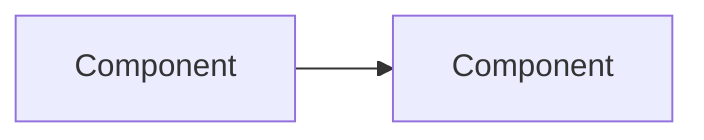

# Chapter N — {Title}

> **Reading time:** ~35 minutes · **Career weight:** ★★★★☆ · **Prerequisites:** Chapter X
>
> **In one line:** {The single sentence that captures the chapter.}

---

## 1. Why This Matters

Why should an AI Engineer care? Open with the consequence of *not* knowing this — a real failure, a wasted quarter, a blown budget. Three or four paragraphs maximum.

---

## 2. The Problem

State the engineering problem precisely. What breaks without this? What did people do before it existed, and why did that stop working?

---

## 3. Mental Model

An analogy to traditional software engineering the reader already knows.

> **{Thing} is {familiar thing} for {AI context}.**

Then state where the analogy breaks. Every analogy leaks; naming the leak is what makes it useful rather than misleading.

---

## 4. Architecture

How the pieces fit together. One diagram that earns its place.

Walk through the diagram in prose. Do not make the reader infer it.

---

## 5. Internal Working

What happens under the hood, and — more importantly — *why it was built that way*. Reasoning over implementation detail. The reader should be able to predict how it behaves in a situation this chapter never mentions.

---

## 6. Engineering Decisions

- **Why does this exist?** What forced it into being.
- **What alternatives exist?** Including "do nothing" and "use the boring technology you already run."
- **What problems does it actually solve?** And which ones it is wrongly believed to solve.

---

## 7. Decision Matrix

### Should I use this?

| | |
| --- | --- |
| ✅ **YES if** | {Condition} · {Condition} · {Condition} |
| ❌ **NO if** | {Condition} · {Condition} · {Condition} |
| ⚠️ **It depends on** | {The specific variable that decides it} |

### Alternatives

| Alternative | Choose it when | Cost of choosing it |
| --- | --- | --- |
| | | |

---

## 8. Technology Landscape

The major APIs, SDKs, and frameworks. No syntax — purpose, fit, and limits only.

| Technology | Purpose | Use when | Strengths | Limitations | Enterprise adoption |
| --- | --- | --- | --- | --- | --- |
| | | | | | |

> This section ages fastest. Reviewed quarterly.

---

## 9. Production Notes

| Concern | What to get right |
| --- | --- |
| **Security** | |
| **Scaling** | |
| **Observability** | |
| **Logging** | |
| **Tracing** | |
| **Failure scenarios** | |
| **Cost** | |

---

## 10. Best Practices

Practical and specific. If a practice could be applied without understanding this chapter, it is too generic to include.

---

## 11. Common Mistakes

Mistakes actually seen on real projects, each with the symptom and the fix.

| Mistake | What it looks like | Do this instead |
| --- | --- | --- |
| | | |

---

## 12. Forward Deployed Engineer Notes

**Real customer problems** — how this shows up in the field, in the customer's words rather than yours.

**Discovery questions** — what to ask in week one to find out whether this applies.

**Architecture decisions** — the calls you will have to make on site.

**Integration challenges** — what breaks when it meets the customer's actual estate.

**Build vs Buy** — the honest version.

**Production checklist** — what must be true before go-live.

**Enterprise considerations** — procurement, compliance, data residency, audit.

---

## 13. Career Notes

**Importance:** ★★★★☆ Important

**In interviews:** where and how this comes up.

**In enterprise projects:** how often you will actually touch it.

**Signal of seniority:** what a senior engineer says about this that a junior does not.

---

## 14. One Minute Summary

> If you remember one thing: **{the one thing}**

Three to five bullets underneath. No new material.

---

## 15. Interview Questions

Ten to fifteen conceptual questions. No coding.

1.
2.

---

## References

**Official documentation** ·
**Repositories** ·
**Technical writing** ·
**Papers** (only where they change how you build)

---

← [Previous chapter](.) · [Table of Contents](../SUMMARY.md) · [Next chapter](.) →
