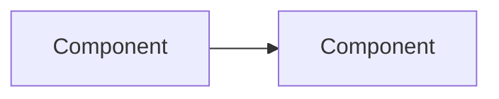

# Chapter N — {Title}

> **Reading time:** ~30 minutes · **Career weight:** ★★★★☆ · **Prerequisites:** Chapter X
>
> **In one line:** {The single sentence that captures the chapter.}

---

## How to Write a Chapter

*(Delete this block when you use the template.)*

**The reader is an experienced software engineer who is new to AI and is building tools, MCP servers, and agents.** They do not have an ML background and do not need one. They need to understand things well enough to make good decisions and build working systems.

### Style rules — these are mechanical, not aspirational

| Rule | Why |
| --- | --- |
| Paragraphs of 2–4 sentences. Never 6 | Walls of text are where readers give up |
| Open every section with a **bolded one-line takeaway** | Skimming has to work |
| Real numbers and real symptoms, not abstract description | "3% of responses returned malformed JSON" beats "reliability can suffer" |
| Analogies to things the reader already knows | REST, JDBC, microservices, Kubernetes, plugins, drivers |
| No hardware internals | No memory bandwidth, kernel behaviour, or KV cache mechanics. Give the consequence, not the mechanism |
| No maths | Ever. Intuition only |

### Every concept appears three times, getting more concrete

1. **The idea** — plain English plus an analogy
2. **Raw OpenAI SDK** — 8–12 lines with nothing hiding the concept
3. **LangChain / LangGraph** — the same thing, plus what the framework adds *and what it hides*

Always name the concept and the framework's word for it separately:

> *"This is tool calling. LangChain calls it `bind_tools`. The wrapper handles the retry loop you would otherwise write yourself."*

That way the chapter survives the framework renaming things.

**Snippets stay under 12 lines.** If it needs more, it needs a diagram.

### Examples must be self-contained

Explain the scenario where it appears, in one sentence, using something the reader recognises instantly — an order lookup, a support ticket, a customer record, a refund.

**Never require the reader to remember a scenario from an earlier chapter.** A named running example seems elegant when you are writing and is an obstacle when someone opens a chapter in the middle. If your example needs a paragraph of setup, pick a more obvious one.

---

## 1. Why This Matters

**{One-line takeaway.}**

Open with the consequence of not knowing this — a real failure, a wasted month, a blown budget. Three short paragraphs.

---

## 2. The Problem

**{One-line takeaway.}**

The engineering problem, stated plainly. What breaks without this?

---

## 3. Mental Model

> **{Thing} is {familiar thing} for {AI context}.**

The analogy, then where it leaks. Every analogy leaks; naming the leak is what stops it misleading people.

---

## 4. The ML Bit, in Plain English

> **Skippable.** Here for when someone asks you in a meeting.

Intuition only. No maths, no notation, no training details. If you cannot explain it without a formula, cut it.

*Omit this section entirely in chapters where there is no ML concept to explain.*

---

## 5. Architecture

**{One-line takeaway.}**

One diagram that earns its place, then walk through it in prose.



---

## 6. See It in Code

**{One-line takeaway.}**

### Raw OpenAI

```python
# 8-12 lines. Nothing hidden.
```

What to notice: {the one or two things the reader should take from the snippet}.

### With LangChain / LangGraph

```python
# The same thing, framework version.
```

**What the framework adds:** {concrete list}
**What it hides:** {concrete list — this matters more}
**Use the framework when:** {condition}. **Use the raw SDK when:** {condition}.

### In practice

A worked example that pulls the two together. Self-contained.

---

## 7. Engineering Decisions

**{One-line takeaway.}**

- Why does this exist? What forced it into being.
- What alternatives exist? Including "do nothing" and "use the boring thing you already run."
- What does it actually solve, and what is it wrongly believed to solve?

---

## 8. Decision Matrix

| | |
| --- | --- |
| ✅ **YES if** | {Condition} · {Condition} · {Condition} |
| ❌ **NO if** | {Condition} · {Condition} · {Condition} |
| ⚠️ **Depends on** | {The specific variable that decides it} |

| Alternative | Choose it when | What it costs you |
| --- | --- | --- |
| | | |

---

## 9. Technology Landscape

No syntax. Purpose, fit, and limits only.

| Technology | What it is for | Use when | Watch out for |
| --- | --- | --- | --- |
| | | | |

> Ages fastest. Reviewed quarterly.

---

## 10. Production Notes

| Concern | What to get right |
| --- | --- |
| **Security** | |
| **Scaling** | |
| **Observability** | |
| **Failure modes** | |
| **Cost** | |

---

## 11. Best Practices and Common Mistakes

**Do this**

- {Specific and actionable. If it could be said without reading this chapter, it is too generic}

**Not this**

| Mistake | What it looks like | Do instead |
| --- | --- | --- |
| | | |

---

## 12. Forward Deployed Engineer Notes

Keep tight — a table and a checklist, not essays.

**What customers say, and what it means**

| They say | It means | Ask |
| --- | --- | --- |
| | | |

**Discovery questions** — three to five that change the shape of the engagement.

**Build vs buy** — the honest version.

**Before go-live**

- [ ] {Checklist item}

---

## 13. Career Notes

**Importance:** ★★★★☆

**In interviews:** how it comes up.
**On the job:** how often you touch it.
**Seniority signal:** what a senior engineer says that a junior does not.

---

## 14. One Minute Summary

> **If you remember one thing: {the one thing}**

Three to five bullets. No new material.

---

## 15. Interview Questions and References

Ten to fifteen conceptual questions, no coding.

1.

**References** — official docs, repositories, technical writing, and papers only where they change how you build.

---

← [Previous](.) · [Contents](../SUMMARY.md) · [Next](.) →
